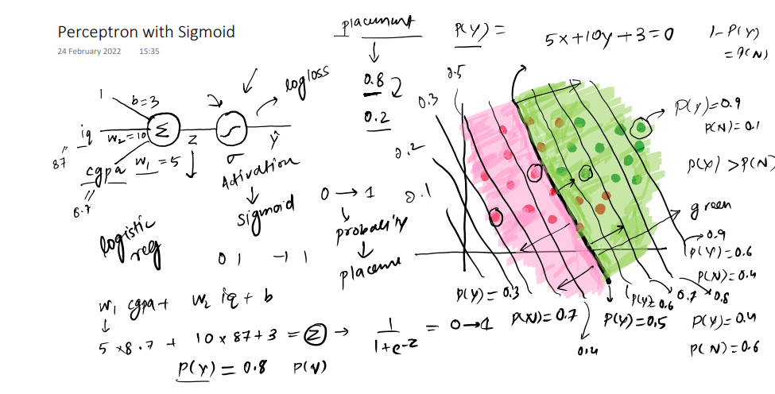
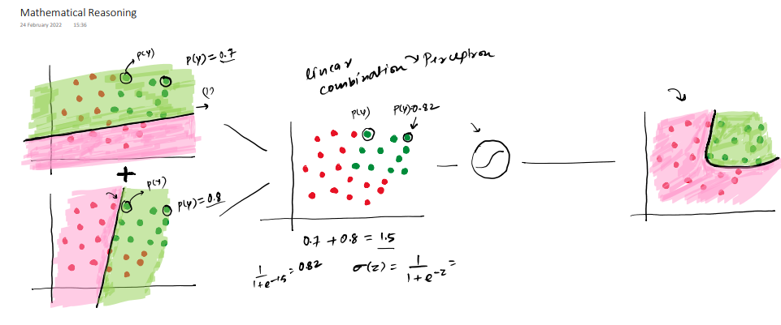
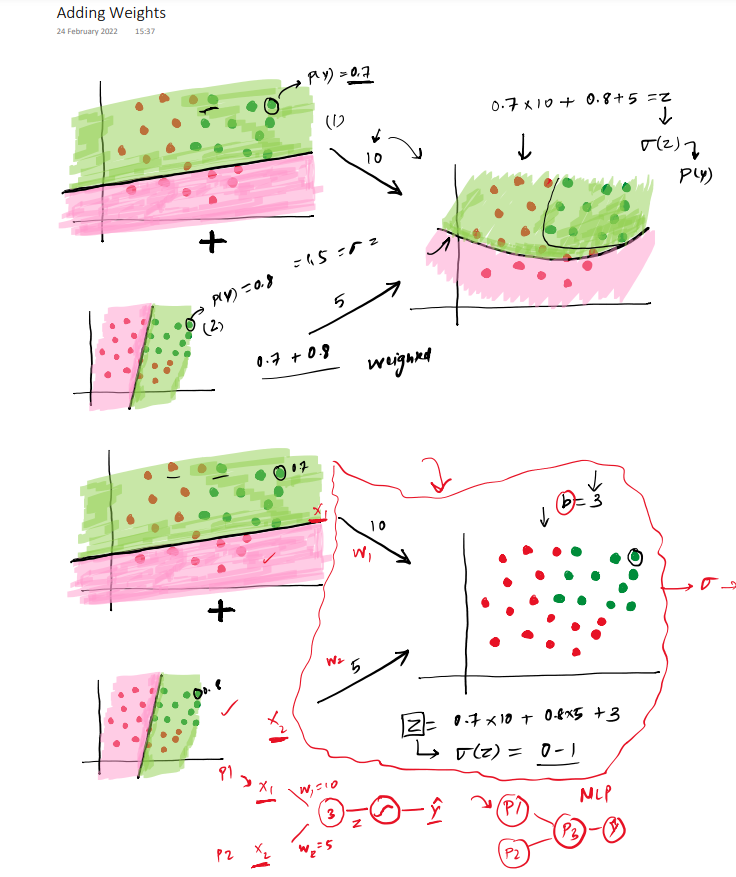
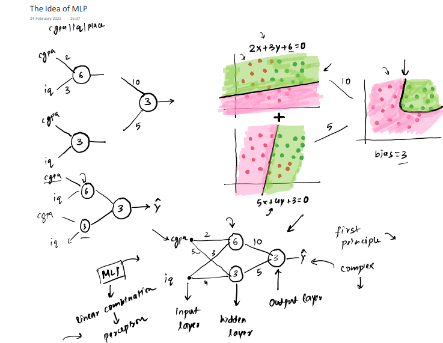
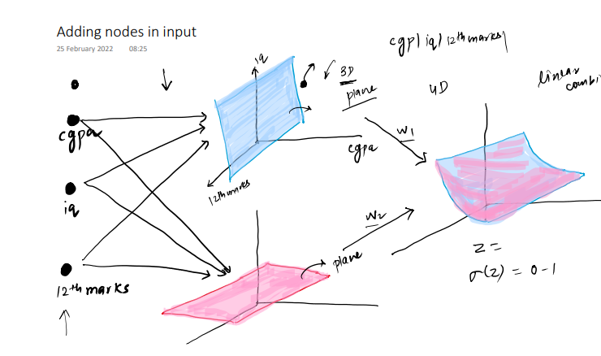
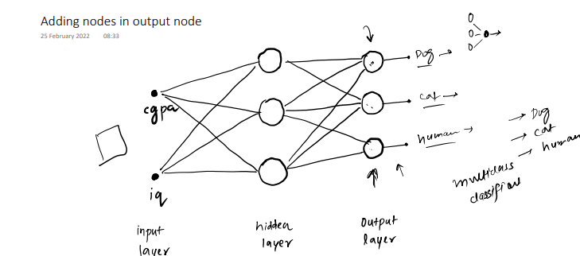
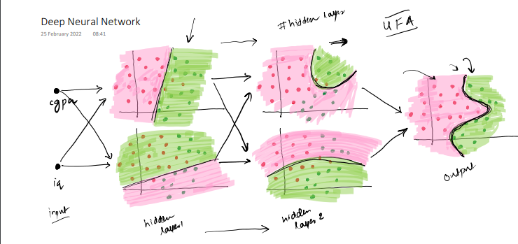

## Multi-Layer Perceptrons (MLPs)

1. **Superimposition of Multiple Neurons:**
   - In an MLP, each layer has multiple neurons.
   - Each neuron in a layer performs a weighted sum of its inputs (linear combination), which is then passed through an activation function.
   - This process enables the network to model interactions between different inputs, allowing for the "superimposition" of features.
   - For example, the network learns how to combine various input features (like edges in images) to form higher-order features (like shapes or objects).

2. **Smoothing of Outputs:**
   - Non-linear activation functions (like Sigmoid, Tanh, or ReLU) are applied after the linear combination.
   - These activation functions smooth or squash the output values into a specific range, ensuring that the network remains stable and capable of learning complex relationships.

3. **Linear Combination of Multiple Perceptrons:**
   - Each layer of the MLP takes the output of the previous layer (or input data for the first layer) and applies a **linear transformation**:
     $$ z = W \cdot x + b $$
     where $W$ is the weight matrix, $x$ is the input, and $b$ is the bias.
   - This transformation is then passed through a non-linear activation function:
     $$ a = \text{activation}(z) $$
   - The network layers stack these operations, creating a hierarchical combination of simpler functions, enabling the MLP to approximate highly complex functions.

4. **Intuition Behind MLP:**
   - **Superposition Principle:** Each layer combines outputs from the previous layer, forming a richer representation of the data.
   - **Smoothing:** Activation functions ensure the outputs are bounded and introduce non-linear capabilities to the network.
   - **Linear Combination:** Each neuron acts as a "feature detector" that combines inputs linearly before non-linear transformations refine the output.

### Real-World Analogy:
Think of an orchestra:
- Each instrument (neuron) contributes its sound (output).
- The conductor (activation function) smooths and balances these sounds to create harmony.
- Together, the orchestra (MLP) produces a complex and beautiful piece of music (the model's prediction).

   
   
   
   
   
   
   
   

