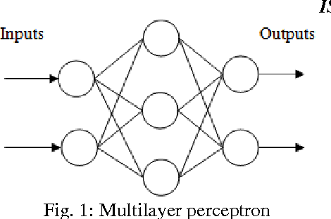

## MLP $\textbf{notation}$

### $\textbf{Weights } (W^k_{ij})$
#### $\textbf{General Notation:}$
$$
W^k_{ij}
$$
- $\textbf{Description:}$
    - $W$: Represents the weight in the network.
    - Superscript $k$: Layer number (e.g., $k = 1, 2, \dots, L$).
    - Subscript $ij$:
        - $i$: Index of the $\textbf{neuron}$ in the current layer $k$.
        - $j$: Index of the $\textbf{neuron}$ in the previous layer $k-1$.

#### $\textbf{Interpretation:}$
- $W^k_{ij}$: Weight connecting the $j$-th neuron in layer $k-1$ (previous layer) to the $i$-th neuron in layer $k$ (current layer).
- This weight determines the influence of the $j$-th neuron in layer $k-1$ on the $i$-th neuron in layer $k$.

#### $\textbf{Dimensions:}$
- If the previous layer $k-1$ has $n^{(k-1)}$ neurons and the current layer $k$ has $n^{(k)}$ neurons:
    $$
    W^k \in \mathbb{R}^{n^{(k)} \times n^{(k-1)}}
    $$
    - A $\textbf{matrix}$ where $W^k_{ij}$ represents the weight between the $j$-th neuron in $k-1$ and the $i$-th neuron in $k$.

---

### $\textbf{Biases } (b^k_i)$
#### $\textbf{General Notation:}$
$$
b^k_i
$$
- $\textbf{Description:}$
    - $b$: Represents the bias in the network.
    - Superscript $k$: Layer number (e.g., $k = 1, 2, \dots, L$).
    - Subscript $i$: Index of the $\textbf{neuron}$ in the current layer $k$.

#### $\textbf{Interpretation:}$
- $b^k_i$: Bias term associated with the $i$-th neuron in layer $k$.
- The bias allows the neuron to adjust the output independently of the inputs, enabling more flexible learning.

#### $\textbf{Dimensions:}$
- If the current layer $k$ has $n^{(k)}$ neurons:
    $$
    b^k \in \mathbb{R}^{n^{(k)}}
    $$
    - A $\textbf{vector}$ with one bias value $b^k_i$ for each neuron in the current layer $k$.

---

### $\textbf{Parameter Calculation}$

The total number of $\textbf{trainable parameters}$ in an MLP is the sum of all weights $(W^k_{ij})$ and biases $(b^k_i)$ across all layers.

#### $\textbf{Formula for Each Layer } k:$
1. $\textbf{Weights } (W^k):$
     $$
     \text{Number of weights in } W^k = n^{(k)} \times n^{(k-1)}
     $$
     - $n^{(k-1)}$: Number of neurons in the previous layer $(k-1)$.
     - $n^{(k)}$: Number of neurons in the current layer $(k)$.

2. $\textbf{Biases } (b^k):$
     $$
     \text{Number of biases in } b^k = n^{(k)}
     $$

3. $\textbf{Total Parameters in Layer } k:$
     $$
     \text{Total in Layer } k = \underbrace{n^{(k)} \times n^{(k-1)}}_{\text{weights}} + \underbrace{n^{(k)}}_{\text{biases}}
     $$

#### $\textbf{Overall Total Parameters (Summing Over All Layers):}$
$$
\text{Total Parameters} = \sum_{k=1}^{L} \left( n^{(k)} \times n^{(k-1)} + n^{(k)} \right)
$$

---

### $\textbf{Example Parameter Calculation}$
Consider an MLP with:
- $\textbf{Input Layer } (L_0)$: $n^{(0)} = 4$ (4 input features).
- $\textbf{Hidden Layer 1 } (L_1)$: $n^{(1)} = 3$ (3 neurons).
- $\textbf{Hidden Layer 2 } (L_2)$: $n^{(2)} = 2$ (2 neurons).
- $\textbf{Output Layer } (L_3)$: $n^{(3)} = 1$ (1 output neuron).

#### $\textbf{Layer-Wise Parameters:}$
1. $\textbf{Input Layer to Hidden Layer 1 } (L_0 \rightarrow L_1):$
     - Weights $(W^1)$: $n^{(1)} \times n^{(0)} = 3 \times 4 = 12$.
     - Biases $(b^1)$: $n^{(1)} = 3$.
     - Total: $12 + 3 = 15$.

2. $\textbf{Hidden Layer 1 to Hidden Layer 2 } (L_1 \rightarrow L_2):$
     - Weights $(W^2)$: $n^{(2)} \times n^{(1)} = 2 \times 3 = 6$.
     - Biases $(b^2)$: $n^{(2)} = 2$.
     - Total: $6 + 2 = 8$.

3. $\textbf{Hidden Layer 2 to Output Layer } (L_2 \rightarrow L_3):$
     - Weights $(W^3)$: $n^{(3)} \times n^{(2)} = 1 \times 2 = 2$.
     - Biases $(b^3)$: $n^{(3)} = 1$.
     - Total: $2 + 1 = 3$.

#### $\textbf{Total Parameters:}$
$$
\text{Total Parameters} = 15 + 8 + 3 = 26
$$

---

### $\textbf{Summary of Notation:}$
1. $\textbf{Weights } (W^k_{ij}):$
     - Superscript $k$: Layer number.
     - Subscript $ij$: Connection between neuron $j$ in layer $k-1$ and neuron $i$ in layer $k$.

2. $\textbf{Biases } (b^k_i):$
     - Superscript $k$: Layer number.
     - Subscript $i$: Bias for the $i$-th neuron in layer $k$.

3. $\textbf{Parameter Calculation Formula:}$
     - For each layer $k$: $n^{(k)} \times n^{(k-1)} + n^{(k)}$.
     - Total across all layers: $\sum_{k=1}^{L} \left( n^{(k)} \times n^{(k-1)} + n^{(k)} \right)$.

### Diagram

