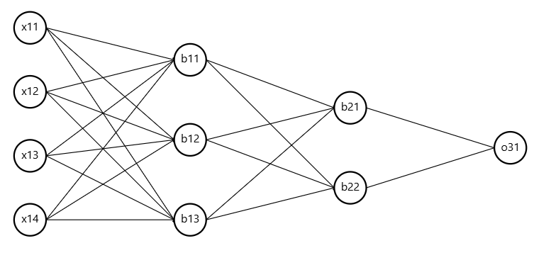

## **Forward Propagation in a Neural Network**
The goal of forward propagation is to compute the predicted output $ \hat{y} $ using matrix multiplications and activation functions.

### **Given Data**
We have an input matrix:
$$
X = [x_{i1}, x_{i2}, x_{i3}, x_{i4}]
$$
where:
- $ x_{i1}, x_{i2}, x_{i3}, x_{i4} $ are the features.

We also have three layers in the neural network.

## **Layer 1 (Input Layer → Hidden Layer 1)**

### **Step 1: Weight Matrix for Layer 1**
The weight matrix $ W^{(1)} $ has dimensions **(4 × 3)**:
$$
W^{(1)} =
\begin{bmatrix}
W_{11}^{(1)} & W_{12}^{(1)} & W_{13}^{(1)} \\
W_{21}^{(1)} & W_{22}^{(1)} & W_{23}^{(1)} \\
W_{31}^{(1)} & W_{32}^{(1)} & W_{33}^{(1)} \\
W_{41}^{(1)} & W_{42}^{(1)} & W_{43}^{(1)}
\end{bmatrix}
$$

### **Step 2: Bias Vector for Layer 1**
The bias vector has dimensions **(3 × 1)**:
$$
B^{(1)} =
\begin{bmatrix}
b_{11} \\
b_{12} \\
b_{13}
\end{bmatrix}
$$

### **Step 3: Compute $ Z^{(1)} $**
The formula for the weighted sum is:
$$
Z^{(1)} = W^{(1)} X + B^{(1)}
$$

Breaking it down:

$$
Z^{(1)} =
\begin{bmatrix}
W_{11}^{(1)} x_{i1} + W_{21}^{(1)} x_{i2} + W_{31}^{(1)} x_{i3} + W_{41}^{(1)} x_{i4} \\
W_{12}^{(1)} x_{i1} + W_{22}^{(1)} x_{i2} + W_{32}^{(1)} x_{i3} + W_{42}^{(1)} x_{i4} \\
W_{13}^{(1)} x_{i1} + W_{23}^{(1)} x_{i2} + W_{33}^{(1)} x_{i3} + W_{43}^{(1)} x_{i4}
\end{bmatrix}
+
\begin{bmatrix}
b_{11} \\
b_{12} \\
b_{13}
\end{bmatrix}
$$

### **Step 4: Apply Activation Function $ \sigma $**
$$
A^{(1)} = \sigma(Z^{(1)})
$$

$$
A^{(1)} =
\begin{bmatrix}
a_{11} \\
a_{12} \\
a_{13}
\end{bmatrix}
$$
This represents the activations of the first hidden layer.

## **Layer 2 (Hidden Layer 1 → Hidden Layer 2)**

### **Step 1: Weight Matrix for Layer 2**
$$
W^{(2)} =
\begin{bmatrix}
W_{11}^{(2)} & W_{12}^{(2)} \\
W_{21}^{(2)} & W_{22}^{(2)} \\
W_{31}^{(2)} & W_{32}^{(2)}
\end{bmatrix}
$$
**Dimensions:** (3 × 2)

### **Step 2: Bias Vector for Layer 2**
$$
B^{(2)} =
\begin{bmatrix}
b_{21} \\
b_{22}
\end{bmatrix}
$$
**Dimensions:** (2 × 1)

### **Step 3: Compute $ Z^{(2)} $**
$$
Z^{(2)} = W^{(2)} A^{(1)} + B^{(2)}
$$

Expanding:

$$
Z^{(2)} =
\begin{bmatrix}
W_{11}^{(2)} a_{11} + W_{21}^{(2)} a_{12} + W_{31}^{(2)} a_{13} + b_{21} \\
W_{12}^{(2)} a_{11} + W_{22}^{(2)} a_{12} + W_{32}^{(2)} a_{13} + b_{22}
\end{bmatrix}
$$

### **Step 4: Apply Activation Function $ \sigma $**
$$
A^{(2)} = \sigma(Z^{(2)})
$$

$$
A^{(2)} =
\begin{bmatrix}
a_{21} \\
a_{22}
\end{bmatrix}
$$

## **Layer 3 (Hidden Layer 2 → Output Layer)**

### **Step 1: Weight Matrix for Layer 3**
$$
W^{(3)} =
\begin{bmatrix}
W_{11}^{(3)} & W_{12}^{(3)}
\end{bmatrix}
$$
**Dimensions:** (1 × 2)

### **Step 2: Bias Term for Layer 3**
$$
B^{(3)} =
\begin{bmatrix}
b_{31}
\end{bmatrix}
$$
**Dimensions:** (1 × 1)

### **Step 3: Compute $ Z^{(3)} $**
$$
Z^{(3)} = W^{(3)} A^{(2)} + B^{(3)}
$$

Expanding:

$$
Z^{(3)} =
W_{11}^{(3)} a_{21} + W_{12}^{(3)} a_{22} + b_{31}
$$

### **Step 4: Apply Activation Function $ \sigma $**
Since this is a classification problem (as indicated by the dataset where the label is **0 or 1**), we apply the **sigmoid activation**:

$$
\hat{y} = A^{(3)} = \sigma(Z^{(3)})
$$

## **Final Computation Summary**
### **Overall Forward Propagation Formula**
$$
A^{(1)} = \sigma(W^{(1)} X + B^{(1)})
$$
$$
A^{(2)} = \sigma(W^{(2)} A^{(1)} + B^{(2)})
$$
$$
\hat{y} = A^{(3)} = \sigma(W^{(3)} A^{(2)} + B^{(3)})
$$

### **Final Dimensions Recap**
| **Matrix**    | **Dimensions** |
|----------------|--------------|
| $ W^{(1)} $ | $ 4 \times 3 $ |
| $ X $       | $ 4 \times 1 $ |
| $ B^{(1)} $ | $ 3 \times 1 $ |
| $ Z^{(1)} $ | $ 3 \times 1 $ |
| $ A^{(1)} $ | $ 3 \times 1 $ |
| $ W^{(2)} $ | $ 3 \times 2 $ |
| $ B^{(2)} $ | $ 2 \times 1 $ |
| $ Z^{(2)} $ | $ 2 \times 1 $ |
| $ A^{(2)} $ | $ 2 \times 1 $ |
| $ W^{(3)} $ | $ 1 \times 2 $ |
| $ B^{(3)} $ | $ 1 \times 1 $ |
| $ Z^{(3)} $ | $ 1 \times 1 $ |
| $ A^{(3)} $ | $ 1 \times 1 $ |

### **Final Output**
$$
\hat{y} = A^{(3)}
$$

Where $ \hat{y} $ is the predicted probability that an input belongs to class **1** (placed), and $ 1 - \hat{y} $ is the probability that it belongs to class **0** (not placed).

