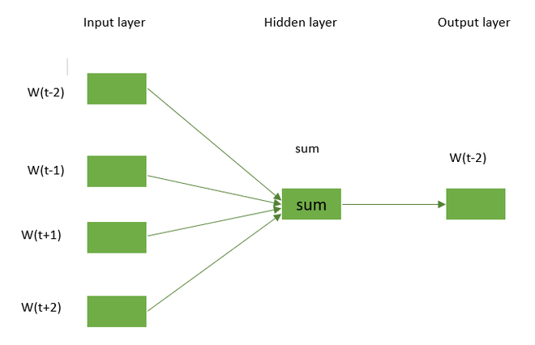

## [Learn more about CBOW](https://www.scaler.com/topics/nlp/cbow/)

# Continuous Bag of Words (CBOW) Model in NLP

## Overview
The continuous bag-of-words (CBOW) model is a neural network designed for natural language processing tasks such as language translation and text classification. It functions by predicting a target word based on the context of surrounding words. The model is trained on large text datasets using optimization algorithms like stochastic gradient descent. Once trained, CBOW generates numerical vectors called word embeddings that capture word semantics in a continuous vector space, which can be utilized in various NLP applications. It's often combined with other techniques like the skip-gram model and can be implemented using libraries such as Gensim in Python.

## Introduction to Word2Vec
Word2Vec is a widely used NLP technique that employs neural networks to learn distributed representations of words (word embeddings). These embeddings capture word semantics in a continuous vector space, positioning similar words close together. Word2Vec features two main architectural models:

1. **Continuous bag-of-words (CBOW)**: Predicts the current word based on surrounding context words
2. **Skip-gram**: Predicts surrounding words given the current word

Word2Vec can be trained on large text datasets and finds applications in various NLP tasks including language translation, text classification, and information retrieval.

## The CBOW Model Explained
The CBOW model predicts a target word given the context of surrounding words. It processes a window of surrounding words as input to predict the central target word. This model:
- Learns from patterns observed in input data
- Is trained on large text datasets
- Can be combined with other NLP techniques to enhance performance
- Works alongside models like skip-gram for improved results

## Understanding CBOW in Depth
CBOW predicts target words based on surrounding context words in text. It utilizes a feedforward neural network where:
- Input: Set of context words
- Output: Target word
- Learning process: Adjusting neuron weights in the hidden layer to produce outputs most likely to match target words

The embeddings learned by CBOW can support various NLP tasks including:
- Text classification
- Language translation
- Sentiment analysis

CBOW offers fast and efficient learning of context word representations, using one-pass learning to predict target words. This method is widely employed for learning word embeddings, creating dense representations where semantically similar words occupy nearby positions in the embedding space.

## CBOW Architecture
The CBOW model aims to understand context words surrounding a target word to predict it. For example, with the sentence "It is a pleasant day" and a context window size of 2, the word pairs would be:
- ([it, a], is)
- ([is, nice], a)
- ([a, day], pleasant)

The model attempts to predict the target word using these word pairs while considering the context words.

When four context words are used to predict one target word, the input layer consists of four 1*W input vectors. These vectors pass to the hidden layer and are multiplied by a W*N matrix. The 1*N output from the hidden layer enters the sum layer, where vectors undergo element-wise summation before final activation produces the output.

## Vocabulary in Word2Vec
In word embedding models like Word2Vec, the vocabulary comprises unique words on which the model trains. This vocabulary is created by preprocessing input text data and selecting words based on criteria such as occurrence frequency or length.

The Word2Vec model creates a vocabulary by:
1. Building a dictionary of all unique words in the input text
2. Filtering out infrequent or overly long words
3. Using parameters like min_count to specify minimum occurrences required for inclusion

The vocabulary enables creation of numerical vectors (word embeddings) for each included word. These embeddings capture word semantics in continuous vector space, positioning similar words near each other. The embeddings then serve as input to the Word2Vec model, which processes the data and learns relationships between words.


---

### **1. Word Pairing in CBOW (Context → Target)**

Let’s say you have the sentence:

```
"It is a pleasant day"
```

Suppose we use a **context window size of 2**. That means, for each word, we’ll consider the two words before and after it (if they exist). Here's how word pairing works:

#### Example Word Pair Generation

```
Sentence: ["It", "is", "a", "pleasant", "day"]

Pairs:
- Context: ["It", "a"],      Target: "is"
- Context: ["is", "pleasant"], Target: "a"
- Context: ["a", "day"],     Target: "pleasant"
```

In **CBOW**, you input the context words and try to predict the target word.

---

### **2. CBOW Architecture – Matrix Multiplication & Vector Flow**

Let’s understand what actually happens inside the neural network.

Let:
- `V`: vocabulary size
- `D`: embedding dimension (say 10, 100, 300…)
- `C`: number of context words (say 2 on the left, 2 on the right → total context size = 4)

We have:
- **Embedding matrix** `W` of shape `[V x D]`  
  This is where each word is mapped to a vector of size `D`.

---

#### Step-by-Step Flow of CBOW

Let’s take an example.

```python
Context Words: ["it", "is", "a", "day"]  
Target Word:   "pleasant"
```

#### Step 1: Convert words to one-hot or word indices
Assume word-to-index mapping:
```python
{"it": 0, "is": 1, "a": 2, "pleasant": 3, "day": 4}
```

Now:
```python
Context word indices: [0, 1, 2, 4]  # "it", "is", "a", "day"
Target word index: 3  # "pleasant"
```

---

#### Step 2: Embedding lookup

We use PyTorch's `nn.Embedding` to get the embeddings:
```python
embedding = nn.Embedding(V, D)  # say V=10, D=5
context_indices = torch.tensor([0, 1, 2, 4])
context_vectors = embedding(context_indices)  # shape: [C x D] = [4 x 5]
```

This gives a 4×5 matrix (each context word is represented by a 5-dimensional vector).

---

#### Step 3: Average context embeddings

```python
context_vector = torch.mean(context_vectors, dim=0)  # shape: [5]
```

This is the **hidden layer output**, a single vector that combines all context word vectors.

---

#### Step 4: Multiply with weights to get output scores

Now we project this hidden vector to output vocabulary size using a weight matrix:

```python
output_weights = nn.Linear(D, V)
output_scores = output_weights(context_vector)  # shape: [V]
```

This gives a score for each word in the vocabulary — representing how likely each word is the **target word**.

---

#### Step 5: Apply Softmax to get probabilities

```python
probs = torch.softmax(output_scores, dim=0)
```

---

#### Step 6: Calculate Loss and Backpropagate

You compute the loss using `nn.CrossEntropyLoss()` comparing predicted scores with the actual target word index.

---

### Summary of Vector Multiplications

Here’s a simplified view:

1. **Input**: Context words → indices → embedding vectors (matrix: `C x D`)
2. **Hidden Layer**: Mean of these vectors → `[D]`
3. **Output Layer**: Linear layer → `[D x V]` weight multiplication → `[V]` score vector
4. **Softmax**: Converts scores into probabilities

So internally, CBOW uses:
- **Embedding Lookup** (efficient matrix indexing)
- **Averaging** over embeddings
- **Matrix Multiplication** to project hidden representation to vocabulary space

---


### Is there any difference between Bag-of-Words (BoW) model and the Continuous Bag-of-Words (CBOW)?

The Bag-of-Words model and the Continuous Bag-of-Words model are both techniques used in natural language processing to represent text in a computer-readable format, but they differ in how they capture context.

The **BoW model** represents text as a collection of words and their frequency in a given document or corpus. It does not consider the order or context in which the words appear, and therefore, it may not capture the full meaning of the text. The BoW model is simple and easy to implement, but it has limitations in capturing the meaning of language.


### Architecture of the CBOW model

The CBOW model uses the context words around the target word in order to predict it. Consider the above example “She is a great dancer.” The CBOW model converts this phrase into pairs of context words and target words. The word pairings would appear like this ([she, a], is), ([is, great], a) ([a, dancer], great) having window size=2. 




The model considers the context words and tries to predict the target term. The four 1∗W input vectors will be passed to the input layer if have four words as context words are used to predict one target word. The hidden layer will receive the input vectors and then multiply them by a W∗N matrix. The 1∗N output from the hidden layer finally enters the sum layer, where the vectors are element-wise summed before a final activation is carried out and the output is obtained from the output layer.


---

