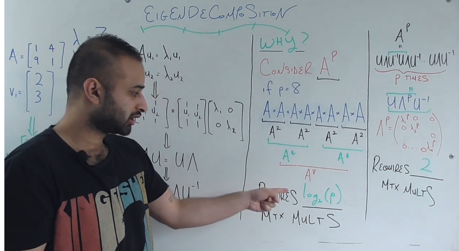

### Resources

[Eigenvalue and Eigenvector - Chatgpt](https://chatgpt.com/share/671f100e-612c-8011-b17d-52a677159ff4)<br>
---

[Eigenvalue and Eigenvector - Wikipedia](https://en.wikipedia.org/wiki/Eigenvalues_and_eigenvectors)<br>
[Eigenvalue and Eigenvector - Math is Fun](https://www.mathsisfun.com/algebra/eigenvalue.html)<br>
[Eigenvalue and Eigenvector](https://math.libretexts.org/Bookshelves/Linear_Algebra/A_First_Course_in_Linear_Algebra_(Kuttler)/07:_Spectral_Theory/7.01:_Eigenvalues_and_Eigenvectors_of_a_Matrix)<br>
[Eigenvalue and Eigenvector - Geeks for Geeks](https://www.geeksforgeeks.org/eigen-values/)<br>

### Eigenvalue Decompositon

[Eigendecomposition of a Matrix - Wikipedia](https://en.wikipedia.org/wiki/Eigendecomposition_of_a_matrix)  
[Eigendecomposition Overview - Built In](https://builtin.com/data-science/eigendecomposition)  
[Intuitive Tutorial on Eigenvalue Decomposition in NumPy - Medium](https://medium.com/@louisdevitry/intuitive-tutorial-on-eigenvalue-decomposition-in-numpy-af0062a4929b)  
[Matrix Diagonalization - University of Florida](https://cmp.phys.ufl.edu/files/matrix-diagonalization.html)  
[Eigenvector Decomposition - Unacademy](https://unacademy.com/content/upsc/study-material/mathematics/brief-notes-on-eigenvector-decomposition/)  
[Eigenvalue Decomposition - DS Dojo on Medium](https://dsdojo.medium.com/eigenvalue-decomposition-cc30e71e710)  
[EigenDecomposition - Wolfram MathWorld](https://mathworld.wolfram.com/EigenDecomposition.html)


### Why Use Eigen Decomposition?

**Goal:** Efficiently compute powers of $A$, denoted $A^p$.

1. **Consider $A^p$**  
   If $p = 8$, we want to compute:
   $$
   A^8 = A \times A \times A \times A \times A \times A \times A \times A
   $$
   - Using exponentiation by squaring, we can break down $A^8$ as:
     $$
     A^8 = (A^2)^4
     $$
   - Thus, we compute $A^2$, then square it to get $A^4$, and finally square $A^4$ to get $A^8$.

2. **Efficiency**  
   This approach reduces the required matrix multiplications to $\log_2(p)$.

---

### Efficient Calculation with Eigen Decomposition

**Using $A = U \Lambda U^{-1}$:**

1. **Raise to Power**  
   When using eigendecomposition:
   $$
   A^p = (U \Lambda U^{-1})^p
   $$
   - Expanding, we get $A^p = U \Lambda^p U^{-1}$.

2. **Diagonal Power Calculation**  
   Since $\Lambda$ is diagonal, $\Lambda^p$ can be computed by raising each eigenvalue to the $p$-th power, requiring only **2 matrix multiplications**.





---

*Eidgendecomposition and Matrix Reconstruction Example*

```python
# create simple 3x3 matrix
A = np.array([[10, 21, 36], [47, 51, 64], [72, 87, 91]])
# get eigenvalues and eigenvectors
values, vectors = np.linalg.eig(A)
```

The equation for reconstructing the original matrix $A$ using eigen decomposition is:

$
A = V \Lambda V^{-1}
$

where:
- $V$ is the matrix of eigenvectors,
- $\Lambda$ is the diagonal matrix of eigenvalues,
- $V^{-1}$ is the inverse of the eigenvector matrix $V$.

```py
# diagonalize the eigenvalues
values = np.diag(values)
# invert the eigenvectors
vectors_inv = np.linalg.inv(vectors)
#reconstruct the original matrix
A_reconstructed = vectors @ values @ vectors_inv

print(A_reconstructed)
```