### Visualizing patches which maximally activate a neuron
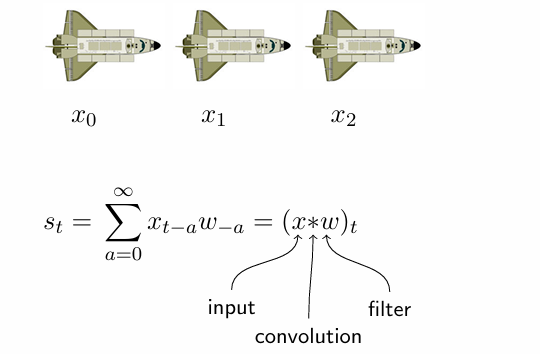
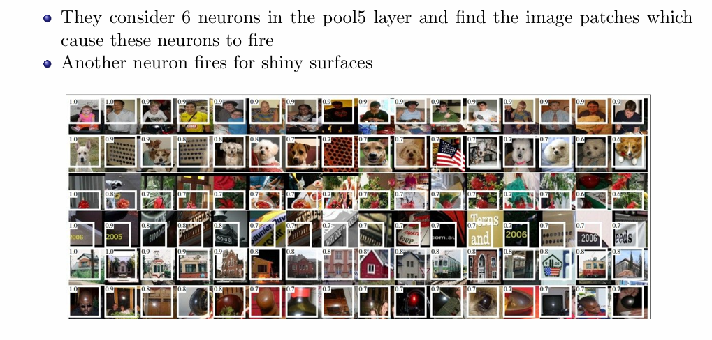

---

### Visualizing filters of a CNN

1. **Objective**: The primary goal is to find an input $ x $ that maximally activates a specific neuron within the network. This process helps in understanding what features the neuron responds to.

2. **Activation Function**: The activation of a neuron can be expressed as:
   $$
   w^T x
   $$
   where $ w $ represents the weight vector associated with the neuron, and $ x $ is the input vector.

3. **Normalization Constraint**: To ensure the input's influence on the activation is based on its direction rather than its magnitude, we impose a normalization constraint:
   $$
   ||x||^2 = x^T x = 1
   $$
   This means the input vector $ x $ is constrained to have a unit length.

4. **Optimal Input Calculation**: The input that maximally activates the neuron is derived as follows:
   $$
   x = \frac{w}{||w||}
   $$
   This indicates that the optimal input aligns with the neuron's weight vector, normalized to have a magnitude of one.

5. **Neural Network Structure**: The visualization typically includes a neural network with three layers:
   - **Input Layer**: The initial layer where data is fed into the network.
   - **Hidden Layer**: Contains neurons that process the input. One specific neuron is highlighted to indicate focus on its activation.
   - **Output Layer**: The final layer that produces the output based on the processed information from the hidden layer.

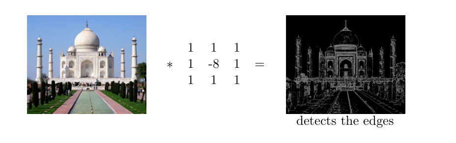

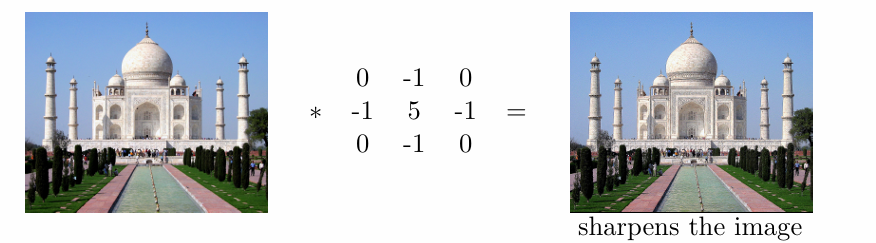
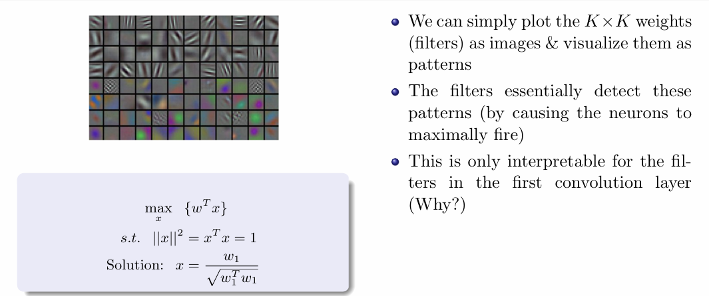

### Summary of CNN Concepts

1. **CNN as Feed-Forward Network**:
   - A Convolutional Neural Network (CNN) can be viewed as a feed-forward network with sparse connections and weight sharing.

2. **Neuron Activation**:
   - The goal is to determine what inputs will activate a given neuron, represented mathematically as 

   $$
   \frac{W}{||W||}
   $$

   where $W$ is the filter (e.g., 2x2).

3. **Filters as Pattern Detectors**:
   - Filters in CNNs act as pattern detectors, causing neurons to fire maximally when specific patterns are present in the input.

4. **Visualization of Filters**:
   - Filters can be visualized as images to interpret the patterns they detect, particularly in the first convolutional layer.

5. **Mathematical Representation**:
   - The activation can be expressed as:

   $$
   \text{max} \{w^{T}x\} \quad \text{s.t.} \quad ||x||^{2} = x^{T}x = 1
   $$

   - The solution is given by:

   $$
   x = \frac{w_{1}}{\sqrt{w_{1}^{T}w_{1}}}
   $$

6. **Pooling Techniques**:
   - Instead of max pooling, average pooling can also be applied to reduce dimensionality while retaining important features.

### Occlusion Experiment

**Overview**: Occlusion Sensitivity Analysis helps identify which parts of an image significantly influence a neural network's classification decisions.

#### Steps Involved:

1. **Softmax Layer**: The image passes through the network, and the softmax layer outputs probabilities for each class.

2. **Occlusion**: Patches of the image are covered one at a time with a gray square to assess the impact on predictions.

3. **Prediction**: Each occluded image is evaluated again to calculate new class probabilities.

4. **Sensitivity Analysis**: The change in probability for the correct class pre- and post-occlusion measures the importance of the occluded patch.

#### Interpretation of Results:

- **High Sensitivity**: Significant probability drop upon occlusion indicates that the patch is critical to the classification.
  
- **Low Sensitivity**: Minimal impact suggests the patch is less important for the model's decision.

#### Visualization:

- **Heatmaps**: Results are displayed using heatmaps:
  - **Red** indicates high sensitivity (important features).
  - **Cool colors** (like blue) denote low sensitivity (less influential regions).

#### Examples:

- **Pomeranian**: Heatmap shows the dog's face as vital for classification.
- **Car Wheel**: Highlights the wheel as essential for vehicle identification.
- **Afghan Hound**: Again, the dog's face is recognized as a key factor.

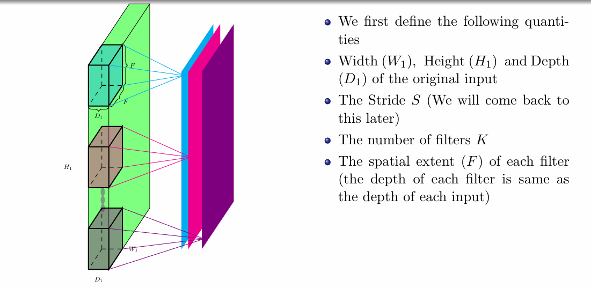

---

 ### Finding influence of input pixels using backpropagation

**Overview**: Saliency maps are a technique used to visualize the influence of individual pixels in an image on the activation of neurons in a neural network. This helps in understanding which parts of the image contribute most to the model's decision-making.

#### Key Concepts:

1. **Image Representation**:
   - An image is treated as a matrix of pixels ($m \times n$), where each pixel can be represented as an input $x_i$ to the neural network.

2. **Neural Network Structure**:
   - The image is fed into a neural network that consists of multiple layers.
   - Each neuron $h_j$ receives inputs from multiple pixels.

3. **Influence of Pixels**:
   - To determine how much a change in the value of a pixel $x_i$ affects the activation of a specific neuron $h_j$, we assess the sensitivity of the neuron to the pixel.
   - A significant change in $h_j$ resulting from a small change in $x_i$ indicates that $x_i$ has a strong influence on $h_j$.

4. **Gradient as a Measure of Influence**:
   - The gradient $\frac{\partial h_j}{\partial x_i}$ quantifies the influence of pixel $x_i$ on neuron $h_j$.
   - A larger gradient signifies a stronger influence, while:
     - $\frac{\partial h_j}{\partial x_i} = 0$: No influence
     - $\frac{\partial h_j}{\partial x_i} = \text{large}$: High influence
     - $\frac{\partial h_j}{\partial x_i} = \text{small}$: Low influence

#### Calculation of Gradients:

- **Backpropagation**: Saliency maps leverage the backpropagation algorithm to compute gradients efficiently.
- **Gradient Calculation**:
  - The gradient $\frac{\partial h_{32}}{\partial x_1}$ can be expressed as:
    $$
    \frac{\partial h_{32}}{\partial x_1} = \sum_{i=1}^{3} \frac{\partial h_{32}}{\partial h_{1i}} \cdot \frac{\partial h_{1i}}{\partial x_1}
    $$
  - The first hidden layer's activations are calculated as:
    $$
    h_{1i} = \sum_{j=1}^{4} w_{ji} \cdot x_j
    $$
  - Therefore, $\frac{\partial h_{1i}}{\partial x_1} = w_{12}$, leading to:
    $$
    \frac{\partial h_{32}}{\partial x_1} = w_{12} \cdot \frac{\partial h_{32}}{\partial h_{12}}
    $$

### Application in Neural Networks

- **Example Visualization**: For an image of a cat processed by the neural network, the resulting saliency map emphasizes critical areas, such as the cat's face and fur, which are pivotal for the network's classification (e.g., identifying the image as a "cat").

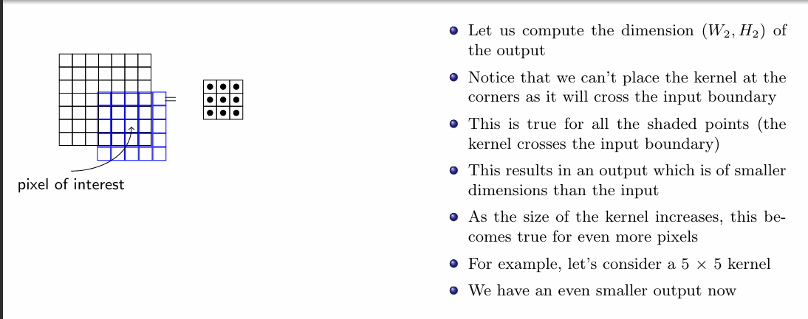

---

### Guided Backpropagation

**Overview**: Guided backpropagation is a technique used to improve the interpretability of neural networks by modifying how gradients are propagated backward, focusing on positive influences from the input to the output.

#### Key Steps:
1. **Input and Forward Pass**: An input image $x$ is processed through the network to produce feature maps and a reconstructed image $x'$.

2. **Backward Pass**:
   - **Standard Backpropagation**: Gradients flow back through all neurons.
   - **Guided Backpropagation**: 
     - Negative gradients from upper layers are set to zero, ensuring only positive gradients affect the output.
     - Neurons that produced negative activations during the forward pass do not propagate any gradients backward.

#### Implications:

- **Enhanced Interpretability**: This approach creates clearer saliency maps that highlight which parts of the input image positively contribute to the model's predictions.
- **Applications**: It helps visualize feature importance in classification tasks, making it easier to understand model behavior.

### Conclusion

Guided backpropagation is a valuable technique for interpreting neural networks, allowing for a better understanding of which features influence the model's decisions.

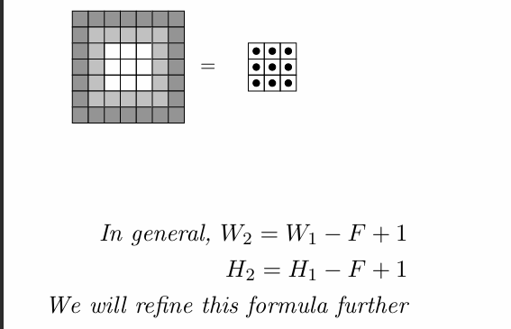

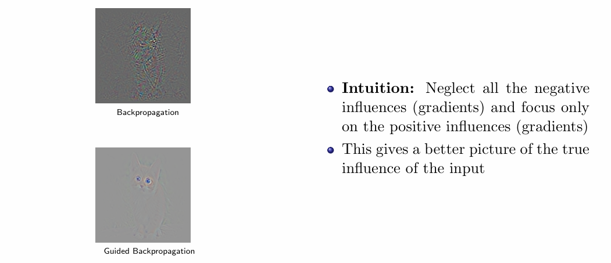

### Optimization over images

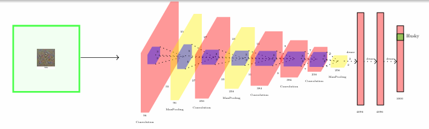

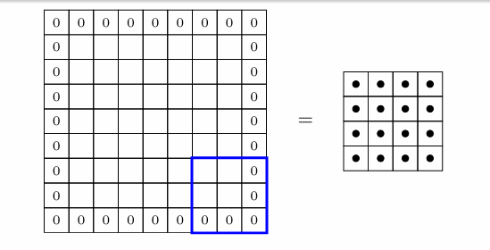

### Image Optimization for Class Activation

**Objective**: Create an image that maximizes the score for a target class (e.g., "dumbbell") when passed through a trained ConvNet.

#### Optimization Framework

1. **Parameters**: Treat the image as a collection of parameters (pixel values).
2. **Fixed Weights**: Keep the weights of the trained ConvNet fixed while adjusting the image pixels.
3. **Score Function**: Define the score for class $C$ before applying softmax:
   $$
   \text{arg max}(S_c(I) - \lambda \Omega(I))
   $$
   where:
   - $S_c(I)$: Score for class $C$
   - $\Omega(I)$: Regularizer to ensure the image resembles a typical image.

#### Steps to Generate the Image

1. **Initialization**: Start with a zero image.
2. **Set Score Vector**: Initialize the score vector with the target class as the focus (e.g., $[0, 0, ..., 1, 0, 0]$).
3. **Compute Gradient**: Calculate the gradient of the score concerning each pixel:
   $$
   \frac{\partial S_c(I)}{\partial i_k}
   $$
4. **Update Pixel**: Adjust the pixel value:
   $$
   i_k = i_k - \eta \frac{\partial S_c(I)}{\partial i_k}
   $$
5. **Forward Pass**: Pass the updated image through the network.
6. **Iterate**: Repeat steps 2-5 until convergence.

#### Application to Arbitrary Neurons

- **Neuron Activation**: You can also target specific neurons in the ConvNet:
  - Set activations for all neurons in the layer of interest to zero, except for the targeted neuron.
  - Backpropagate to the image:
  $$
  i_k = i_k - \eta \frac{\partial A(I)}{\partial i_k}
  $$
  where $A(I)$ is the activation of the neuron of interest.

#### Visualization

- **Updated Images**: By starting with different initializations instead of a zero image, various insights can be obtained.
- **Layer-Specific Analysis**: The process can be applied to different layers in the ConvNet to observe how images corresponding to specific neuron activations vary.

### Example Outputs

- **Layer 8 and Layer 7**: Images generated from focusing on different neurons show distinct patterns and features learned by the ConvNet.

### Conclusion

---

Method for reconstructing images from embeddings using a neural network, particularly leveraging the fully connected layer (fc7) as an embedding space. Here’s a concise summary:

### Creating Images from Embeddings

**Objective**: Given an embedding from a specific layer (e.g., fc7), reconstruct the original image that corresponds to that embedding.

#### Methodology

1. **Define Variables**:
   - **$\Phi_0$**: The embedding of the target image you want to reconstruct.
   - **$X$**: An initial random image (commonly initialized as a zero image).

2. **Optimization Problem**:
   - Pose the reconstruction task as an optimization problem.

3. **Loss Function**:
   - Define the loss function $L(i)$ to minimize the difference between the computed embedding of the image $X$ and the target embedding $\Phi_0$:
   $$
   L(i) = ||\Phi(X) - \Phi_0||^2 + \lambda ||\Phi(X)||^6
   $$
   - Here, $||\Phi(X) - \Phi_0||^2$ measures the distance between the embeddings, and $||\Phi(X)||^6$ serves as a regularization term to ensure $X$ remains a valid image.

4. **Gradient Descent Update**:
   - Update the pixel values of $X$ using gradient descent:
   $$
   i_k = i_k - \eta \frac{\partial L(i)}{\partial i_k}
   $$
   - Calculate the gradient of the loss function with respect to the pixel values to adjust them iteratively.

#### Iterative Process

- **Repeat**: Continuously perform forward passes and update the image $X$ until the loss converges or reaches an acceptable level.

### Conclusion

This approach effectively reconstructs images from their embeddings by optimizing a loss function that quantifies the difference between the desired and generated embeddings. By iteratively updating the image based on the gradients, you can generate an image that closely resembles the original image corresponding to the embedding from the fc7 layer.

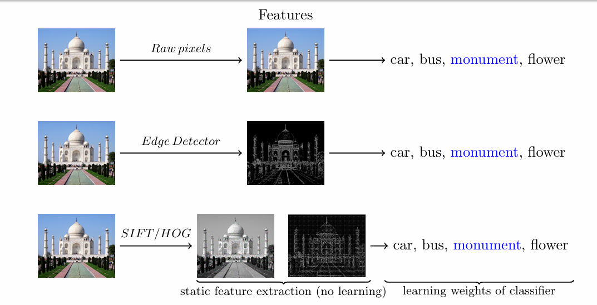
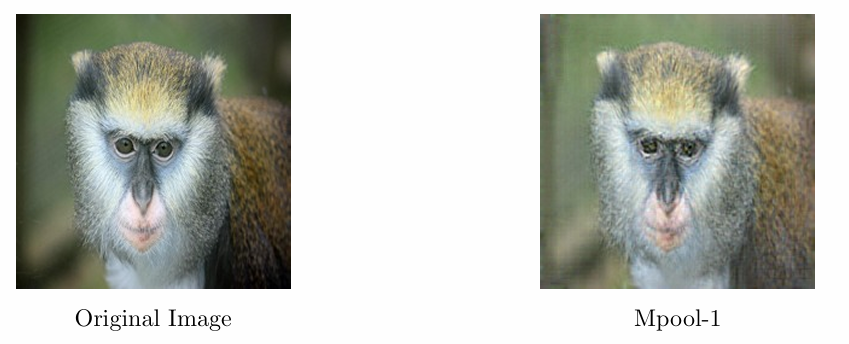

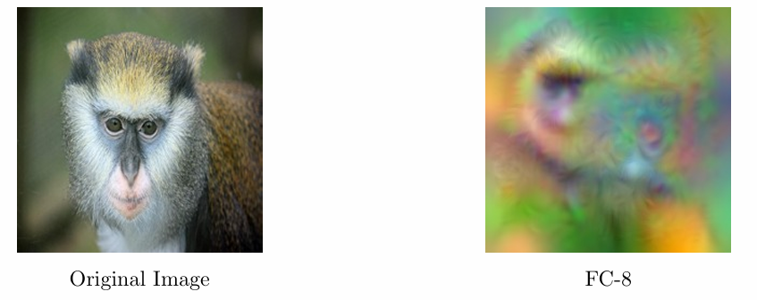

### DeepDream
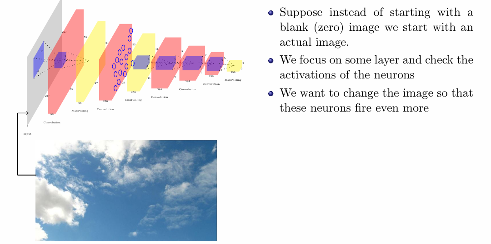
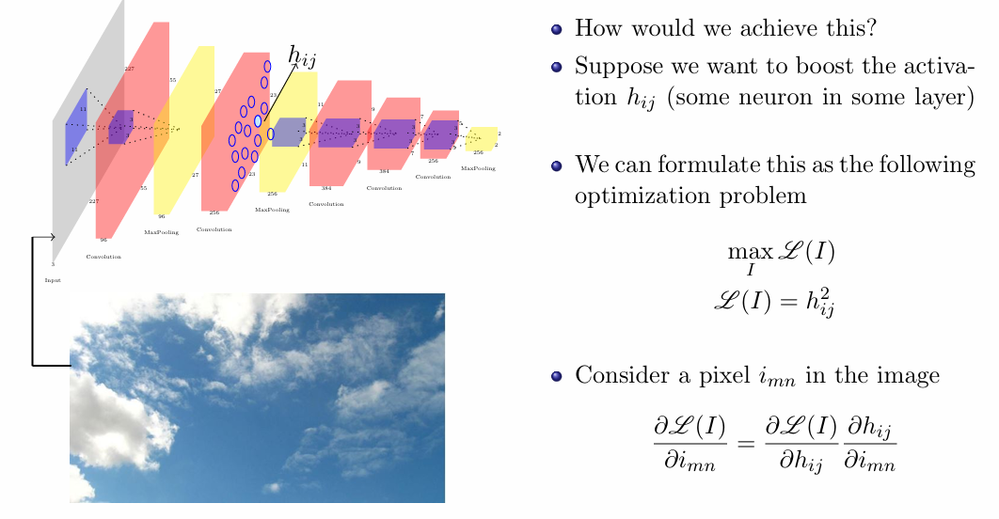
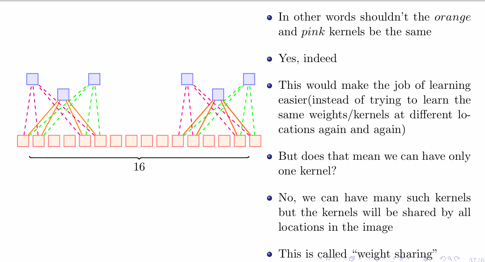
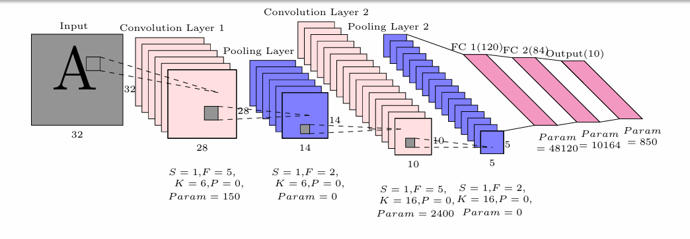

### Deep Art

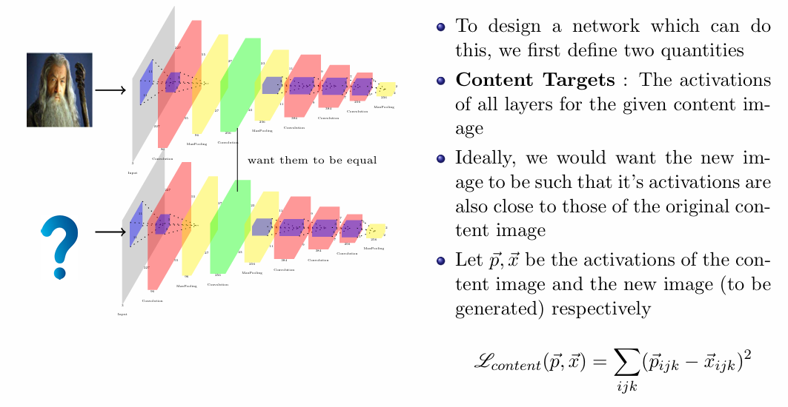

---

### Fooling Deep Convolution Neural Networks

