1. **Objective**: Track the position of an airplane using a laser sensor at discrete time intervals.

  
1. **Challenge**: The sensor data is noisy, which can distort the measurements.

2. **Solution**: Use a weighted average of several measurements to obtain a smoother (less noisy) estimate of the airplane's position.

3. **Weighted Averaging**:
   - More recent measurements are considered more relevant.
   - Hence, a weighted average is applied, where recent measurements have higher weights.

4. **Convolution Equation**:
   - 
   - $s_t = \sum_{a=0}^{\infty} x_{t-a} \cdot w_{-a} = (x * w)_t$
   - This equation describes the convolution operation, where:
     - $s_t$: Output signal at time step $t$.
     - $x_{t-a}$: Input signal (measurement) at time step $t-a$.
     - $w_{-a}$: Weight (or filter) applied to the input signal.
     - $\sum_{a=0}^{\infty}$: Summation over all past time steps $a$, from $0$ to $\infty$.

5. **Result**:
   - The convolution operation $s_t$ yields a smoother output signal, reducing the noise in the measurements by averaging them with a weight that prioritizes recent data.

6. **Definition**:
   - The convolution operation for the output signal $s_t$ at time step $t = 6$ is computed as:
    $$
     s_6 = x_6 w_0 + x_5 w_{-1} + x_4 w_{-2} + x_3 w_{-3} + x_2 w_{-4} + x_1 w_{-5} + x_0 w_{-6}
    $$
   - This summation occurs over a **finite window** of recent inputs, limiting the computation to the most recent few values.

7. **Filter (Weight Array)**:
   - The filter (weight array $w$) defines the importance of each input value within the window.
   - Example filter values:
     $$
     w = [0.01, 0.01, 0.02, 0.02, 0.04, 0.4, 0.5]
     $$
   - Here, more recent measurements (weights closer to $w_0$) are given higher values, making them more influential.

8. **Input Signal (x)**:
   - The input signal values over time are given as:
     $$
     x = [1.00, 1.10, 1.20, 1.40, 1.70, 1.80, 1.90, 2.10, 2.20, 2.40, 2.50, 2.70]
     $$

9.  **Output Signal Calculation (s)**:
   - The output signal values $s$ are calculated by applying the filter to each window of inputs.
   - Example output values:
     $$
     s = [0.00, 1.80, 1.96, 2.11, 2.16, 2.28, 2.42]
     $$

10. **Sliding Window Approach**:
   - The filter slides over the input, computing each $s_t$ by applying weights to the current window of input values centered around $x_t$.
   - This approach helps produce a smoother output signal by reducing noise and emphasizing recent measurements.

11. **Extending to 2D**:
   - Yes, convolution can be applied to **2D inputs** as well, where the filter moves over a 2D grid (e.g., image) rather than a 1D sequence).

---

### 1. **Concept of 2D Convolution**:
   - In a **2D convolution**, a small matrix called a *kernel* or *filter* slides over a 2D input (such as an image) to produce an output called a **feature map**.
   - Each time the kernel slides to a new position, it computes a weighted sum of the input values, where the weights are defined by the kernel values.

### 2. **Examples of Common Kernels**:
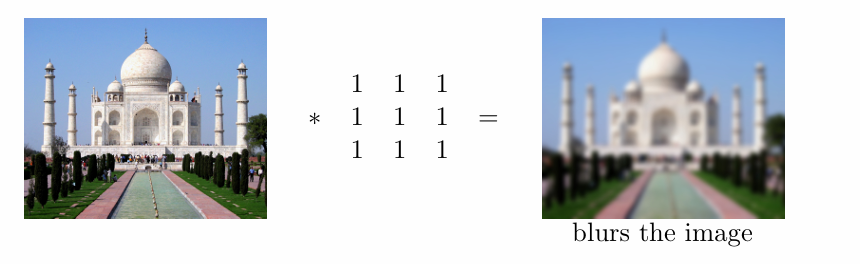
   - **Blurring Kernel**:
     $$
     \text{Kernel} = \begin{bmatrix} 1 & 1 & 1 \\ 1 & 1 & 1 \\ 1 & 1 & 1 \end{bmatrix}
     $$
     Applying this kernel averages neighboring pixel values, creating a blurred effect.

   - **Sharpening Kernel**:
     $$
     \text{Kernel} = \begin{bmatrix} 0 & -1 & 0 \\ -1 & 5 & -1 \\ 0 & -1 & 0 \end{bmatrix}
     $$
     This kernel enhances edges and details, making the image appear sharper.

   - **Edge Detection Kernel**:
     $$
     \text{Kernel} = \begin{bmatrix} 1 & 1 & 1 \\ 1 & -8 & 1 \\ 1 & 1 & 1 \end{bmatrix}
     $$
     This kernel highlights the edges by emphasizing regions with high contrast.

### 3. **Sliding the Kernel**:
   - The kernel slides over the image, computing one output value per position by performing a weighted sum of pixel values within the kernel’s window.
   - The output at each position forms a single element in the resulting feature map.

### 4. **Output - Feature Map**:
   - Each kernel application produces a **feature map**, representing one type of transformation (e.g., blurring, sharpening, or edge detection).
   - **Multiple filters** can be applied to the same image to generate multiple feature maps, each highlighting different image characteristics.

### 5. **Extending to Higher Dimensions**:
   - In the **1D case**, a 1D filter slides over a 1D input (e.g., a time-series data).
   - In the **2D case**, a 2D filter slides over a 2D input (e.g., an image).
   - **3D Convolution**: This would involve a 3D filter applied to a 3D input (e.g., volumetric data, video frames over time).

To understand the relationship between input size, output size, and filter size in a convolutional layer, we can define some key quantities and derive the output dimensions based on these. Here’s the breakdown in points and notation:

### Key Quantities
1. **Input Dimensions**:
   - Width of input: $W_1$
   - Height of input: $H_1$
   - Depth of input: $D_1$

2. **Filter Characteristics**:
   - Number of filters: $K$
   - Spatial extent of each filter (filter size): $F$
   - Depth of each filter: same as depth of input, $D_1$

3. **Stride**:
   - Stride: $S$ (This is the step size at which the filter moves over the input.)

4. **Output Dimensions**:
   - Width of output: $W_2$
   - Height of output: $H_2$
   - Depth of output: $D_2 = K$ (since each filter produces one channel in the output)

### Calculating the Output Dimensions

To compute the dimensions $W_2$ and $H_2$ of the output, use the following formulas:

$$
W_2 = \frac{W_1 - F}{S} + 1
$$
$$
H_2 = \frac{H_1 - F}{S} + 1
$$

### Important Observations

- **Boundary Condition**: The filter cannot be placed at the edges or corners of the input if it would cross the input boundaries. This limits the area over which the filter can be applied, leading to a smaller output dimension than the input.
- **Impact of Filter Size**: As the filter size $F$ increases, the output dimensions $W_2$ and $H_2$ decrease because more of the input area is excluded at the boundaries. For example, using a $5 \times 5$ filter would yield a smaller output than using a $3 \times 3$ filter for the same input.

### Summary

In summary, the output dimensions $W_2$, $H_2$, and $D_2$ depend on:
- **Input dimensions** $W_1$, $H_1$, and $D_1$
- **Filter size** $F$
- **Stride** $S$
- **Number of filters** $K$

A **filter** (also known as a **kernel** or **convolutional kernel**) in the context of convolutional neural networks (CNNs) is a small matrix of values used to detect patterns, features, or regions of interest in the input data, such as images. The filter "slides" over the input, performing an element-wise multiplication between the values in the filter and a portion of the input, producing a single output value. This operation is repeated across the entire input to generate a transformed output, called the **feature map**.

### Key Characteristics of Filters

1. **Size**:
   - Filters have a specified **height** and **width**, often represented as $F \times F$, where $F$ is the spatial extent of the filter.
   - Common filter sizes are $3 \times 3$, $5 \times 5$, or $7 \times 7$.
   - The **depth** of a filter matches the depth of the input it is applied to. For example, if an image has three color channels (RGB), each filter would also have a depth of 3.

2. **Weights in a Filter**:
   - Each position in the filter has a **weight**, which is a learned value that adapts during the training process to detect specific patterns.
   - These weights are applied to regions of the input, and their learned values help the filter to recognize features like edges, textures, or complex patterns.

3. **Number of Filters**:
   - A layer in a CNN typically uses multiple filters to capture various features of the input.
   - For example, one filter might detect vertical edges, another might detect horizontal edges, and others might capture texture patterns or other features.

4. **Stride**:
   - The **stride** determines how much the filter moves each time it slides across the input. A stride of 1 means the filter moves one pixel at a time, while a stride of 2 means it moves two pixels at a time.
   - The stride affects the output dimensions: a larger stride results in a smaller output size.

### Example of a Filter in Action

Consider a **3x3 filter** sliding over a **5x5 grayscale image**:

- **Filter**:
  $$
  \begin{bmatrix}
  -1 & 0 & 1 \\
  -1 & 0 & 1 \\
  -1 & 0 & 1 \\
  \end{bmatrix}
  $$
  This filter is designed to detect **vertical edges**.

- **Image (5x5)**:
  $$
  \begin{bmatrix}
  0 & 0 & 0 & 0 & 0 \\
  0 & 255 & 255 & 255 & 0 \\
  0 & 255 & 255 & 255 & 0 \\
  0 & 255 & 255 & 255 & 0 \\
  0 & 0 & 0 & 0 & 0 \\
  \end{bmatrix}
  $$

When the filter is applied to the image, it performs element-wise multiplication and sums the results for each position. For example:

1. The filter starts at the top-left corner of the image, aligning with the first $3 \times 3$ section.
2. The filter slides over one pixel to the right, computes a new weighted sum, and repeats this process across the image.

### Summary

- A **filter** is a small matrix used in CNNs to extract patterns or features from an input.
- Filters vary in size, depth, and weight values, and are optimized during training to detect specific features.
- Applying filters across an input results in a **feature map**, which represents the transformed output and highlights the detected features.

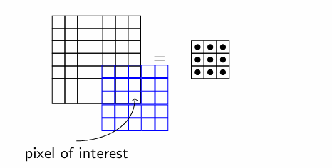

### General Formula for Output Dimensions

Given:
- **Input Width ($W_1$)** and **Input Height ($H_1$)**
- **Filter Size** (or **Spatial Extent, $F$**): For a square filter, $F \times F$
- **Stride $S$**: The number of pixels the filter moves at each step (typically 1)
- **Padding $P$**: Zero-padding applied to input borders, often to preserve output size

The formulas for output width ($W_2$) and height ($H_2$) without considering padding are as follows:

$$
W_2 = \frac{W_1 - F}{S} + 1
$$
$$
H_2 = \frac{H_1 - F}{S} + 1
$$

### Boundary Constraints and Smaller Outputs

If padding is **not** applied, the filter cannot process the edge pixels fully, as it would go beyond the input's boundaries. This results in reduced output dimensions relative to the input.

#### Example: 5x5 Kernel on Smaller Outputs

Consider an input with:
- Input Width ($W_1$) = 10
- Input Height ($H_1$) = 10

Using a $5 \times 5$ kernel (with no padding and a stride of 1):

$$
W_2 = H_2 = \frac{10 - 5}{1} + 1 = 6
$$

Thus, the output dimensions are $6 \times 6$, which is smaller than the input dimensions. 

### Impact of Filter Size

This reduction in size becomes more pronounced as the filter size increases relative to the input dimensions. With larger filters, fewer pixels remain for the filter to slide across, leading to even smaller output dimensions.

To maintain the same output size as the input, we can use **padding**, which involves adding a certain number of extra rows and columns (filled with zeros) around the input matrix. This allows the filter to be applied even at the borders without reducing the output dimensions.

### Padding Explained
Padding fills the border of the input matrix with zeros, enabling the kernel to slide across the entire input, including the corners. This way, the output has the same width and height as the original input.

#### Example of Padding with $ P = 1 $
If we use a $3 \times 3$ filter with padding $ P = 1 $:
- We add one row of zeros at the top and bottom and one column of zeros on the left and right.
- This effectively increases the input dimensions by 2 (one zero-padding on each side).

### Formula for Output Dimensions with Padding
The formulas for output width ($W_2$) and height ($H_2$) when padding is applied become:

$$
W_2 = \frac{W_1 - F + 2P}{S} + 1
$$
$$
H_2 = \frac{H_1 - F + 2P}{S} + 1
$$

### Example
For an input size of $W_1 = 5$ and $H_1 = 5$, with a filter size $F = 3$, padding $P = 1$, and stride $S = 1$:

$$
W_2 = \frac{5 - 3 + 2 \times 1}{1} + 1 = 5
$$
$$
H_2 = \frac{5 - 3 + 2 \times 1}{1} + 1 = 5
$$

Thus, the output dimensions remain $5 \times 5$, the same as the input dimensions. 

By adjusting $P$, we can control the output size relative to the input size, often preserving it or customizing it as needed for specific applications.

The **stride $S$** defines the step size at which the filter moves across the input. A larger stride results in the filter “jumping” over pixels, effectively reducing the size of the output. 

### Understanding Stride with an Example
- With a stride $S = 1$, the filter slides over each adjacent pixel, providing maximum overlap.
- With a stride $S = 2$, the filter skips every second pixel, resulting in fewer positions for the filter to be applied and, thus, a smaller output size.

### Updated Formula with Stride
Taking stride into account, the formula for the output dimensions $W_2$ and $H_2$ becomes:

$$
W_2 = \frac{W_1 - F + 2P}{S} + 1
$$
$$
H_2 = \frac{H_1 - F + 2P}{S} + 1
$$

### Example
For an input with:
- Width $W_1 = 7$, Height $H_1 = 7$
- Filter size $F = 3$
- Padding $P = 1$
- Stride $S = 2$

The output dimensions would be:

$$
W_2 = \frac{7 - 3 + 2 \times 1}{2} + 1 = 4
$$
$$
H_2 = \frac{7 - 3 + 2 \times 1}{2} + 1 = 4
$$

So, the output would be $4 \times 4$, showing that increasing the stride reduces the output size. This is commonly used to downsample data within convolutional networks.
 
---

In convolutional layers, the **depth of the output** ($D_2$) is determined by the number of filters applied. Here’s a step-by-step breakdown:

### 1. Depth of Output ($D_2$)
   - Each filter produces a single 2D output, known as a feature map.
   - By applying $K$ filters, we get $K$ 2D feature maps.
   - Therefore, the depth $D_2$ of the output is simply $K$, i.e., $D_2 = K$.

   We can view the final output as a **volume of dimensions $K \times W_2 \times H_2$**.

### 2. Final Formula for Output Dimensions
   Including width, height, and depth, the formulas are as follows:

   - Width:  
     $$ 
     W_2 = \frac{W_1 - F + 2P}{S} + 1 
     $$

   - Height:  
     $$ 
     H_2 = \frac{H_1 - F + 2P}{S} + 1 
     $$

   - Depth:  
     $$ 
     D_2 = K 
     $$

### Example Calculation
Given:
   - Input width $W_1 = 32$, height $H_1 = 32$, and depth $D_1 = 1$
   - Filter size $F = 5$
   - Number of filters $K = 6$
   - Stride $S = 1$
   - Padding $P = 0$

   Calculating output dimensions:

   $$
   W_2 = \frac{32 - 5 + 2 \times 0}{1} + 1 = 28
   $$
   $$
   H_2 = \frac{32 - 5 + 2 \times 0}{1} + 1 = 28
   $$
   $$
   D_2 = K = 6
   $$

The output dimensions are $6 \times 28 \times 28$, showing a volume with height and width reduced by the kernel size and depth determined by the number of filters.

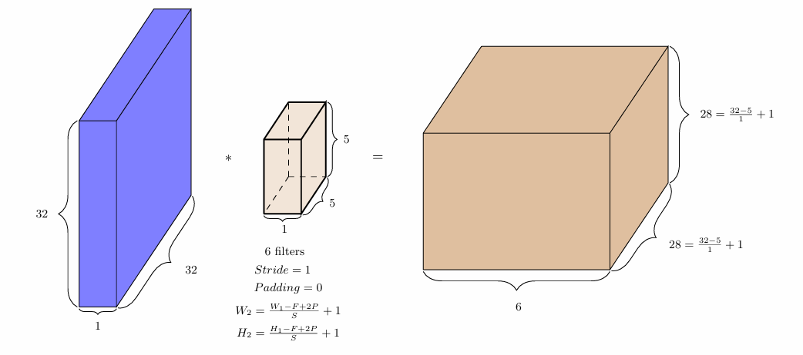

In **Convolutional Neural Networks (CNNs)**, the convolution operation is a foundational building block. CNNs are particularly effective in image classification tasks, and here’s how convolution fits into the architecture of a neural network:

### Key Concepts and Connection to Neural Networks
- **Convolution Operation**: CNNs apply convolutional filters (kernels) over an input image to detect various features like edges, textures, and patterns. 
- **Learnable Filters**: Unlike traditional edge detectors or handcrafted filters, CNNs learn these filters automatically during training. This means they can identify the most relevant features for a given task, such as recognizing different objects in an image.
- **Multiple Layers of Filters**: CNNs typically use multiple layers, each containing many filters that learn progressively complex features:
  - **Lower layers** detect simple features, such as edges or textures.
  - **Higher layers** combine these features to recognize more complex shapes or entire objects.
  
### Training Filters with Backpropagation
- **Learning Filters**: During training, CNNs treat filters as learnable parameters, similar to the weights in a fully connected neural network.
- **Backpropagation**: Using backpropagation, CNNs adjust filter values along with classifier weights to minimize classification error, leading to an optimal set of learned filters for the task.

### Final Perspective
This structure allows CNNs to automatically and efficiently learn feature representations directly from the data. By stacking layers of learned filters, CNNs become highly effective at complex tasks like image classification, making them central to many vision-based AI systems.

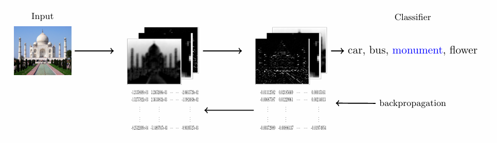

### Differences between the CNN and Feed forward neural network
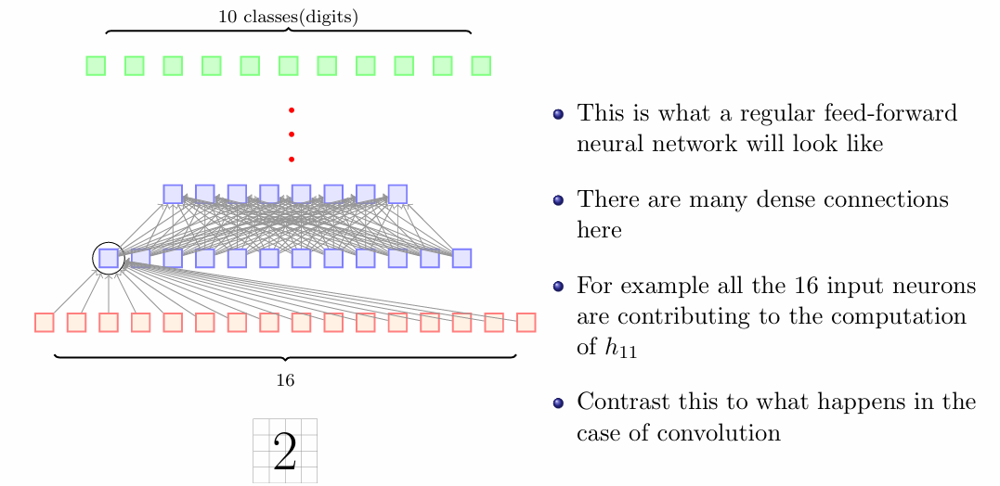

**weight sharing** and **sparse connectivity** in Convolutional Neural Networks (CNNs):

---

### Weight Sharing in CNNs
- **What It Is**: Using the same filter (or kernel) weights across different parts of the input image.
- **Purpose**: Allows CNNs to detect features (like edges) regardless of their position in the image.
- **Benefits**:
  1. **Fewer Parameters**: Reduces the total number of weights, speeding up training and minimizing overfitting risk.
  2. **Translation Invariance**: Helps the model recognize the same features even if they appear in different locations.
  3. **Scalability**: Makes it easier to handle larger images without significantly increasing the number of parameters.

**Example**: An edge-detection kernel is learned once and applied across the entire image, rather than learning a unique kernel for each position.

---

### Kernels vs. Filters
- **Kernel**: A small matrix (e.g., \(3 \times 3\)) used to perform convolution and extract specific features from the image.
- **Filter**: A broader term that includes a set of kernels used to generate a feature map representing specific characteristics (like edges or textures).

| Aspect         | Kernel                                         | Filter                                           |
|----------------|------------------------------------------------|--------------------------------------------------|
| **Definition** | Small matrix for convolution.                  | Set of kernels for one feature map.             |
| **Purpose**    | Detects local features.                        | Combines outputs from kernels for features.     |
| **Usage**      | Applies to small regions (local).             | Gathers kernel outputs for complete feature representation. |

---

### Sparse Connectivity in CNNs
- **Definition**: Each neuron connects only to a small region of neurons in the previous layer.
- **Purpose**: Focusing on local areas makes the network efficient and captures localized features.
- **Advantages**:
  1. **Reduced Parameters**: Fewer connections lead to less complexity and reduce the risk of overfitting.
  2. **Localized Feature Detection**: Captures patterns (like edges) that are typically found in neighboring pixels.

**Concern**: While some pixel interactions are ignored, information still propagates through deeper layers, allowing for integration of broader context.

---

### Summary
- **Weight Sharing** and **Sparse Connectivity** in CNNs enhance efficiency by reducing complexity and enabling robust feature detection across images.
- These strategies allow CNNs to effectively handle large datasets while minimizing computational demands.

--- 

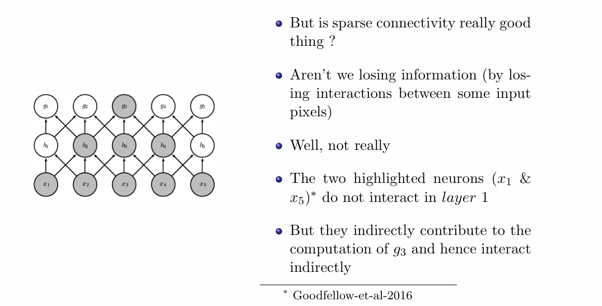
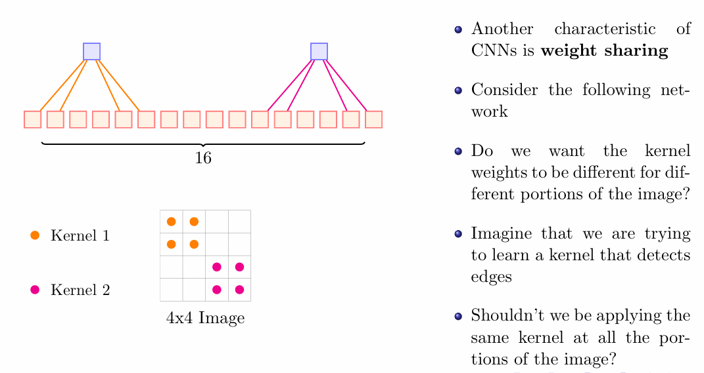

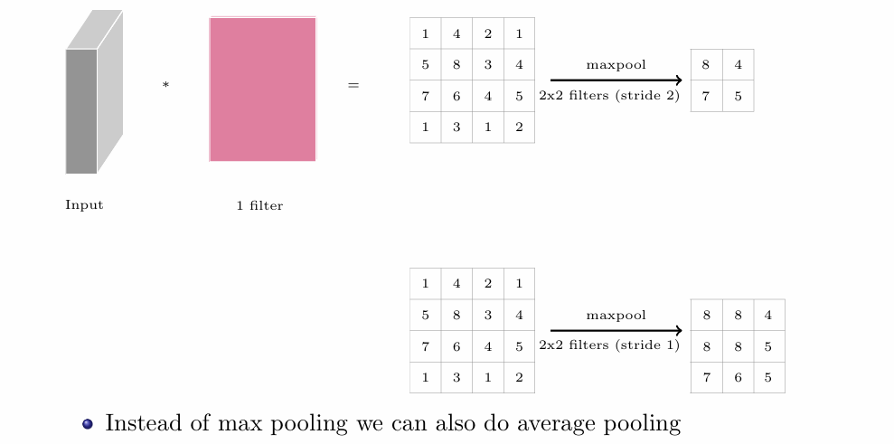

### Pooling in CNNs
1. **Input and Filter**:
   - The image shows an input volume and a filter being applied.

2. **Max Pooling**:
   - **Operation**: Uses a $2 \times 2$ filter with a stride of 2.
   - **Result**: Outputs the maximum values from the regions covered by the filter.
   - **Example Output**: 
     - From the input matrix, the max pooling results in:
       - $8, 4$
       - $7, 5$

3. **Average Pooling**:
   - **Alternative to Max Pooling**: Instead of taking the maximum value, average pooling calculates the average of the values in the filter's coverage.
   - **Example Output**: 
     - From the input matrix, the average pooling results in:
       - $8, 8, 4$
       - $7, 6, 5$

4. **Pooling Benefits**:
   - Reduces the spatial dimensions of the input, leading to fewer parameters and computations in the network.
   - Helps in retaining important features while discarding less significant information.

### Max Pooling

**Formula**: For a region of the input feature map covered by the filter, max pooling takes the maximum value.

$$
\text{Max Pooling Output} = \max(\text{region})
$$

**Example**: 

Given the following $4 \times 4$ input feature map:

$$
\begin{bmatrix}
1 & 2 & 3 & 4 \\
5 & 6 & 7 & 8 \\
9 & 10 & 11 & 12 \\
13 & 14 & 15 & 16
\end{bmatrix}
$$

If we apply a $2 \times 2$ max pooling filter with a stride of 2:

1. **First Region (Top-left)**:
   - Consider the region:
   $$
   \begin{bmatrix}
   1 & 2 \\
   5 & 6
   \end{bmatrix}
   $$
   - Max value: $6$

2. **Second Region (Top-right)**:
   - Consider the region:
   $$
   \begin{bmatrix}
   3 & 4 \\
   7 & 8
   \end{bmatrix}
   $$
   - Max value: $8$

3. **Third Region (Bottom-left)**:
   - Consider the region:
   $$
   \begin{bmatrix}
   9 & 10 \\
   13 & 14
   \end{bmatrix}
   $$
   - Max value: $14$

4. **Fourth Region (Bottom-right)**:
   - Consider the region:
   $$
   \begin{bmatrix}
   11 & 12 \\
   15 & 16
   \end{bmatrix}
   $$
   - Max value: $16$

**Output of Max Pooling**:
$$
\begin{bmatrix}
6 & 8 \\
14 & 16
\end{bmatrix}
$$

### Average Pooling

**Formula**: For a region of the input feature map covered by the filter, average pooling computes the average value.

$$
\text{Average Pooling Output} = \frac{1}{n} \sum_{i=1}^{n} \text{region}_i
$$
Where $n$ is the number of elements in the region.

**Example**:

Using the same $4 \times 4$ input feature map:

$$
\begin{bmatrix}
1 & 2 & 3 & 4 \\
5 & 6 & 7 & 8 \\
9 & 10 & 11 & 12 \\
13 & 14 & 15 & 16
\end{bmatrix}
$$

Applying a $2 \times 2$ average pooling filter with a stride of 2:

1. **First Region (Top-left)**:
   - Consider the region:
   $$
   \begin{bmatrix}
   1 & 2 \\
   5 & 6
   \end{bmatrix}
   $$
   - Average: 
   $$
   \frac{1 + 2 + 5 + 6}{4} = \frac{14}{4} = 3.5
   $$

2. **Second Region (Top-right)**:
   - Consider the region:
   $$
   \begin{bmatrix}
   3 & 4 \\
   7 & 8
   \end{bmatrix}
   $$
   - Average: 
   $$
   \frac{3 + 4 + 7 + 8}{4} = \frac{22}{4} = 5.5
   $$

3. **Third Region (Bottom-left)**:
   - Consider the region:
   $$
   \begin{bmatrix}
   9 & 10 \\
   13 & 14
   \end{bmatrix}
   $$
   - Average: 
   $$
   \frac{9 + 10 + 13 + 14}{4} = \frac{46}{4} = 11.5
   $$

4. **Fourth Region (Bottom-right)**:
   - Consider the region:
   $$
   \begin{bmatrix}
   11 & 12 \\
   15 & 16
   \end{bmatrix}
   $$
   - Average: 
   $$
   \frac{11 + 12 + 15 + 16}{4} = \frac{54}{4} = 13.5
   $$

**Output of Average Pooling**:
$$
\begin{bmatrix}
3.5 & 5.5 \\
11.5 & 13.5
\end{bmatrix}
$$

### Summary
- **Max Pooling** captures the highest value in each region, which may be useful for detecting dominant features.
- **Average Pooling** computes the average of values, helping to smooth out the outputs and may be used for reducing sensitivity to specific weights in the feature map.

---

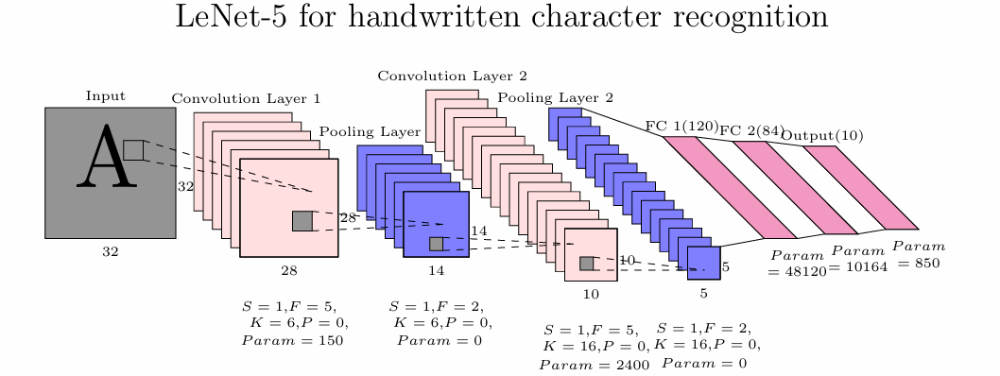

---

### LeNet-5 Architecture Overview

**Purpose**: Handwritten digit recognition (MNIST)

### 1. Input Layer
- **Input Size**: $32 \times 32$ grayscale image
- **Note**: MNIST images ($28 \times 28$) are typically padded to $32 \times 32$.

---

### 2. Convolutional Layer 1 (C1)
- **Kernel Size (F)**: $5 \times 5$
- **Stride (S)**: $1$
- **Padding (P)**: $0$
- **Number of Filters (K)**: $6$
- **Output Size**: $28 \times 28 \times 6$
- **Parameters Calculation**:
  $$
  \text{Parameters} = (5 \times 5 \times 1) \times 6 + 6 = 150
  $$

---

### 3. Pooling Layer 1 (S2)
- **Type**: Subsampling (Average Pooling)
- **Kernel Size (F)**: $2 \times 2$
- **Stride (S)**: $2$
- **Output Size**: $14 \times 14 \times 6$
- **Parameters**: $0$ (no trainable parameters)

---

### 4. Convolutional Layer 2 (C3)
- **Kernel Size (F)**: $5 \times 5$
- **Stride (S)**: $1$
- **Padding (P)**: $0$
- **Number of Filters (K)**: $16$
- **Output Size**: $10 \times 10 \times 16$
- **Parameters Calculation**:
  $$
  \text{Parameters} = (5 \times 5 \times 6) \times 16 + 16 = 2400
  $$

---

### 5. Pooling Layer 2 (S4)
- **Type**: Subsampling (Average Pooling)
- **Kernel Size (F)**: $2 \times 2$
- **Stride (S)**: $2$
- **Output Size**: $5 \times 5 \times 16$
- **Parameters**: $0$ (no trainable parameters)

---

### 6. Fully Connected Layer 1 (FC1)
- **Input Size**: $5 \times 5 \times 16 = 400$
- **Output Size**: $120$
- **Parameters Calculation**:
  $$
  \text{Parameters} = 400 \times 120 + 120 = 48120
  $$

---

### 7. Fully Connected Layer 2 (FC2)
- **Input Size**: $120$
- **Output Size**: $84$
- **Parameters Calculation**:
  $$
  \text{Parameters} = 120 \times 84 + 84 = 10164
  $$

---

### 8. Output Layer
- **Input Size**: $84$
- **Output Size**: $10$ (digits $0-9$)
- **Parameters Calculation**:
  $$
  \text{Parameters} = 84 \times 10 + 10 = 850
  $$

---

### Total Parameters Summary
- **Total Parameters in LeNet-5**:
$$
\text{Total} = 150 + 0 + 2400 + 0 + 48120 + 10164 + 850 = 60,060
$$

---

### Key Design Features of LeNet-5
- **Convolutional Layers**: Extract local features from the input image.
- **Pooling Layers**: Reduce spatial dimensions, minimizing computation and controlling overfitting.
- **Fully Connected Layers**: Classify based on the extracted features, acting as the final decision-making layer.

--- 
**How do we train a convolutional neural network ?**

### Training a Convolutional Neural Network (CNN)

1. **Forward Pass**:
   - **Input Layer**: Receives the image, divided into patches.
   - **Convolution**: A kernel/filter slides over the image, performing element-wise multiplication and summation to produce a feature map that highlights specific features (e.g., edges).

2. **Activation Functions**:
   - Apply non-linear functions (like ReLU) after each convolution to enable the network to model complex data patterns.

3. **Pooling**:
   - Use pooling layers (e.g., max pooling) to reduce the spatial dimensions of feature maps, decreasing computational load and improving translation invariance.

4. **Fully Connected Layers**:
   - Connect every neuron to the previous layer's neurons. These layers serve as classifiers, yielding network predictions based on extracted features.

5. **Backpropagation**:
   - **Calculate Loss**: Compare network prediction to the ground truth using a loss function (e.g., cross-entropy).
   - **Compute Gradients**: Use the chain rule to find gradients of the loss with respect to each parameter, considering shared weights in convolutional layers.
   - **Update Weights**: Adjust weights using an optimization algorithm like **SGD** or **Adam** to minimize loss.

6. **Iterate Through Epochs**:
   - Repeat the above steps across multiple epochs, allowing the model to learn and improve its accuracy in pattern recognition.

### Key Benefits:
- Structured sparsity and reduced parameters enhance computational efficiency, making CNNs effective for image recognition tasks.

--- 

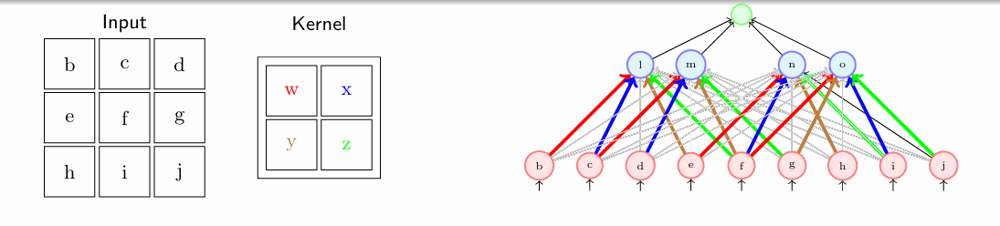

---

### CNNs (success stories on ImageNet)

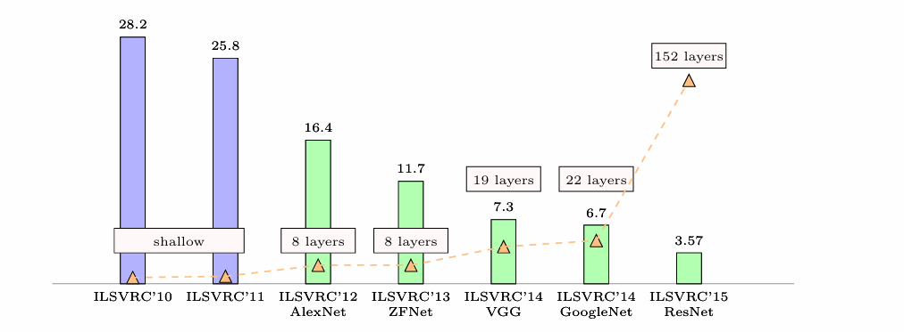

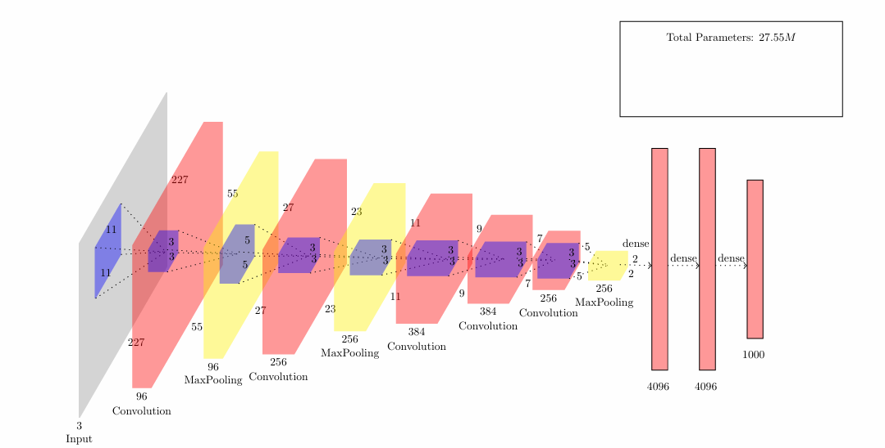
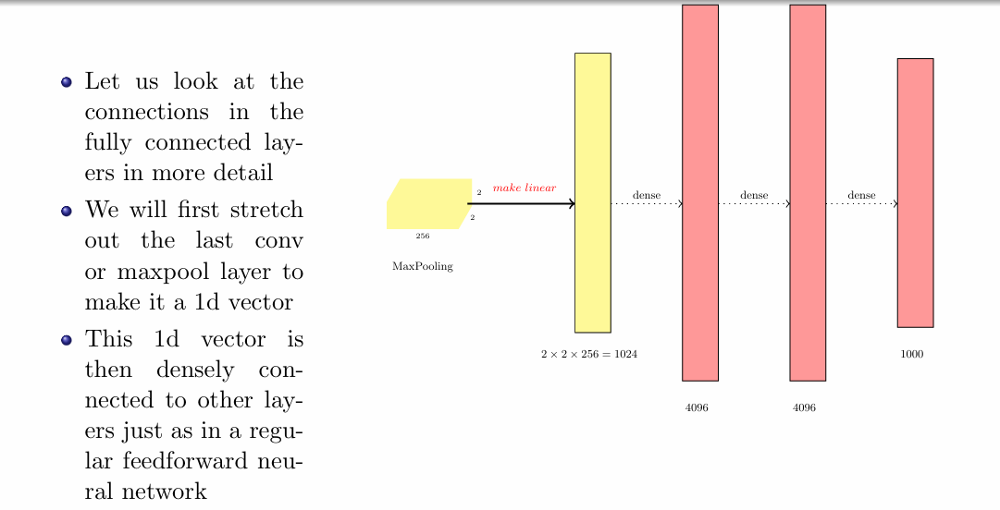

### AlexNet:

#### **Step 1: Final Convolutional Layer Calculation**

1. **Parameters of the Final Convolutional Layer:**
   - **Filter Size ($F$)**: $3$
   - **Stride ($S$)**: $2$
   - **Input Dimensions (Width, Height, Depth)**: $5 \times 5 \times 256$

2. **Calculate Output Dimensions:**
   Using the formula for output width ($W_2$) and height ($H_2$):
   $$
   W_2 = \frac{W_1 - F}{S} + 1
   $$
   $$
   H_2 = \frac{H_1 - F}{S} + 1
   $$

   - Substitute input dimensions into the equation:
   $$
   W_2 = \frac{5 - 3}{2} + 1 = \frac{2}{2} + 1 = 1 + 1 = 2
   $$
   $$
   H_2 = \frac{5 - 3}{2} + 1 = \frac{2}{2} + 1 = 1 + 1 = 2
   $$

3. **Output Dimensions:**
   - **Final Output**: **$2 \times 2 \times 256$**

---

#### **Step 2: Calculate Number of Parameters for the Final Convolutional Layer**

1. **Parameters Calculation:**
   - **Formula**: 
   $$
   \text{Parameters} = (F \times F \times \text{Depth}) \times \text{Number of Filters}
   $$

2. **Substituting Values:**
   - **Filter Size**: $3 \times 3 = 9$
   - **Depth**: $256$
   - **Number of Filters**: $256$

   Calculating the total parameters:
   $$
   \text{Parameters} = 9 \times 256 \times 256 = 589,824
   $$

---

#### **Step 3: Final Summary of Layer Output and Parameters**

- **Output Dimensions of the Final Convolution Layer**: **$2 \times 2 \times 256$**
- **Total Number of Parameters in the Final Convolution Layer**: **$589,824$**

---

#### **Step 4: Transition to Fully Connected Layers**

1. **Connection to Fully Connected Layers:**
   - After the final convolutional or max-pooling layer, we stretch out the output ($2 \times 2 \times 256$) into a 1D vector.

2. **Creating the 1D Vector:**
   - The total number of elements in the output is:
   $$
   2 \times 2 \times 256 = 1024
   $$
   - This forms a 1D vector of size **$1024$**.

3. **Connecting to Dense Layers:**
   - This 1D vector is then densely connected to other layers, similar to a regular feedforward neural network. The fully connected layers will use this vector as input to classify the features extracted by the previous layers.

---

### ZFNet

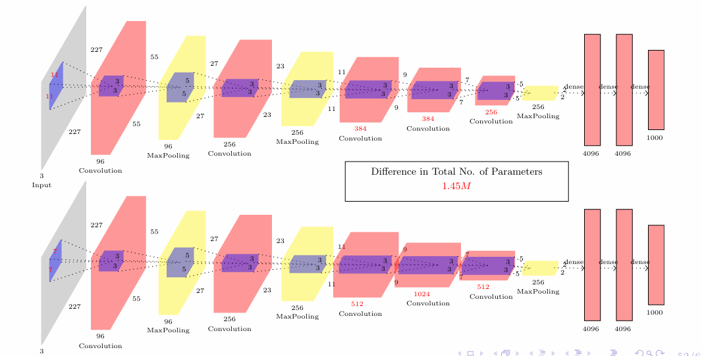

### VGGNet

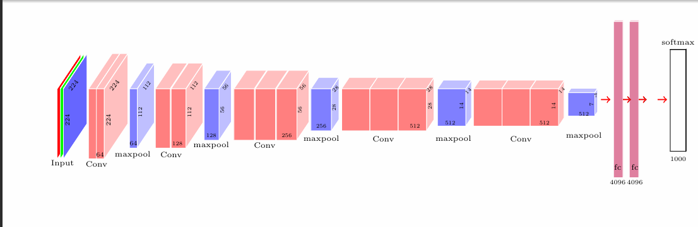

VGGNet is a deep convolutional neural network (CNN) model that employs a consistent **3x3 kernel size** across all its convolutional layers, making it suitable for high-resolution image inputs of size **224x224** pixels.

---

#### Key Components

1. **Input & Convolution Layers**:
   - **Input Dimensions**: **224x224x3** (height x width x channels)
   - **Convolutional Layers**:
     - All convolutional layers utilize **3x3 kernels**.
     - Padding is applied to ensure the spatial dimensions are preserved after convolution.
     - Filter counts are progressively increased at different stages:
       - **64 filters** → Outputs: **112x112**
       - **128 filters** → Outputs: **56x56**
       - **256 filters** → Outputs: **28x28**
       - **512 filters** → Outputs: **14x14** and **7x7**

2. **Max-Pooling Layers**:
   - Positioned after groups of convolutional layers.
   - Each max-pooling layer effectively downsamples the spatial dimensions by a factor of two.

3. **Fully Connected Layers (FC)**:
   - Consists of three fully connected layers:
     - **First FC Layer**: **4096 nodes**
     - **Second FC Layer**: **4096 nodes**
     - **Third FC Layer**: **1024 nodes**

4. **Softmax Layer**:
   - The final layer uses the softmax function to output classification probabilities across the various classes.

---

#### Parameter Count

- **Non-Fully Connected (Non-FC) Layers**: Approximately **16 million parameters**.
- **Fully Connected (FC) Layers Calculation**:
  - Calculation breakdown:
  $$
  \text{Parameters in FC Layers} = (512 \times 7 \times 7 \times 4096) + (4096 \times 4096) + (4096 \times 1024)
  $$
  - Detailed calculation:
    - From Conv Layer  --> **Input to First FC**: $512 \times 7 \times 7 \times 4096 =  14,899,456$
    - First FC to Second FC: $4096 \times 4096 = 16,777,216$
    - Second FC to Third FC: $4096 \times 1024 = 4,194,304$
    - **Total for FC Layers**: 
        $$
      14,899,456 + 16,777,216 + 4,194,304 = 35,871,976 \text{ (Approximately 36 million)}
        $$

#### Total Parameters

- **Total Parameters Calculation**:
  $$
  \text{Total} = \text{Non-FC Parameters} + \text{FC Parameters} 
  $$
  $$
  \text{Total} = 16M + 122M = \text{138 million parameters}
  $$

VGGNet's architecture takes advantage of the depth provided by layers of small filters while maintaining a manageable number of parameters. This design facilitates the efficient learning of complex features, showcasing the benefits of depth in deep learning.

--- 

###  Image Classifcation (GoogLeNet and ResNet)

### GoogLeNet and the Inception Module for Image Classification

GoogLeNet is a deep convolutional neural network (CNN) that incorporates **Inception modules** to effectively reduce computational costs while capturing complex features vital for image classification. Below are the key components and principles behind this architecture.

---

#### Key Components

1. **1x1 Convolutions for Dimensionality Reduction**:
   - **Purpose**: The **1x1 convolution** operates along the depth (channel) dimension, effectively compressing the number of feature maps.
   - **Input Size**: For an input volume of size **D x W x H** (Depth x Width x Height), applying **D1 < D** filters, where D1 is less than D, yields a compressed output of size **D1 x W x H**.
   - **Computational Efficiency**: This reduces the number of calculations required, as the complexity for each subsequent layer drops from **O(F x F x D)** to **O(F x F x D1)**, greatly enhancing efficiency.

2. **Parallel Filters and Max-Pooling**:
   - **Varied Filter Sizes**: In addition to 1x1 convolutions, multiple filters (such as 3x3 and 5x5) operate on the reduced-dimension input. This allows the network to capture features of differing scales.
   - **Max-Pooling**: A **3x3 max-pooling layer** is integrated for further dimensionality reduction, enabling efficient processing and feature extraction.

3. **Filter Concatenation**:
   - **Fusion of Outputs**: The outputs from the diverse filters (1x1, 3x3, 5x5) and the max-pooling layer are concatenated on the depth dimension.
   - **Feature Capture**: This concatenation allows the model to capture multiple levels of features (from fine details to broader patterns) within a single Inception module.

4. **Inception Module**:
   - **Core Architecture**: The Inception module serves as a foundational structure of GoogLeNet, comprising a blend of various convolutional layers.
   - **Independent Processing**: Each module processes and learns different feature types concurrently; these outputs are then merged, allowing the network to capture complex features while optimizing the number of computations needed.

---

#### Advantages of Using Inception Modules

- **Computational Efficiency**: By reducing dimensionality through 1x1 convolutions and employing mixed filter sizes, GoogLeNet avoids the heavy computational burden often associated with deeper networks.
- **Deep Architecture Capabilities**: The efficient structure enables the use of a deeper architecture without sacrificing performance, making it possible to train more robust models.
- **Multi-Scale Feature Extraction**: The ability to learn features at multiple scales within the same module enhances the model's capacity to discern intricate patterns and details across images.

---

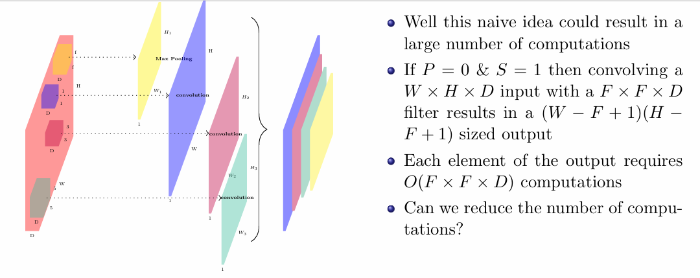
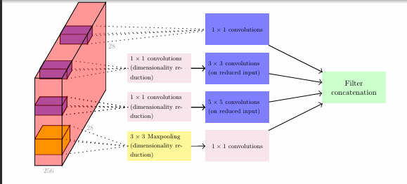
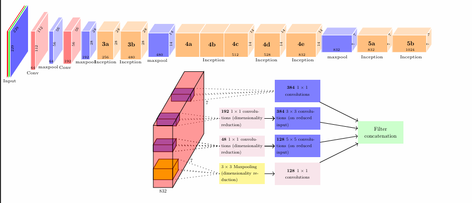
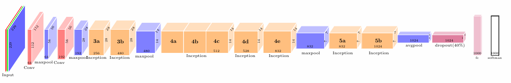

### Parameter Reduction in GoogLeNet

1. **Removal of Fully Connected (FC) Layer**:
   - An FC layer with **1000 nodes** for the **1000 classes** would require **49 million parameters** (7 x 7 x 1024 x 1000), making the model large and computationally intensive.

2. **Global Average Pooling**:
   - Instead of using an FC layer, GoogLeNet employs **global average pooling** over the **7 x 7** spatial dimensions of the **1024 feature maps**.
   - This results in a **1 x 1 x 1024** output, reducing it to **1024 dimensions**.

3. **Efficiency Gains**:
   - By using only **1024 parameters** instead of 49 million, the architecture remains compact and efficient while maintaining performance.
   - This approach helps mitigate overfitting, making it a widely adopted technique in deep networks.

### Comparison Between GoogLeNet and AlexNet

- **Parameters**: GoogLeNet has **12 million fewer parameters** than AlexNet (approximately **60 million**), making it more compact and efficient.

- **Computations**: GoogLeNet requires **2 times more computations** than AlexNet due to its deeper architecture and Inception modules.

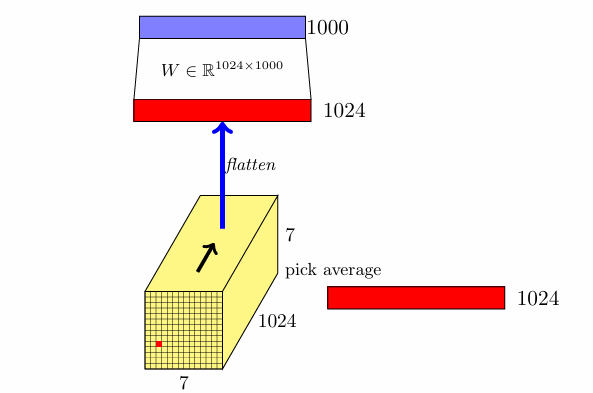

### ResNet
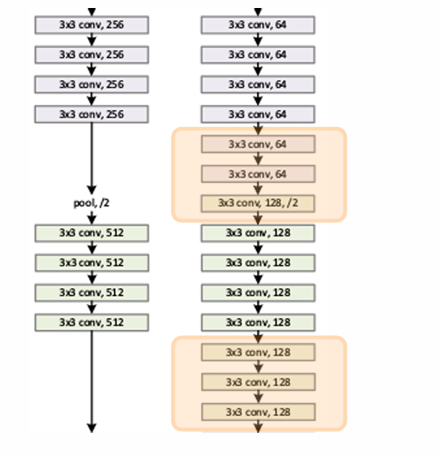

### ResNet and Residual Learning

**Residual Learning Concept**:
1. **Identity Mapping**: Deeper networks should ideally learn to approximate identity mappings, allowing new layers to "do nothing" if they don't improve performance. However, deeper networks often face challenges like vanishing gradients.
2. **Residual Connections**: ResNet introduces shortcuts that add the input of a layer directly to its output, simplifying gradient flow and enabling the network to more easily learn identity functions.
3. **Expanded Solution Space**: With residual connections, deeper networks can model both simple and complex functions, expanding their learning capability.

**Challenges of Deeper Networks**:
1. **Overfitting**: Greater parameter counts lead to a risk of overfitting.
2. **Vanishing/Exploding Gradients**: Increased layer depth complicates gradient flow during training.
3. **Optimization Issues**: More complex loss landscapes can hinder training.
4. **Learning Dynamics**: Poor feature representation in early layers affects deeper layers.
5. **Batch Normalization Instability**: Ineffective use can cause training instability.
6. **Architecture Design**: Network configuration influences performance.
7. **Evaluation Metrics**: Choice of metrics can affect perceived performance.

**Advantages of Residual Functions**:
1. **Ease of Optimization**: Learning residuals simplifies the problem.
2. **Mitigates Vanishing Gradients**: Ensures better gradient flow.
3. **Preserves Information**: Important features are retained.
4. **Encourages Feature Reuse**: Builds on previously learned features.
5. **Facilitates Training of Deep Networks**: Enables training of very deep architectures with lower error rates.
6. **Fewer Parameters**: Achieves performance with fewer parameters.
7. **Flexibility**: Easily adaptable to various tasks.

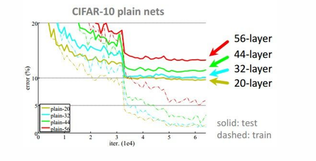
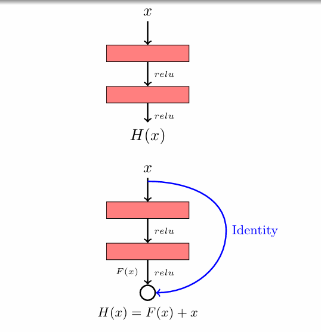

### ResNet Achievements and Training Strategies

**Achievements:**
1. **ImageNet Classification**: First place with ultra-deep 152-layer networks.
2. **ImageNet Detection**: 16% better performance than the second-best system.
3. **ImageNet Localization**: 27% improvement over the second-best.
4. **COCO Detection**: 11% better than the second-best.

**Training Strategies:**
1. **Batch Normalization**: Applied after every convolutional layer for stable learning.
2. **Xavier/2 Initialization**: Used to avoid vanishing/exploding gradients.
3. **Optimizer**: SGD with Momentum (0.9) for efficient convergence.
4. **Learning Rate**: Starting at 0.1, reduced by 10 when validation error plateaus.
5. **Mini-Batch Size**: Set at 256 for balanced training.
6. **Weight Decay**: Regularization with a weight decay of 1e-5.
7. **No Dropout**: Relied on residual connections and batch normalization for regularization.

### Summary
ResNet's innovative residual connections and these training techniques led to its exceptional performance in image classification and detection tasks, setting a new benchmark in deep learning.