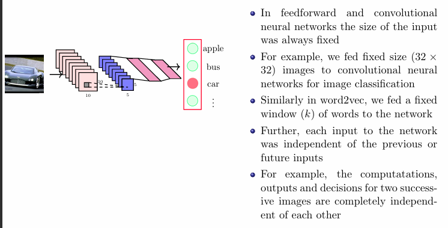

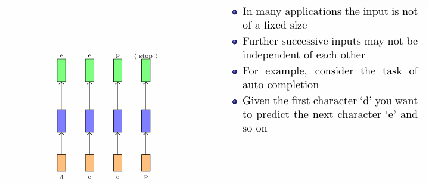

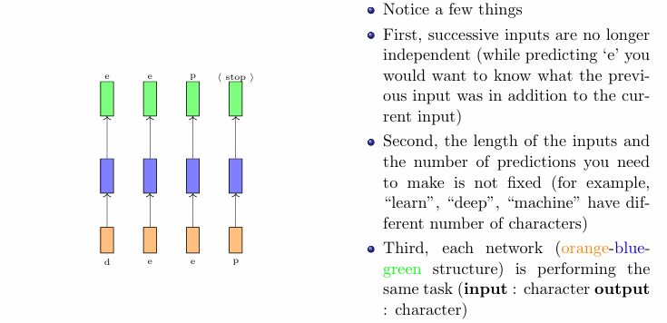

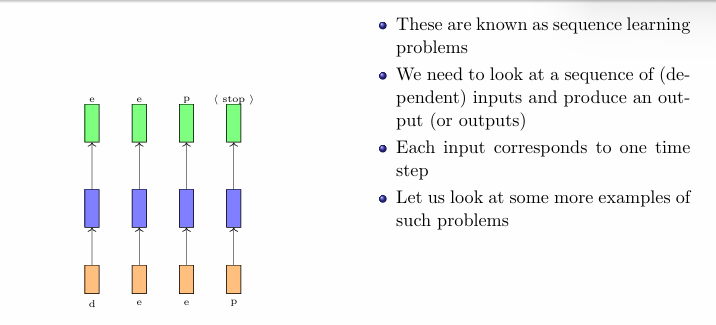

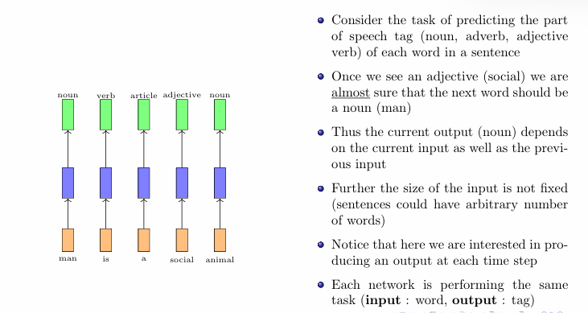

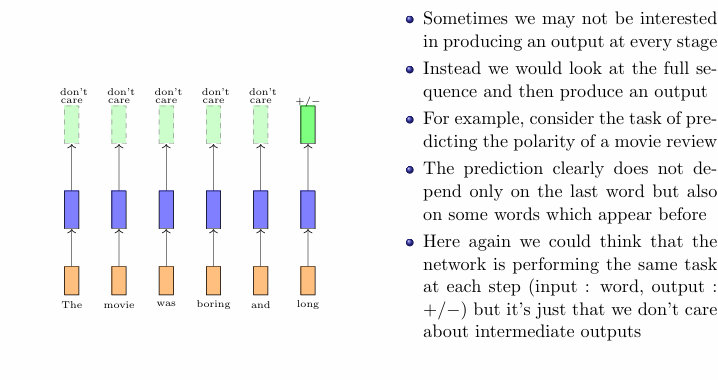

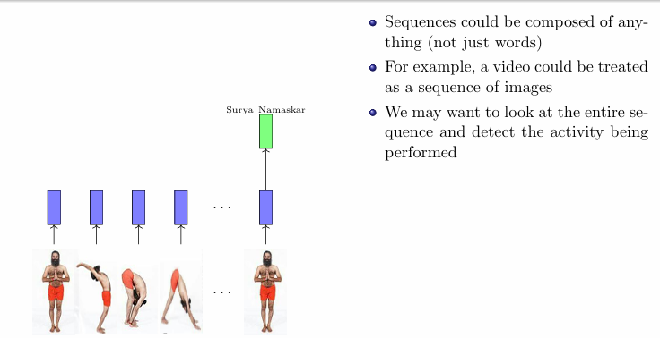

## Recurrent Neural Networks

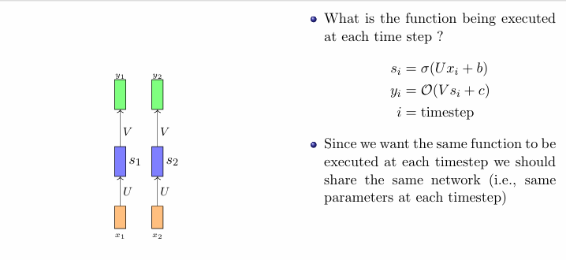
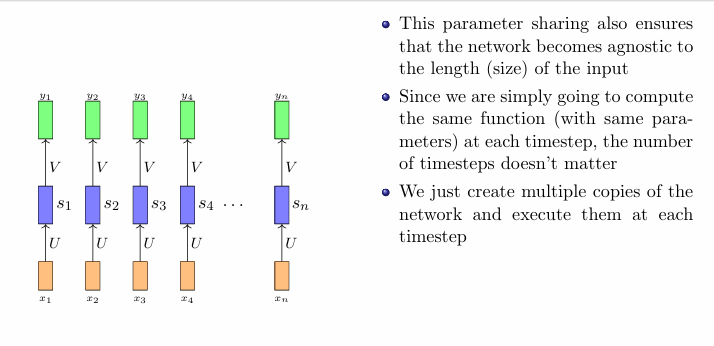
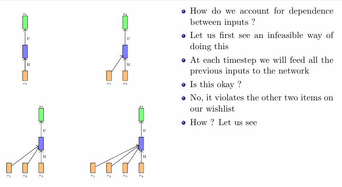

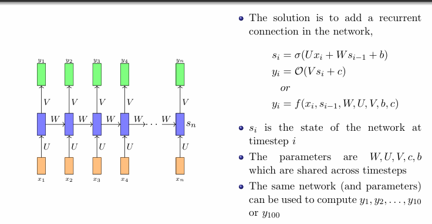
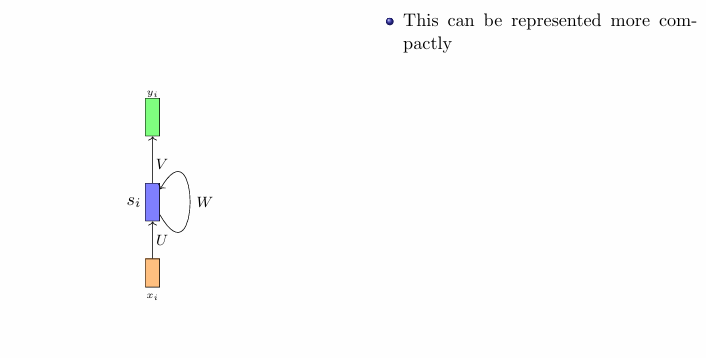

### Recurrent Neural Networks (RNNs) Overview

- **Definition**: RNNs are specialized neural networks designed to process sequences of data by handling inputs one timestep at a time.
- **Purpose**: They retain information about previous timesteps, enabling them to capture temporal dependencies across sequences.
- **Applications**: Ideal for tasks involving time-series data, language modeling, and more.

#### Function at Each Timestep

1. **Hidden State Update**:
   $$
   s_i = \sigma(Ux_i + b)
   $$
   - **$U$**: Weight matrix that transforms the input $x_i$.
   - **$b$**: Bias term for hidden state adjustment.
   - **$\sigma$**: Activation function (e.g., tanh, ReLU) introducing non-linearity.

2. **Output Computation**:
   $$
   y_i = O(Vs_i + c)
   $$
   - **$V$**: Weight matrix that transforms the hidden state into output.
   - **$c$**: Bias term for output computation.
   - **$O$**: Activation function for output layer (e.g., softmax for classification).

#### Benefits of RNN Structure
- **Parameter Sharing**: Same parameters ($U$, $V$, $b$, $c$) are used across all timesteps, allowing consistent learning across sequence positions.
- **Input Length Agnosticism**: RNNs can process sequences of varying lengths by replicating the function for the required number of timesteps.

#### Temporal Dependencies in RNNs

- **Challenge**: Capturing dependencies between inputs over time is critical for effective sequence modeling.
- **Initial Approach**: Feeding all previous inputs $(x_1, x_2, ..., x_{i-1})$ at each timestep leads to:
  - **Parameter Sharing Violation**: Unique parameters would be needed for each timestep, contradicting parameter-sharing principles.
  - **Scalability Issues**: Increased input size with more timesteps makes this approach computationally impractical for long sequences.

#### Efficient Solution: Using Hidden States

- **Hidden States**: RNNs utilize hidden states to carry context from one timestep to the next.
  - Instead of feeding all previous inputs, the hidden state $s_{i-1}$ from timestep $i-1$ is used alongside $x_i$.
  - The hidden state updates at each timestep, encoding information about prior inputs in a fixed-size vector.

- **Advantages**:
  - Maintains internal memory of the sequence, preserving temporal dependencies.
  - Efficiently captures sequence patterns without violating parameter sharing or scalability principles.

### Structural Evolution of Recurrent Neural Networks (RNNs)

**Overview**  
RNNs address the challenges posed by conventional feedforward networks in managing sequence dependencies and variability in input lengths. Here's a detailed breakdown:

### 1. Problem in Feedforward Networks
- **Unique Functions for Each Timestep**: In a feedforward network, processing each timestep $i$ would require a distinct function $f_i$ that incorporates all previous inputs:
  $$
  y_1 = f_1(x_1) \\
  y_2 = f_2(x_1, x_2) \\
  y_3 = f_3(x_1, x_2, x_3)
  $$
- **Limitations**:
  - **Sensitive to Sequence Length**: Each sequence length demands a different number of functions (e.g., $f_1$ to $f_{10}$ for length $10$, and $f_1$ to $f_{100}$ for length $100$).
  - **Scalability Issues**: Growing sequence lengths increase the number of parameters and functions required, making training inefficient.

### 2. Solution: Adding a Recurrent Connection
- **Introduction of Hidden State**: To address the limitations of feedforward networks, RNNs maintain an internal hidden state $s_i$ that updates over time, capturing information from prior inputs:
  $$
  s_i = \sigma(Ux_i + Ws_{i-1} + b)
  $$
  where:
  - **$s_{i-1}$**: Hidden state from the previous timestep.
  - **$U$**: Weight matrix for the current input.
  - **$W$**: Weight matrix for the recurrent connection.
  - **$b$**: Bias term.
  - **$\sigma$**: Non-linear activation function (e.g., tanh or ReLU).

- **Output Computation**: The output at each timestep is:
  $$
  y_i = O(Vs_i + c)
  $$
  where:
  - **$V$**: Weight matrix for the transformation from hidden state to output.
  - **$c$**: Bias term for the output layer.
  - **$O$**: Activation function for producing the output.

- **Advantages of RNN Structure**:
  - **Parameter Sharing**: The same parameters $W$, $U$, $V$, $b$, and $c$ are used across all timesteps, allowing the network to adapt to sequences of different lengths without increasing complexity.
  - **Efficient Processing**: The RNN computes the same function at each timestep, avoiding the growth in parameters with increased input length.

### 3. Compact Representation of RNN Computation
- The entire process can be expressed as:
  $$
  y_i = f(x_i, s_{i-1}, W, U, V, b, c)
  $$
  This function integrates the current input and previous hidden state while utilizing shared parameters, enabling the RNN to process sequences while effectively capturing temporal dependencies and adapting to varying lengths.

### 4. Network Diagram Summary
- **Feedforward Process**: Illustrates limitations where each output depends on an increasing number of inputs.
- **Recurrent Structure**: Visualizes the addition of a recurrent loop from $s_{i-1}$ to $s_i$ to show how hidden states help capture dependencies.
- **Parameter Sharing**: Demonstrates how the same parameters enable the network to handle varied sequence lengths.

### 5. Applications of RNNs in Sequence Data
RNNs are especially suited for tasks involving ordered or time-dependent data:

- **Text Sequences**: Words in sentences or paragraphs are processed sequentially, where meaning is often context-dependent based on previous words.
- **Image Sequences**: Videos or time-lapse images where each frame relies on the preceding context, applicable in action recognition or tracking.

### 6. RNN Modeling of Sequence Data
- At each timestep $i$:
  1. The **input $x_i$** is processed alongside the **hidden state $s_{i-1}$** from the previous timestep.
  2. This generates a new **hidden state $s_i$**, encoding information about past inputs.
  3. The **output $y_i$** at each timestep is generated based on the current input and evolving hidden state.

### 7. Key Benefits and Applications of RNNs
- **Capturing Sequential Dependencies**: RNNs effectively model sequences using a hidden state as memory, capable of learning both long and short dependencies.
- **Parameter Sharing**: Shared parameters allow RNNs to dynamically handle sequences of varying lengths.
- **Domain Flexibility**: RNNs can be utilized across text, speech, and image processing tasks, making them foundational in fields like natural language processing and computer vision.

### Backpropagation through time
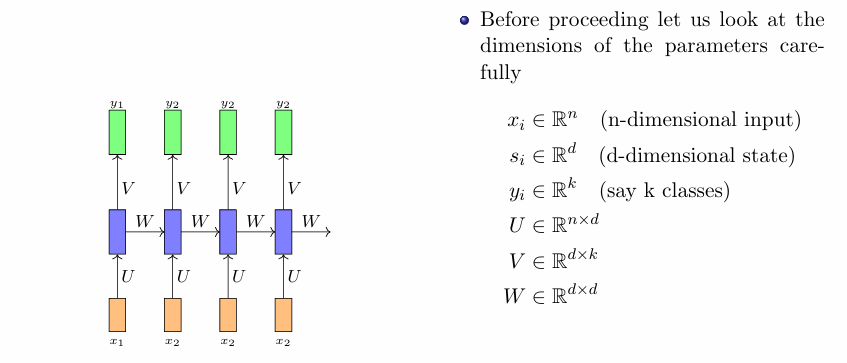
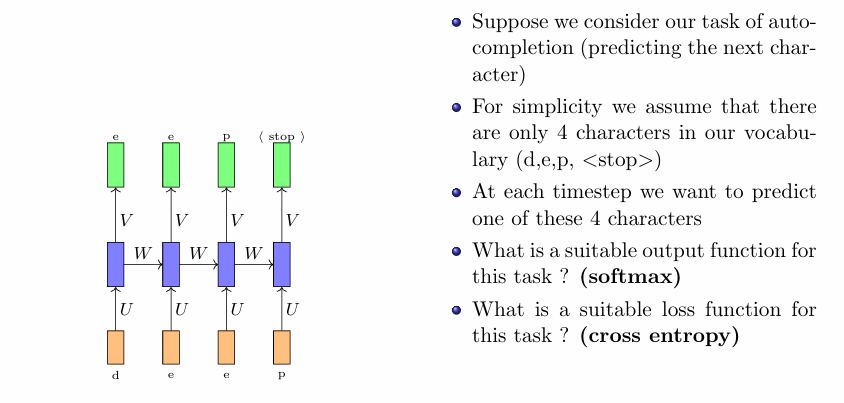
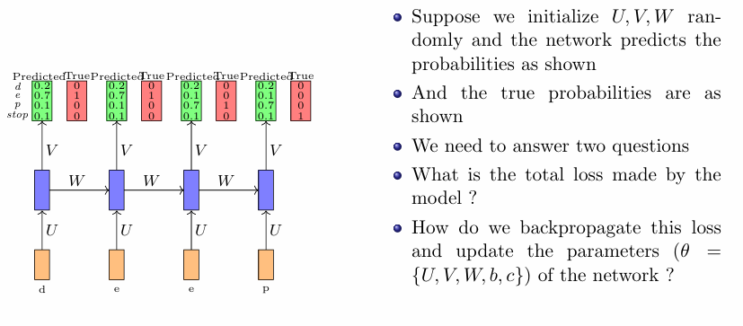
### Backpropagation Through Time (BPTT) Explained Simply

Backpropagation Through Time (BPTT) is an extension of the standard backpropagation algorithm designed specifically for training Recurrent Neural Networks (RNNs). It allows the network to learn from sequences of data by considering how the output is influenced by inputs over multiple time steps. Let’s break it down step by step, using a simple auto-completion example to illustrate the concepts.

### Key Concepts and Parameters

#### RNN Structure
In an RNN, at every timestep $i$, there are three main components:

- **Input ($x_i$)**: This represents the input data at time $i$ and has $n$ dimensions.
- **Hidden State ($s_i$)**: This captures the memory of the network and has $d$ dimensions.
- **Output ($y_i$)**: The prediction made by the network at time $i$, with $k$ classes (e.g., possible next characters).

#### Parameter Dimensions
The RNN has parameters that transform and update these components:
- **$U$** (Input to Hidden): $U \in \mathbb{R}^{n \times d}$
- **$W$** (Hidden to Hidden): $W \in \mathbb{R}^{d \times d}$
- **$V$** (Hidden to Output): $V \in \mathbb{R}^{d \times k}$

### Example: Auto-Completion Task
Suppose we want to build an RNN that predicts the next character given a sequence. For simplicity, let’s say our vocabulary consists of four characters: `d`, `e`, `p`, and `<stop>` (the end of input). 

Given an input character, the RNN should output probabilities for the next character.

#### Output Function
At each timestep, we apply a **softmax** function to convert the RNN's raw outputs into probabilities for each character:
- For example, if the RNN processes `d`, it might output [0.1, 0.7, 0.2, 0.0], meaning it thinks there’s a 10% chance for `d$, 70% for `e$, 20% for `p$, and 0% for `<stop>`.

#### Loss Function
To measure how well the RNN is doing, we use the **cross-entropy loss**, which compares the predicted probabilities with the true class labels (1 for the true class and 0 for others):
$$
\text{Loss}_i = -\sum_{j=1}^k \text{true}_{i,j} \cdot \log(\text{pred}_{i,j})
$$

### Steps to Compute Loss

1. **Calculate Loss per Timestep**: For each timestep $i$, compute the loss based on the predicted output compared to the true output.
   
2. **Total Loss**: Sum the losses from all timesteps to get the total loss:
$$
\text{Total Loss} = \sum_{i=1}^T \text{Loss}_i
$$

### Backpropagation Through Time (BPTT)

BPTT allows us to adjust the weights of the RNN based on this total loss.

#### 1. Unfolding the RNN
The key idea of BPTT is to "unfold" the RNN across all timesteps, meaning we treat the RNN like a deep feedforward network with $T$ layers (one for each timestep). This makes it possible to perform backpropagation through each layer.

#### 2. Compute Gradients
- **Compute Gradients of Loss**: Start from the last timestep and calculate the gradients for the output and then propagate backward:
  - For the output layer, calculate the error and then find gradients with respect to $V$ and the output biases.
  - For the hidden state, calculate gradients with respect to $W$ and $U$, and account for how the current hidden state $s_i$ depends on the previous hidden state $s_{i-1}$.

#### 3. Parameter Updates
- After computing all the gradients back to the first timestep, sum these gradients for each parameter across all timesteps.
- Use an optimization algorithm (like gradient descent) to update the weights:
$$
\theta \leftarrow \theta - \eta \frac{\partial \text{Total Loss}}{\partial \theta}
$$
where $\eta$ is the learning rate.

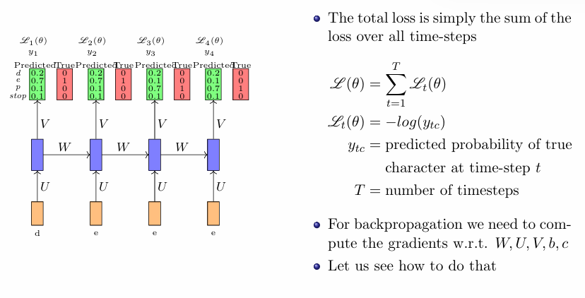
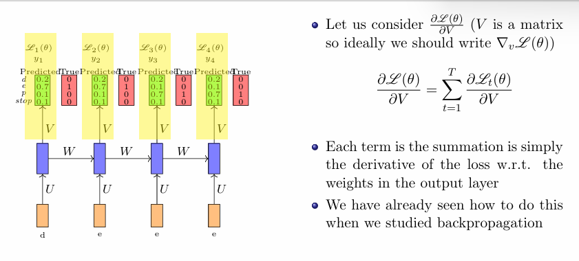
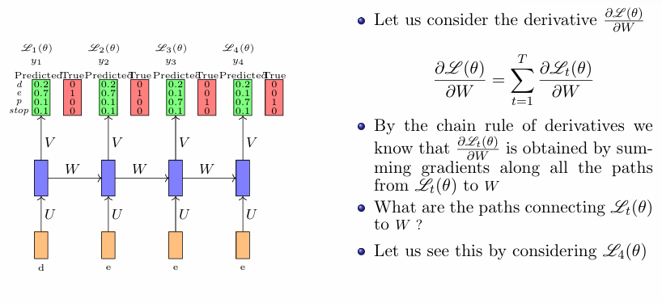

### Backpropagation Through Time (BPTT) Explained

Backpropagation Through Time (BPTT) is a key technique used to train Recurrent Neural Networks (RNNs) by effectively computing how changes to the model parameters affect the overall loss over time. This enables RNNs to learn dependencies in sequential data, such as time series or text, where the current output is influenced by previous inputs and states.

### Total Loss Calculation

The first step in BPTT is calculating the **total loss** across all timesteps in a sequence. The total loss is defined as:

$$
L(\theta) = \sum_{t=1}^T L_t(\theta)
$$

Where:
- $L_t(\theta)$ is the loss at timestep $t$.
- $y_{tc}$ is the predicted probability of the true character at timestep $t$.

Assuming we are handling a multi-class classification problem (like predicting the next character in a sequence), we typically use the cross-entropy loss:

$$
L_t(\theta) = -\log(y_{tc})
$$

Here:
- $y_{tc}$ is the predicted probability for the correct class (the true character) at timestep $t$.

This summation $L(\theta)$ allows us to aggregate errors across the entire sequence, ensuring the model considers the impact of all past predictions when updating its parameters.

### Gradient Computation for Each Parameter

For successful parameter updates, we need to compute the **gradients of the total loss** $L(\theta)$ with respect to each parameter:

1. **Weights for Input to Hidden Layer ($U$)**
2. **Weights for Hidden to Hidden Layer ($W$)**
3. **Weights for Hidden to Output Layer ($V$)**
4. **Biases for the Hidden Layer ($b$)**
5. **Biases for the Output Layer ($c$)**

Let's focus on the important calculations for this process.

#### Gradient with Respect to Output Layer Weights ($V$)

The gradient of the loss with respect to the output layer weights $V$ is straightforward:

$$
\frac{\partial L(\theta)}{\partial V} = \sum_{t=1}^T \frac{\partial L_t(\theta)}{\partial V}
$$

In this case, each term reflects how much the loss at each time $t$ changes in response to changes in the weights $V$. This calculation closely resembles standard backpropagation seen in feedforward networks, where only the current timestep $t$ affects the output layer.

#### Gradient with Respect to Recurrent Weights ($W$)

Calculating the gradient with respect to the recurrent weights $W$ is more complex due to the dependencies across multiple timesteps:

1. **Direct Dependencies**: At timestep $t$, the hidden state $s_t$ directly depends on $W$ through the previous hidden state $s_{t-1}$.

2. **Indirect Dependencies**: The loss $L_t(\theta)$ at timestep $t$ also relies on the hidden states from previous timesteps, meaning that $s_{t-1}$ influences both $s_t$ and hence $L_t(\theta)$.

To compute the gradient, we use the chain rule:

$$
\frac{\partial L(\theta)}{\partial W} = \sum_{t=1}^T \frac{\partial L_t(\theta)}{\partial W}
$$

Each term $\frac{\partial L_t(\theta)}{\partial W}$ incorporates contributions from pathways extending back through multiple timesteps, increasing the complexity. 

For example, starting from $L_4(\theta)$, the paths contributing to $\frac{\partial L_4(\theta)}{\partial W}$ would include:

- **Direct Path**: From the loss at $L_4$ through $s_3$ affecting $s_4$ (via $W$).
- **Indirect Paths**: Contributions from $s_2$ to $s_3$ via $W$ (thus affecting $s_4$), $s_1$ to $s_2$, and all the way from the input $x_1$ to $s_1$ through $U$.

### Example to Illustrate Gradients

Let’s illustrate with a simple sequence prediction task, where an RNN is trained to predict the next character based on the previous one. Suppose our input sequence is "de", and the true next character is "p".

1. **Forward Pass**:
   - The hidden states are updated: $s_1$ from `d`, then $s_2$ from `e`.
   - The output probabilities at $t=2$ are calculated, yielding probabilities for `d`, `e`, `p`, and `<stop>`.

2. **Loss Calculation**:
   - Calculate $L(\theta)$ using the predicted probabilities against the true character, which for this case, might yield a loss of $L_2(\theta) = -\log(y_{2p})$, indicating how well the RNN predicted `p` after `de`.

3. **Backward Pass**:
   - Calculate gradients:
     - For $V$ using direct loss contributions from $y_{2p}$.
     - For $W$, summing up contributions from $s_1$ to $s_2$ to $L_2$ (taking into account all sequences affecting it).

### BPTT Summary

In conclusion, BPTT involves calculating gradients for each parameter based on cumulative losses across all timesteps. This comprehensive update mechanism allows the model to effectively learn from sequences over time:

- **Adjusting Weights**: By backpropagating through all paths, RNNs can capture how earlier inputs influence current outputs.
- **Parameter Updates**: Using these gradients, we can update all parameters $U$, $V$, $W$, $b$, and $c$ to minimize total loss, ultimately improving the predictive performance of the RNN over sequential data.

BPTT is essential for training RNNs as it incorporates the full sequence context, allowing the network to learn long-term dependencies effectively.

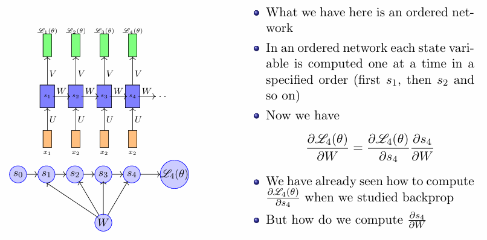
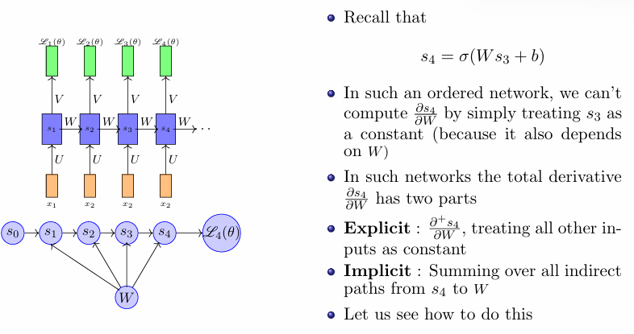

In an **ordered network** such as a Recurrent Neural Network (RNN), the sequential computation of state variables $s_t$ allows the network to capture temporal dependencies effectively. However, this sequential nature complicates the gradient calculation because each state $s_t$ is dependent not only on its immediate predecessor $s_{t-1}$ but also on all previous states, creating both **direct** and **indirect** dependencies.

### Gradient Calculation for $\frac{\partial L(\theta)}{\partial W}$

To update the recurrent weights $W$ using backpropagation, we need to compute the gradient $\frac{\partial L(\theta)}{\partial W}$. This process accounts for both the direct and indirect influences on the loss through various 'paths' in the RNN's architecture.

#### 1. Direct Path Contribution

The direct contribution to the gradient from the recurrence relation for a state variable is expressed as follows:

$$
s_4 = \sigma(Ws_3 + b)
$$

Here:
- $s_4$ is computed directly from $s_3$ and the recurrent weights $W$ along with the bias $b$.
- The derivative of $s_4$ with respect to $W$ can be obtained directly via the chain rule:

$$
\frac{\partial L}{\partial W} = \frac{\partial L}{\partial s_4} \cdot \frac{\partial s_4}{\partial W} = \delta_4 \cdot \frac{\partial s_4}{\partial W}
$$

Where $\delta_4 = \frac{\partial L}{\partial s_4}$ is the gradient of the loss with respect to the state $s_4$.

#### 2. Indirect Path Contribution

Besides the direct path, $s_4$ also has indirect dependencies through earlier states. For instance:

- **Indirect Influence from State Variables**:
  - $s_3$ is computed based on $s_2$, which in turn is based on $s_1$, and so forth.
  - Similarly, the input $x_1$ influences $s_1$, which sets off a chain of dependencies.

To account for these indirect contributions, we need to compute all the gradients propagating from $s_4$ through the previous states down to $W$. 

#### Recursive Chain Rule Application

Using Backpropagation Through Time (BPTT), we systematically compute these gradients backward through time, considering both direct and indirect effects. The process is as follows:

1. **Gradient Computation for the Last Timestep**: Starting at $t = 4$:
   $$
   \frac{\partial L}{\partial s_4} = \delta_4
   $$
   We denote this as the error signal for the output, typically calculated from the loss function.

2. **Backpropagating Gradients to $s_3$**:
   - Calculate the gradient at $s_3$ considering its contribution to $s_4$:
     $$
     \delta_3 = \frac{\partial L}{\partial s_4} \cdot \frac{\partial s_4}{\partial s_3}
     $$

3. **Continue Backpropagating to Earlier States**:
   - For $s_2$ and subsequently $s_1$:
     $$
     \delta_2 = \delta_3 \cdot \frac{\partial s_3}{\partial s_2}
     $$
     $$
     \delta_1 = \delta_2 \cdot \frac{\partial s_2}{\partial s_1}
     $$

4. **Aggregate Contribution from All Gradient Paths**: For $W$, sum up the gradients from all indirect paths leading to $W$:
   $$
   \frac{\partial L}{\partial W} = \sum_{t=1}^{T} \delta_t \cdot \frac{\partial s_t}{\partial W}
   $$

   Here, each $\delta_t$ at time $t$ collects contributions from paths leading into $W$.

### Final Notes on BPTT

- **Total Gradient**: The complete gradient $\frac{\partial L(\theta)}{\partial W}$ being calculated incorporates the effect of state variables $s$ at all timesteps both directly and indirectly, emphasizing the network’s capacity to learn from whole sequences rather than individual inputs.
- **Learning Dependencies**: This method allows the RNN to learn long-range dependencies over time, optimizing $W$ so the model becomes more capable of making predictions considering the entire sequence context.

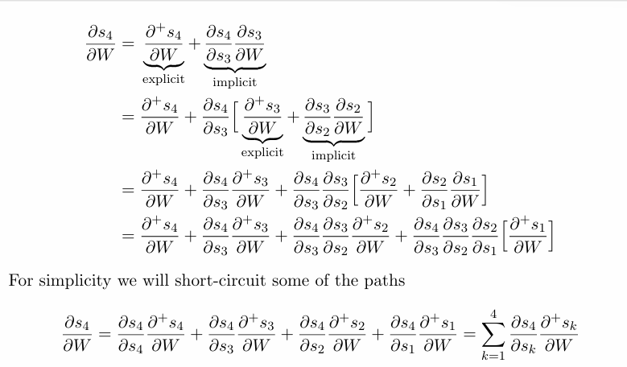
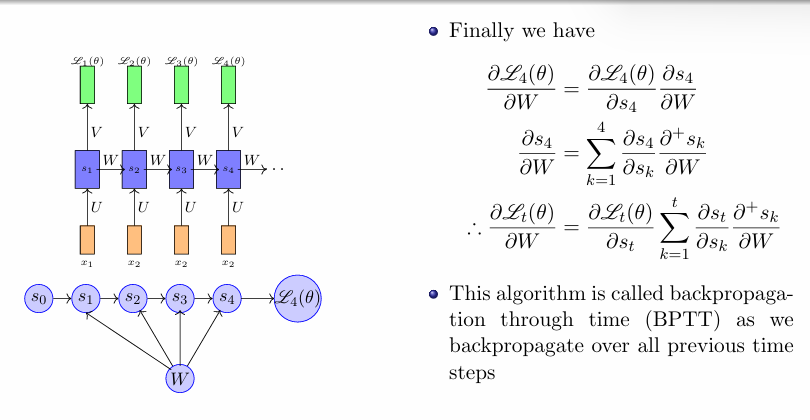

### Step-by-Step Derivation

In an RNN, each state $s_t$ depends on the previous state $s_{t-1}$ and the weights $W$, $U$, and bias $b$, given by:
$$
s_t = \sigma(Ws_{t-1} + Ux_t + b)
$$
where:
- $s_t$ is the hidden state at timestep $t$.
- $W$ is the recurrent weight matrix that connects the hidden state from one timestep to the next.
- $x_t$ is the input at timestep $t$.
- $\sigma$ is a non-linear activation function (e.g., $\text{tanh}$ or $\text{ReLU}$).

Our goal is to compute $\frac{\partial s_4}{\partial W}$ by following both direct and indirect paths from $s_4$ back to $W$ through all intermediate states.

### Step 1: Direct and Indirect Paths

In order to find $\frac{\partial s_4}{\partial W}$, we recognize that $s_4$ is influenced by $W$ in two ways:
1. **Directly** through the connection from $s_3$ to $s_4$.
2. **Indirectly** through previous states: $s_1 \to s_2 \to s_3 \to s_4$.

This means that changes in $W$ can affect $s_4$ directly via $s_3$, and indirectly through $s_2$ and $s_1$ (each impacting the next hidden state).

### Step 2: Setting Up the Total Derivative for $\frac{\partial s_4}{\partial W}$

We write the total derivative of $s_4$ with respect to $W$ as the sum of the **explicit** and **implicit** gradients along all paths:
$$
\frac{\partial s_4}{\partial W} = \frac{\partial^+ s_4}{\partial W} + \frac{\partial s_4}{\partial s_3} \frac{\partial s_3}{\partial W}
$$
where:
- $\frac{\partial^+ s_4}{\partial W}$: The direct effect of $W$ on $s_4$ when $s_3$ is held constant.
- $\frac{\partial s_4}{\partial s_3} \frac{\partial s_3}{\partial W}$: The indirect effect of $W$ on $s_4$ through the previous state $s_3$.

### Step 3: Expanding $\frac{\partial s_4}{\partial W}$ by Including All Paths

#### First Expansion
Let’s expand $\frac{\partial s_4}{\partial W}$ by considering the influence of $W$ through both $s_3$ and earlier states:
$$
\frac{\partial s_4}{\partial W} = \frac{\partial s_4}{\partial W} + \frac{\partial s_4}{\partial s_3} \left( \frac{\partial^+ s_3}{\partial W} + \frac{\partial s_3}{\partial s_2} \frac{\partial s_2}{\partial W} \right)
$$
This accounts for:
- The direct contribution from $W$ to $s_4$.
- The indirect contributions from:
  - $W$ through $s_3$ (with $\frac{\partial s_4}{\partial s_3} \frac{\partial^+ s_3}{\partial W}$).
  - $W$ through both $s_3$ and $s_2$ (with $\frac{\partial s_4}{\partial s_3} \frac{\partial s_3}{\partial s_2} \frac{\partial s_2}{\partial W}$).

#### Second Expansion
Now we expand further by including the dependency through $s_2$ and $s_1$:
$$
\frac{\partial s_4}{\partial W} = \frac{\partial s_4}{\partial W} + \frac{\partial s_4}{\partial s_3} \frac{\partial s_3}{\partial W} + \frac{\partial s_4}{\partial s_3} \frac{\partial s_3}{\partial s_2} \frac{\partial s_2}{\partial W} + \frac{\partial s_4}{\partial s_3} \frac{\partial s_3}{\partial s_2} \frac{\partial s_2}{\partial s_1} \frac{\partial s_1}{\partial W}
$$
Here, each term represents:
- **Direct gradient**: $\frac{\partial s_4}{\partial W}$.
- **First indirect path**: through $s_3$, $\frac{\partial s_4}{\partial s_3} \frac{\partial s_3}{\partial W}$.
- **Second indirect path**: through $s_3$ and $s_2$, $\frac{\partial s_4}{\partial s_3} \frac{\partial s_3}{\partial s_2} \frac{\partial s_2}{\partial W}$.
- **Third indirect path**: through $s_3$, $s_2$, and $s_1$, $\frac{\partial s_4}{\partial s_3} \frac{\partial s_3}{\partial s_2} \frac{\partial s_2}{\partial s_1} \frac{\partial s_1}{\partial W}$.

### Step 4: Generalization as a Summation

We can generalize the expression by summing over all paths from $s_4$ to each earlier state $s_k$:
$$
\frac{\partial s_4}{\partial W} = \sum_{k=1}^4 \frac{\partial s_4}{\partial s_k} \frac{\partial s_k}{\partial W}
$$
This compact summation accounts for all direct and indirect dependencies of $s_4$ on $W$.

### Step 5: Applying the Gradient to the Loss

For backpropagation, we compute the gradient of the loss $L(\theta)$ with respect to $W$ as:
$$
\frac{\partial L(\theta)}{\partial W} = \frac{\partial L(\theta)}{\partial s_4} \sum_{k=1}^4 \frac{\partial s_4}{\partial s_k} \frac{\partial s_k}{\partial W}
$$
where:
- $\frac{\partial L(\theta)}{\partial s_4}$ is the gradient of the loss with respect to $s_4$.

### Step 6: Extending to All Time Steps (Generalized BPTT)

For any timestep $t$, we generalize the gradient calculation as:
$$
\frac{\partial L(\theta)}{\partial W} = \frac{\partial L(\theta)}{\partial s_t} \sum_{k=1}^t \frac{\partial s_t}{\partial s_k} \frac{\partial s_k}{\partial W}
$$
This recursive process across all timesteps is known as **Backpropagation Through Time (BPTT)**. It sums gradients from each timestep, allowing the RNN to capture dependencies across the sequence when updating the parameter $W$.

### 1. **Chain Rule**
The chain rule is fundamental for computing the derivative of a composed function. If you have two functions $ f(g(x)) $, the chain rule states:

$$
\frac{d}{dx} f(g(x)) = f'(g(x)) \cdot g'(x)
$$

In the context of RNNs, this is applied to propagate gradients through multiple layers and timesteps:

$$
\frac{\partial L}{\partial W} = \frac{\partial L}{\partial s_t} \cdot \frac{\partial s_t}{\partial W}
$$

### 2. **Total Derivative**
When considering how a variable depends on other variables, the total derivative accounts for both direct and indirect dependencies. For a state variable $s$ dependent on another variable $W$ through multiple intermediate states, the total derivative is:

$$
\frac{\partial s}{\partial W} = \frac{\partial^+ s}{\partial W} + \sum_{i} \frac{\partial s}{\partial s_i} \frac{\partial s_i}{\partial W}
$$

This is what we used to expand $\frac{\partial s_4}{\partial W}$.

### 3. **Sum of Gradients for Indirect Paths**
When calculating gradients for multiple paths, we sum over the contributions from all paths leading to the variable of interest:

$$
\frac{\partial s_4}{\partial W} = \sum_{k=1}^t \frac{\partial s_4}{\partial s_k} \frac{\partial s_k}{\partial W}
$$

This encapsulates the effect of every earlier hidden state on the current state and thus on $W$.

### 4. **Product Rule**
Although less frequently invoked in the derivation, when multiplying two functions of variables, the product rule can be applied. If $y = u(x)v(x)$, then:

$$
\frac{dy}{dx} = u'v + uv'
$$

This is helpful when dealing with the terms that might involve products of functions in RNN states.

### Example Derivative Calculation
For an RNN, let’s say the hidden state is given by:

$$
s_t = \sigma(Ws_{t-1} + Ux_t + b)
$$

Using the chain rule and total derivatives, we can express:

$$
\frac{\partial s_t}{\partial W} = \frac{\partial s_t}{\partial (Ws_{t-1})} \cdot \frac{\partial (Ws_{t-1})}{\partial W} + \frac{\partial s_t}{\partial s_{t-1}} \cdot \frac{\partial s_{t-1}}{\partial W}
$$

Where:
- $\frac{\partial s_t}{\partial (Ws_{t-1})}$ is related to the derivative of the activation function $\sigma$.
- $\frac{\partial (Ws_{t-1})}{\partial W}$ will give a matrix with the appropriate dimensions that capture how $W$ affects the output through the previous state.

----

### Understanding the Problem of Exploding and Vanishing Gradients in RNNs

When training recurrent neural networks (RNNs) using backpropagation through time (BPTT), we encounter two significant issues: **vanishing gradients** and **exploding gradients**. These problems arise primarily from the way gradients are propagated back through time. Let's break this down step-by-step to understand how these problems occur.

---

### Derivation of Gradients in RNNs

1. **Gradient Representation**: 
   The gradient of the hidden state $s_t$ with respect to an earlier hidden state $s_k$ can be expressed using the chain rule as:

   $$
   \frac{\partial s_t}{\partial s_k} = \frac{\partial s_t}{\partial s_{t-1}} \cdot \frac{\partial s_{t-1}}{\partial s_{t-2}} \cdots \frac{\partial s_{k+1}}{\partial s_k}
   $$

   This can be represented more compactly as:

   $$
   \frac{\partial s_t}{\partial s_k} = \prod_{j=k}^{t-1} \frac{\partial s_{j+1}}{\partial s_j}
   $$

   Here, each term $\frac{\partial s_{j+1}}{\partial s_j}$ is critical because it reflects how the current state depends on the previous state.

---

### Examining the Derivatives

2. **Understanding $\frac{\partial s_j}{\partial a_j}$**:
   Each hidden state $s_j$ is computed through an activation function $\sigma$ applied to a linear combination of inputs and previous states, denoted as $a_j$:

   $$
   a_j = [a_{j1}, a_{j2}, a_{j3}, ..., a_{jd}]
   $$
   $$
   s_j = [\sigma(a_{j1}), \sigma(a_{j2}), ..., \sigma(a_{jd})]
   $$

   The derivative of $s_j$ with respect to $a_j$ is a diagonal matrix:

   $$
   \frac{\partial s_j}{\partial a_j} = \text{diag}(\sigma'(a_j))
   $$

   This means that the partial derivatives are only non-zero along the diagonal, where $\sigma'(a_j)$ is the derivative of the activation function (like sigmoid or tanh).

3. **Calculating $\frac{\partial s_j}{\partial s_{j-1}}$**:
   Now, the derivative of the hidden state with respect to the previous hidden state is given by:

   $$
   \frac{\partial s_j}{\partial s_{j-1}} = \frac{\partial s_j}{\partial a_j} \cdot \frac{\partial a_j}{\partial s_{j-1}} = \text{diag}(\sigma'(a_j)) W
   $$

   Here, $W$ is the weight matrix that connects the hidden states.

---

### Magnitude of Gradients

4. **Magnitude of Gradients**:
   We want to analyze the magnitude of the gradient $\frac{\partial s_j}{\partial s_{j-1}}$:

   $$
   ||\frac{\partial s_j}{\partial s_{j-1}}|| = ||\text{diag}(\sigma'(a_j)) W|| \leq ||\text{diag}(\sigma'(a_j))|| \cdot ||W||
   $$

   This inequality helps to understand how the gradients change as they propagate backward through the network.

5. **Gradient Product**:
   When considering the total gradient from $s_t$ to $s_k$:

   $$
   ||\frac{\partial s_t}{\partial s_k}|| = \prod_{j=k}^{t-1} ||\frac{\partial s_{j+1}}{\partial s_j}|| \leq \prod_{j=k}^{t-1} \gamma \lambda
   $$

   Here, $\gamma$ and $\lambda$ are bounds that depend on the specific activation function and the weight matrix.

---

### Conditions for Vanishing and Exploding Gradients

6. **Conditions**:
   - If $\gamma \lambda < 1$: The gradient magnitudes shrink, leading to **vanishing gradients**. This means that when the gradients reach the earlier layers, they become very small, making it difficult to learn.
   - If $\gamma \lambda > 1$: The gradient magnitudes grow, leading to **exploding gradients**. This causes the updates to the weights to become excessively large, leading to instability in training.

---

### Conclusion

The problems of vanishing and exploding gradients are critical challenges when training RNNs. They arise from the multiplication of many small or large terms during backpropagation through time. Understanding these issues helps researchers and practitioners develop strategies to mitigate them, such as using gradient clipping, layer normalization, or architectures like Long Short-Term Memory (LSTM) and Gated Recurrent Units (GRUs) designed to handle such problems more effectively.

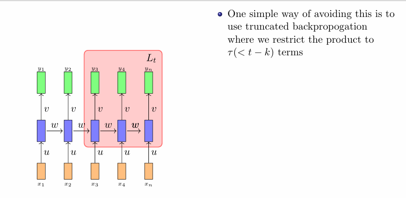
---

### Overview of Derivatives in RNNs

1. **Understanding Notations**:
   - $\frac{\partial L(\theta)}{\partial W}$: This represents the gradient of the loss $L$ with respect to the weight matrix $W$. It tells us how to adjust $W$ to minimize the loss.
   - $\frac{\partial L(\theta)}{\partial s_t}$: This is the gradient of the loss with respect to the hidden state $s_t$ at the last time step $t$.
   - $\frac{\partial s_t}{\partial s_k}$: This represents how the hidden state at time $t$ depends on the hidden state at an earlier time $k$.
   - $\frac{\partial^2 s_k}{\partial W^2}$: This denotes the second derivative of the hidden state $s_k$ with respect to the weight matrix $W$. This is a tensor indicating how the change in $W$ affects the change in $s_k$.

---

### Computing the Second Derivative

2. **First Step**: Expressing the hidden state $s_k$

   The hidden state $s_k$ at time step $k$ is computed as follows:

   $$
   a_k = W s_{k-1}
   $$
   where $a_k$ is the pre-activation value. This leads to:

   $$
   s_k = \sigma(a_k)
   $$

   Here, $\sigma$ is an activation function (like sigmoid or tanh) applied element-wise to $a_k$.

3. **Vector Form**:

   Writing out the matrix-vector multiplication for $a_k$:

   $$
   a_k = \begin{bmatrix}
   a_{k1} \\
   a_{k2} \\
   \vdots \\
   a_{kd}
   \end{bmatrix}
   =
   \begin{bmatrix}
   W_{11} & W_{12} & \ldots & W_{1d} \\
   W_{21} & W_{22} & \ldots & W_{2d} \\
   \vdots & \vdots & \ddots & \vdots \\
   W_{d1} & W_{d2} & \ldots & W_{dd}
   \end{bmatrix}
   \begin{bmatrix}
   s_{k-1,1} \\
   s_{k-1,2} \\
   \vdots \\
   s_{k-1,d}
   \end{bmatrix}
   $$

   Each entry $a_{kp}$ is calculated as:

   $$
   a_{kp} = \sum_{i=1}^{d} W_{pi} s_{k-1,i}
   $$

---

### Partial Derivatives

4. **Calculating $\frac{\partial s_k}{\partial W_{qr}}$**:

   Using the chain rule, we get:

   $$
   \frac{\partial s_k}{\partial W_{qr}} = \frac{\partial s_k}{\partial a_{kp}} \cdot \frac{\partial a_{kp}}{\partial W_{qr}}
   $$

   The first term is:

   $$
   \frac{\partial s_k}{\partial a_{kp}} = \sigma'(a_{kp})
   $$

   The second term, which involves $W$, can be computed as follows:

   $$
   \frac{\partial a_{kp}}{\partial W_{qr}} = \frac{\partial}{\partial W_{qr}} \left( \sum_{i=1}^{d} W_{pi} s_{k-1,i} \right)
   $$

   This derivative is only non-zero for specific indices:

   - If $p = q$ and $i = r$: $\frac{\partial a_{kp}}{\partial W_{qr}} = s_{k-1,i}$
   - Otherwise: $\frac{\partial a_{kp}}{\partial W_{qr}} = 0$

   Thus:

   $$
   \frac{\partial a_{kp}}{\partial W_{qr}} = \begin{cases}
   s_{k-1,r} & \text{if } p = q \\
   0 & \text{otherwise}
   \end{cases}
   $$

5. **Combining Results**:

   Plugging these into the equation for $\frac{\partial s_k}{\partial W_{qr}}$:

   $$
   \frac{\partial s_k}{\partial W_{qr}} = \sigma'(a_{kp}) \cdot \begin{cases}
   s_{k-1,r} & \text{if } p = q \\
   0 & \text{otherwise}
   \end{cases}
   $$

---

### Resultant Tensor $\frac{\partial^2 s_k}{\partial W^2}$

6. **Forming the Tensor**:

   To compute the second derivative, we recognize that:

   $$
   \frac{\partial^2 s_k}{\partial W_{qr} \partial W_{xy}} = \frac{\partial}{\partial W_{xy}} \left( \frac{\partial s_k}{\partial W_{qr}} \right)
   $$

   Each entry in the tensor $\frac{\partial^2 s_k}{\partial W^2}$ can be computed similarly, resulting in:

   $$
   \frac{\partial^2 s_k}{\partial W_{qr} \partial W_{xy}} = \sigma''(a_{kp}) \cdot s_{k-1,r} \cdot \begin{cases}
   1 & \text{if } p = q \text{ and } x = y \\
   0 & \text{otherwise}
   \end{cases}
   $$

   Here, $\sigma''(a_{kp})$ denotes the second derivative of the activation function.

---

### Conclusion
The second derivative $\frac{\partial^2 s_k}{\partial W^2}$ reflects how weight updates influence the hidden states at time $k$. This understanding is essential for analyzing weight changes' effects on the network and for effective RNN training via backpropagation through time (BPTT). The formula shows that many components depend on the previous hidden state and the weight matrix structure, highlighting the importance of accurately tracking these derivatives in gradient-based optimization.

----

The concepts of "Selective Read," "Selective Write," and "Selective Forget" in the context of recurrent neural networks (RNNs) can be understood through a whiteboard analogy. Let’s break down each part of the analogy to explain how RNNs handle information over time.

### The Whiteboard Analogy

Imagine you have a whiteboard where you can write, read, and erase information. Each action corresponds to how an RNN processes sequential data:

1. **Selective Write**:
   - At each timestep, the RNN takes the current input and combines it with the information stored in its hidden state. This is akin to writing new notes on the whiteboard.
   - When a new input arrives, the network "writes" relevant information that will help it learn from the current timestep while also taking into account what was written previously.
   - The writing process can be thought of as updating the state $s_t$ based on the previous state $s_{t-1}$ and the current input $x_t$:

     $$
     s_t = f(W \cdot s_{t-1} + U \cdot x_t + b)
     $$

   Here, $W$ and $U$ are weight matrices, $b$ is a bias term, and $f$ is an activation function (like $\text{tanh}$ or $\text{ReLU}$).

2. **Selective Read**:
   - Just as you can read information from the whiteboard, an RNN can "read" the stored information to inform its output.
   - The output at each timestep is derived from the current state, capturing relevant information that has been accumulated over time.
   - This selective reading allows the RNN to maintain and utilize the important context from all previous timesteps, helping it make predictions or classifications based on the entire sequence of data.

3. **Selective Forget**:
   - Over time, some information on the whiteboard may become less relevant or even confusing. In an RNN, this process corresponds to forgetting some past information.
   - Selective forgetting can be implemented in RNNs through mechanisms like forget gates in Long Short-Term Memory (LSTM) networks, which decide which parts of the information should be kept or erased.
   - The forgetting mechanism helps manage the network's memory, preventing it from being overwhelmed with outdated or unnecessary information, thus enhancing learning efficiency.

### Implications of the Analogy
- **Morphing Information**: New information can obscure older data on the whiteboard, similar to how RNN states evolve, making past inputs less relevant.

- **Memory Management**: RNNs must effectively manage memory, akin to choosing which notes to keep or erase, to learn dependencies in sequential data like language or time-series.

---

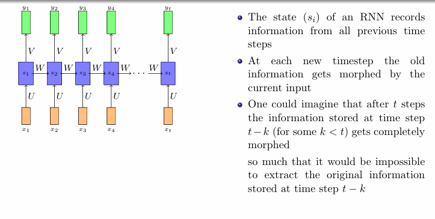
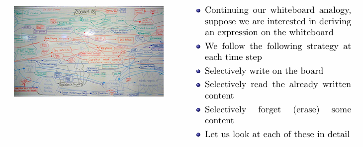
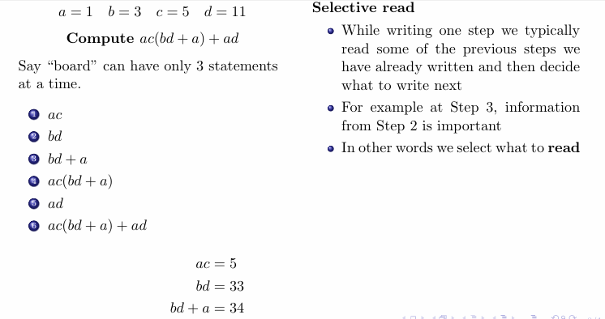

The text presents the concept of **selective write, read, and forget** in recurrent neural networks (RNNs) using the analogy of a limited-capacity whiteboard. Here’s a concise breakdown:

### The Example Calculation

1. **Operation on the Whiteboard**:
   - Consider:
    $$
     a = 1, \quad b = 3, \quad c = 5, \quad d = 11
     $$
     $$
     \text{Compute } ac(bd + a) + ad
     $$
   - This illustrates operations that require managing limited information on a whiteboard.

### Selective Forget

2. **Limited Capacity**:
   - The whiteboard analogy signifies the RNN’s finite memory, which can only hold a set number of statements.
   - When full, new information necessitates removing existing entries.

3. **Decision to Forget**:
   - **Selective forgetting** means discarding the least useful information to prioritize what’s essential.
   - For RNNs, this allows maintaining relevant context while avoiding confusion from outdated data.

### Brain Analogy

4. **Cognitive Processes**:
   - Similar to human memory, which can hold only a finite number of facts, our brains selectively read, write, and forget information based on relevance.
   - This reflects how cognition manages information overload.

### Application to RNNs

5. **Finite State Size**:
   - RNNs have a finite state size, necessitating mechanisms to:
     - **Selectively read**: Extract key information.
     - **Selectively write**: Update states with new data.
     - **Selectively forget**: Remove irrelevant or redundant information.

### Conclusion

Selective write, read, and forget mechanisms in RNNs are crucial for managing information flow, allowing effective learning from relevant past inputs while discarding unnecessary data. This is vital in tasks involving sequential data, ensuring accurate context maintenance for predictions.

---

### Long Short Term Memory(LSTM) and Gated Recurrent Units(GRUs)

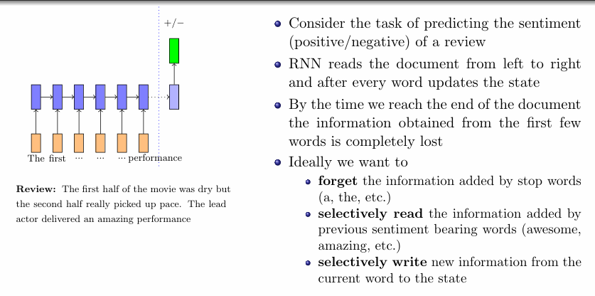
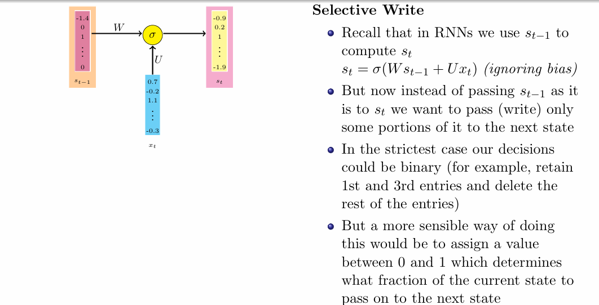

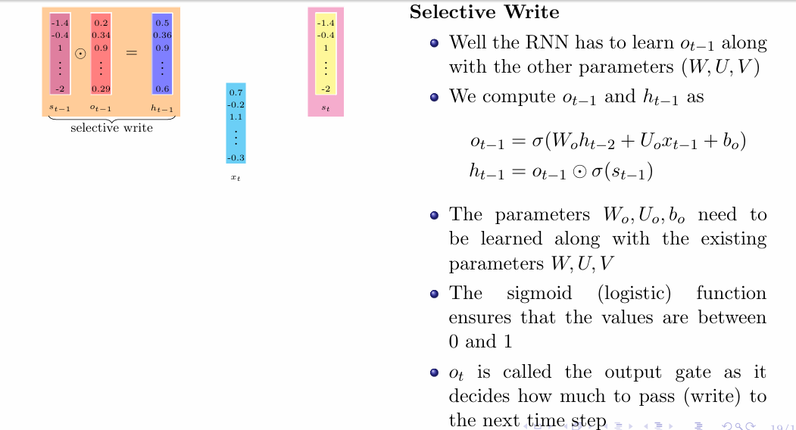

### Selective Write Mechanism in RNNs

The selective write mechanism in RNNs is crucial for determining how much information from the previous state $s_{t-1}$ should be carried forward to the next state $s_t$. This process allows the network to focus on the most relevant information and forget the less important parts, which is essential for effectively managing the finite size of the state vector.

### Defining the Output Gate $o_{t-1}$

The vector $o_{t-1}$ plays a vital role in this mechanism:
- Each element of $o_{t-1}$ specifies a fraction of the corresponding element in $s_{t-1}$ that should be passed to the next state.
- The values in $o_{t-1}$ are constrained between 0 and 1, which means that each value represents how much of the previous state should be retained: 
  - A value of 0 means "forget this element entirely."
  - A value of 1 means "retain this element completely."

### Computation of the Output Gate $o_{t-1}$

To compute $o_{t-1}$, we need to define a formula that utilizes the current input and the previous hidden state. The formula for calculating $o_{t-1}$ is given by:

$$
o_{t-1} = \sigma(W_o h_{t-2} + U_o x_{t-1} + b_o)
$$

#### Breakdown of the Components:

1. **Sigmoid Activation Function ($\sigma$)**:
   - The sigmoid function maps any input to a range between 0 and 1. This property is essential for $o_{t-1}$ since we want to restrict the values to this range.

2. **Weight Matrices**:
   - $W_o$: Weights connecting the previous hidden state $h_{t-2}$ to the output gate.
   - $U_o$: Weights connecting the current input $x_{t-1}$ to the output gate.

3. **Bias Term ($b_o$)**:
   - $b_o$ is a bias added to the linear combination of the previous hidden state and the current input, allowing the model to shift the activation function and improve learning.

### Combining with the State Vector

Once $o_{t-1}$ is computed, it is used to selectively write to the new hidden state $h_{t-1}$:

$$
h_{t-1} = o_{t-1} \odot \sigma(s_{t-1})
$$

#### Explanation of This Equation:

- **Element-wise Multiplication ($\odot$)**:
  - The output gate $o_{t-1}$ is multiplied element-wise with the transformed previous state $\sigma(s_{t-1})$.
  - This operation ensures that only the relevant portions of $s_{t-1}$ (determined by $o_{t-1}$) are retained in $h_{t-1}$.

### Learning Parameters

The parameters $W_o, U_o,$ and $b_o$ are learned during the training process alongside the other parameters $W, U,$ and $V$ of the RNN. This is achieved through backpropagation, where gradients are calculated and used to update these parameters in order to minimize the loss function.

---

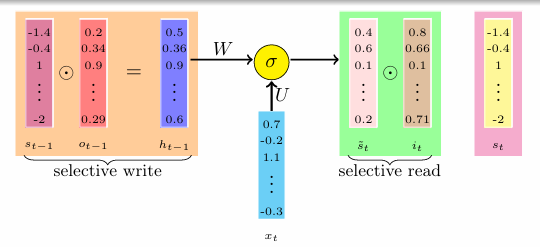

### Selective Read Mechanism in LSTM

The selective read mechanism in Long Short-Term Memory (LSTM) networks is critical for managing the information flow through the network. It allows the LSTM to determine how much of the newly computed information should actually influence the cell state $s_t$.

### Overview of Selective Read

1. **Candidate State $\tilde{s}_t$**:
   - The candidate state $\tilde{s}_t$ is computed based on the previous hidden state $h_{t-1}$ and the current input $x_t$:
   $$
   \tilde{s}_t = \sigma(W h_{t-1} + U x_t + b)
   $$
   - This equation combines information from both $h_{t-1}$ and $x_t$ to form a new candidate state.

2. **Purpose of Selective Read**:
   - While $\tilde{s}_t$ captures all the new information, we may not want to incorporate all of it into the new cell state $s_t$.
   - Instead, the LSTM uses an input gate $i_t$ to determine which parts of $\tilde{s}_t$ should be included in $s_t$.

### The Input Gate $i_t$

The input gate is responsible for controlling the information that enters the cell state:
$$
i_t = \sigma(W_i h_{t-1} + U_i x_t + b_i)
$$

#### Breakdown of the Input Gate Equation:

1. **Weight Matrices**:
   - $W_i$: Weights connecting the previous hidden state $h_{t-1}$ to the input gate.
   - $U_i$: Weights connecting the current input $x_t$ to the input gate.

2. **Bias Term ($b_i$)**:
   - $b_i$ is a bias that is added to the weighted sum, allowing for more flexible learning.

3. **Sigmoid Activation Function**:
   - Similar to the output gate, the sigmoid function ensures that $i_t$ produces values between 0 and 1, indicating the fraction of the candidate state $\tilde{s}_t$ that should be read and passed to the new state $s_t$.

### Selectively Reading Information

To selectively read from $\tilde{s}_t$, the input gate $i_t$ is applied:
$$
\text{Selectively Read} = i_t \odot \tilde{s}_t
$$
- Here, the element-wise multiplication ($\odot$) between $i_t$ and $\tilde{s}_t$ determines which elements of $\tilde{s}_t$ are retained in the new cell state.

### Summary of Steps in LSTM

At this point, we can summarize the key components involved in the selective write and read mechanisms of the LSTM:

1. **Previous Cell State**: $s_{t-1}$
2. **Output Gate**: 
   $$
   o_{t-1} = \sigma(W_o h_{t-2} + U_o x_{t-1} + b_o)
   $$
3. **Selectively Write**: 
   $$
   h_{t-1} = o_{t-1} \odot \sigma(s_{t-1})
   $$
4. **Current (Temporary) State**: 
   $$
   \tilde{s}_t = \sigma(W h_{t-1} + U x_t + b)
   $$
5. **Input Gate**: 
   $$
   i_t = \sigma(W_i h_{t-1} + U_i x_t + b_i)
   $$
6. **Selectively Read**: 
   $$
   \text{Read} = i_t \odot \tilde{s}_t
   $$

### Importance of Selective Read

- The selective read mechanism allows the LSTM to efficiently manage its memory by deciding what to store in $s_t$, ensuring that the model can focus on relevant information.
- This design is crucial for tasks requiring the modeling of long-term dependencies, as it helps to mitigate the issues associated with traditional RNNs, such as the vanishing gradient problem.

---

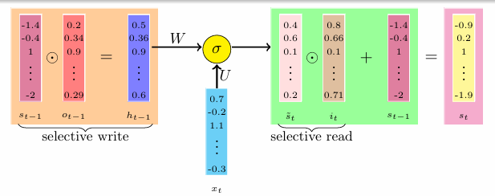

### Selective Forget in LSTM

The **selective forget** process in Long Short-Term Memory (LSTM) networks is vital for managing information in the cell state. It helps the LSTM decide what information to keep from the previous cell state $s_{t-1}$ and what to forget, enabling the network to learn effectively from sequential data without being bogged down by unnecessary information.

### Key Equations for Selective Forget

1. **Forget Gate $f_t$**:
   - The forget gate controls which information from the previous cell state should be kept:
   $$
   f_t = \sigma(W_f h_{t-1} + U_f x_t + b_f)
   $$
   - The output $f_t$ ranges between 0 and 1. A value of 0 means "forget this," while 1 means "keep this."

2. **Combining Old and New States**:
   - The new cell state $s_t$ is formed by blending information from the previous state and new input:
   $$
   s_t = f_t \odot s_{t-1} + i_t \odot \tilde{s}_t
   $$
   - In this equation:
     - $f_t \odot s_{t-1}$: Keeps the parts of $s_{t-1}$ that the forget gate chooses to retain.
     - $i_t \odot \tilde{s}_t$: Adds new information from the candidate state $\tilde{s}_t$, based on the input gate $i_t$.

3. **Hidden State $h_t$**:
   - The hidden state is updated based on the new cell state and the output gate $o_t$:
   $$
   h_t = o_t \odot \sigma(s_t)
   $$
   - The output gate $o_t$ determines which information from the new cell state will be passed to the next time step.

### Summary of LSTM Operations

At each time step $t$, the following operations take place in an LSTM:

#### Gates:
- **Output Gate**: 
  $$
  o_t = \sigma(W_o h_{t-1} + U_o x_t + b_o)
  $$
- **Input Gate**: 
  $$
  i_t = \sigma(W_i h_{t-1} + U_i x_t + b_i)
  $$
- **Forget Gate**: 
  $$
  f_t = \sigma(W_f h_{t-1} + U_f x_t + b_f)
  $$

#### States:
- **Candidate State**:
  $$
  \tilde{s}_t = \tanh(W s_{t-1} + U x_t + b)
  $$
- **New Cell State**:
  $$
  s_t = f_t \odot s_{t-1} + i_t \odot \tilde{s}_t
  $$
- **Hidden State**:
  $$
  h_t = o_t \odot \sigma(s_t)
  $$

### Importance of Selective Forget

- The selective forget mechanism is crucial to prevent the model from becoming overloaded with outdated or irrelevant information. It helps the LSTM maintain a focused, relevant representation of data while processing sequences.
- By balancing retention (through the forget gate) and new information incorporation (through the input gate), LSTMs effectively learn long-term dependencies. This makes them ideal for tasks such as sentiment analysis, language modeling, and others. 

---

### GRUs

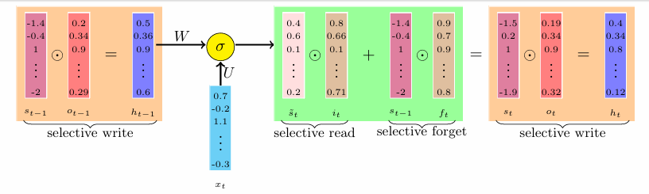

### Gated Recurrent Units (GRUs)

Gated Recurrent Units (GRUs) are a type of recurrent neural network (RNN) architecture designed to capture long-term dependencies in sequential data while simplifying the computational complexity compared to Long Short-Term Memory (LSTM) networks. Below are the key equations and characteristics of GRUs.

### Full Set of Equations for GRUs

#### Gates

1. **Output Gate \( o_t \)**:
   $$
   o_t = \sigma(W_o s_{t-1} + U_o x_t + b_o)
   $$
   - This gate determines how much of the previous state \( s_{t-1} \) should be considered for the next state.

2. **Input Gate \( i_t \)**:
   $$
   i_t = \sigma(W_i s_{t-1} + U_i x_t + b_i)
   $$
   - This gate controls how much new information should be incorporated from the current input \( x_t \) into the new state.

#### States

1. **Candidate State \( \tilde{s}_t \)**:
   $$
   \tilde{s}_t = \sigma(W(o_t \odot s_{t-1}) + U x_t + b)
   $$
   - This state is a candidate for inclusion in the new state, influenced by both the previous state and the current input.

2. **New State \( s_t \)**:
   $$
   s_t = (1 - i_t) \odot s_{t-1} + i_t \odot \tilde{s}_t
   $$
   - The new state \( s_t \) is computed by combining the retained information from the previous state and the newly read information from the candidate state.

### Key Points of GRUs

- **No Explicit Forget Gate**: In GRUs, the forget gate and input gate are effectively combined into a single update mechanism. The input gate \( i_t \) determines how much of the previous state to forget and how much new information to add.
  
- **Direct Dependency on Previous State**: The gates in GRUs depend directly on the previous state \( s_{t-1} \), rather than using an intermediate hidden state \( h_{t-1} \) as in LSTMs. This simplifies the architecture and reduces the number of parameters.

### Advantages of GRUs

- **Computational Efficiency**: Due to the fewer number of gates and simpler structure, GRUs are generally more computationally efficient than LSTMs. This makes them faster to train and easier to implement.

- **Effective Long-Term Dependencies**: Despite their simplicity, GRUs are capable of capturing long-term dependencies in sequences, making them suitable for various tasks such as natural language processing, speech recognition, and more.

### Summary of GRU Operations

To summarize, the operations in a GRU at each time step \( t \) include:

- **Gates**:
  - Output Gate: 
    $$
    o_t = \sigma(W_o s_{t-1} + U_o x_t + b_o)
    $$
  - Input Gate:
    $$
    i_t = \sigma(W_i s_{t-1} + U_i x_t + b_i)
    $$

- **States**:
  - Candidate State:
    $$
    \tilde{s}_t = \sigma(W(o_t \odot s_{t-1}) + U x_t + b)
    $$
  - New State:
    $$
    s_t = (1 - i_t) \odot s_{t-1} + i_t \odot \tilde{s}_t
    $$

GRUs offer a balance between complexity and capability, making them a popular choice for sequential data modeling tasks in machine learning and deep learning.

#### Equations

1. **Output Gate**:
   $$
   o_t = \sigma(W_o s_{t-1} + U_o x_t + b_o)
   $$

2. **Input Gate**:
   $$
   i_t = \sigma(W_i s_{t-1} + U_i x_t + b_i)
   $$

3. **Candidate State**:
   $$
   \tilde{s}_t = \sigma(W(o_t \odot s_{t-1}) + U x_t + b)
   $$

4. **New State**:
   $$
   s_t = (1 - i_t) \odot s_{t-1} + i_t \odot \tilde{s}_t
   $$

### Key Terms and Their Meanings

1. **$s_t$**: 
   - **Meaning**: The new hidden state at time step $t$.
   - **Role**: Represents the output of the GRU at this time step, which is used in subsequent computations.

2. **$s_{t-1}$**: 
   - **Meaning**: The hidden state from the previous time step $t-1$.
   - **Role**: Contains information from the past that is relevant for the current state calculation.

3. **$x_t$**: 
   - **Meaning**: The input vector at time step $t$.
   - **Role**: Represents the current input to the GRU, which influences the new state.

4. **$\tilde{s}_t$**: 
   - **Meaning**: The candidate state at time step $t$.
   - **Role**: A temporary state that combines information from both the previous hidden state and the current input, representing new information that may be added to the new state.

5. **$o_t$**: 
   - **Meaning**: The output gate at time step $t$.
   - **Role**: Controls how much of the previous state $s_{t-1}$ should be passed on to the current output.

6. **$i_t$**: 
   - **Meaning**: The input gate at time step $t$.
   - **Role**: Determines how much of the candidate state $\tilde{s}_t$ should be added to the new state $s_t$.

7. **$W_o$, $U_o$, $b_o$**:
   - **Meaning**: Parameters for the output gate.
     - $W_o$: Weight matrix for the output gate.
     - $U_o$: Weight matrix connecting the input $x_t$ to the output gate.
     - $b_o$: Bias vector for the output gate.
   - **Role**: Used to compute $o_t$ through a weighted sum of inputs and the previous state.

8. **$W_i$, $U_i$, $b_i$**:
   - **Meaning**: Parameters for the input gate.
     - $W_i$: Weight matrix for the input gate.
     - $U_i$: Weight matrix connecting the input $x_t$ to the input gate.
     - $b_i$: Bias vector for the input gate.
   - **Role**: Used to compute $i_t$ to determine how much of the new information should be considered.

9. **$W$**:
   - **Meaning**: Weight matrix used in the candidate state calculation.
   - **Role**: Connects the weighted previous state and input to generate the candidate state $\tilde{s}_t$.

10. **$\sigma$**:
   - **Meaning**: The sigmoid activation function.
   - **Role**: Outputs values between 0 and 1, enabling the model to learn which parts of the state to keep or discard. It helps in determining the influence of gates on the state.

11. **$\odot$**:
   - **Meaning**: The Hadamard product (element-wise multiplication).
   - **Role**: Used to combine the outputs of the gates with the corresponding states, allowing selective updating of the state.

12. **$(1 - i_t)$**:
   - **Meaning**: The complementary value of the input gate.
   - **Role**: Used to determine how much of the previous state $s_{t-1}$ should be retained (i.e., what fraction of the previous state is kept).

### Summary of the Mechanism

GRUs simplify the architecture of LSTMs by combining the forget and input gates into a single update gate. They use fewer parameters and directly operate on the hidden state $s_{t-1}$ rather than an intermediate hidden representation $h_{t-1}$. This allows GRUs to effectively manage information flow and capture long-term dependencies in sequential data while being computationally efficient.