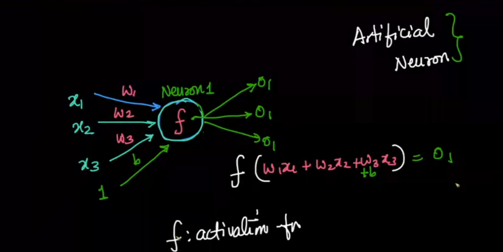
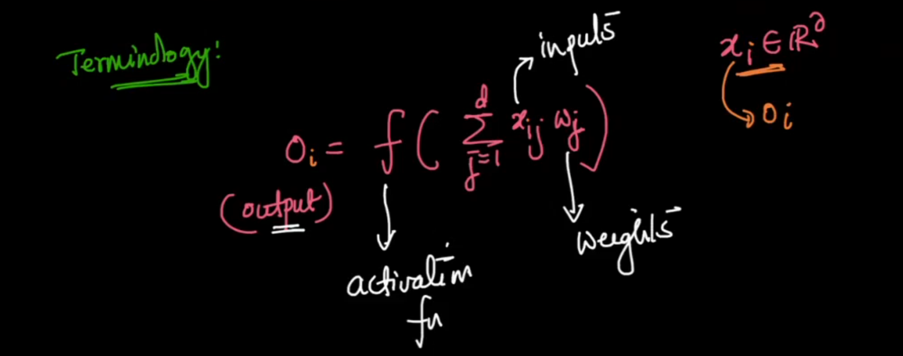

## **1. Introduction: Biological Neurons vs. Artificial Neurons**

### **1.1 Biological Neuron**
A biological neuron is the basic unit of the brain’s nervous system. It processes and transmits information through electrical and chemical signals.

#### **Structure:**
- **Dendrites:** Receive signals from other neurons.
- **Axon:** Transmits signals to other neurons.
- **Neuron Body:** Processes incoming signals.

#### **Neural Network (NN) Inspiration**
Artificial Neural Networks (ANNs) are **loosely inspired by the brain**, where multiple artificial neurons are connected to form a network.

---

### **1.2 Artificial Neuron (Mathematical Representation)**
An **artificial neuron** models a biological neuron mathematically using **weighted sums** and an **activation function**.

#### **Neuron Model:**
$$O = f(W_1x_1 + W_2x_2 + W_3x_3 + \dots + W_nx_n + b)$$
where:
- $x_1, x_2, \dots, x_n$ → Input features
- $W_1, W_2, \dots, W_n$ → Weights (importance of each input)
- $b$ → Bias (adjustment term)
- $f(\cdot)$ → Activation function (introduces non-linearity)
- $O$ → Output of the neuron

---

## **2. Perceptron Model**
### **2.1 Definition**
A **Perceptron** is the simplest form of an artificial neuron, used as a binary classifier.

#### **Mathematical Model:**
$$O = f\left(\sum_{j=1}^{n} W_j x_j + b\right)$$
where:
- $x_j$ = $j^{th}$ input
- $W_j$ = Weight associated with $x_j$
- $b$ = Bias term
- $f(\cdot)$ = Activation function (step function)
- $O$ = Output (binary classification)

#### **2.2 Step Activation Function**
$$f(x) = \begin{cases} 1, & \text{if } x > 0 \\ 0, & \text{otherwise} \end{cases}$$

#### **2.3 Limitations of Perceptron**
- **Works only for linearly separable data.**
- **Cannot model probabilistic outputs.**
- **Cannot solve problems like XOR.**

---

## **3. Logistic  Logistic Regression vs. Perceptron**
### **3.1 Logistic Regression Model**
Unlike the perceptron, logistic regression **outputs probabilities** instead of binary values.

#### **Sigmoid Activation Function:**
$$\sigma(x) = \frac{1}{1 + e^{-x}}$$

#### **Prediction Function:**
$$\hat{y} = \sigma(W^T x + b) = \frac{1}{1 + e^{-(W^T x + b)}}$$
where:
- $W$ = Weight vector
- $x$ = Input feature vector
- $b$ = Bias
- $\hat{y}$ = Predicted probability

### **3.2 Comparison Table**
| Feature | Perceptron | Logistic Regression |
|---------|-----------|----------------------|
| **Activation Function** | Step Function | Sigmoid Function |
| **Output** | 0 or 1 (binary) | Probability (0 to 1) |
| **Learning Algorithm** | Perceptron Learning Rule | Gradient Descent |
| **Loss Function** | Hard Classification | Log-Loss (Cross Entropy) |
| **Decision Boundary** | Linear | Linear |

---

## **4. Training Neural Networks**
### **4.1 Problem Formulation**
We are given a dataset:
$$D = \{(x_i, y_i)\}_{i=1}^{m}$$
where:
- $x_i$ = Input feature vector for $i^{th}$ example
- $y_i$ = True output (label)

The predicted output is:
$$\hat{y}_i = f(W^T x_i + b)$$

### **4.2 Loss Function**
To measure how well the model performs, we use a loss function.

#### **Binary Cross-Entropy Loss (for classification)**
$$\mathcal{L} = - \sum_{i=1}^{m} \left[ y_i \log(\hat{y}_i) + (1 - y_i) \log(1 - \hat{y}_i) \right]$$

### **4.3 Gradient Descent Optimization**
- We minimize the loss function using **gradient descent**, which updates weights as:
  $$W := W - \eta \frac{\partial \mathcal{L}}{\partial W}$$
  $$b := b - \eta \frac{\partial \mathcal{L}}{\partial b}$$
  where:
  - $\eta$ = Learning rate (step size)

- Common optimization techniques:
  - **Stochastic Gradient Descent (SGD)**
  - **Mini-Batch Gradient Descent**
  - **Batch Gradient Descent**

---

## **5. Multi-Layer Perceptron (MLP)**
### **5.1 Structure of MLP**
- **Input Layer** → Receives input features.
- **Hidden Layers** → Intermediate layers that learn complex features.
- **Output Layer** → Produces the final prediction.

### **5.2 Forward Propagation**
For each hidden neuron:
$$h_j = f(W_j^T x + b_j)$$
where:
- $h_j$ = Output of the $j^{th}$ hidden neuron

For the output neuron:
$$\hat{y} = f(W_o^T h + b_o)$$

### **5.3 Activation Functions in MLP**
| Activation Function | Formula | Purpose |
|--------------------|---------|---------|
| **ReLU** | $\max(0, x)$ | Prevents vanishing gradients |
| **Sigmoid** | $\frac{1}{1 + e^{-x}}$ | Converts to probability |
| **Tanh** | $\frac{e^x - e^{-x}}{e^x + e^{-x}}$ | Zero-centered |

### **5.4 Backpropagation**
- **Goal:** Adjust weights to minimize the loss.
- **Uses:** Chain Rule of Calculus
- **Process:**
  1. Compute gradients of loss w.r.t. weights.
  2. Update weights using gradient descent.

---

---
### **What is Sparsity?**
- **Definition:** Sparsity means most elements in a vector, matrix, or dataset are zero (e.g., $[0, 0, 3, 0, 0]$ is 80% sparse).
- **In Neural Networks:**
  - **Sparse Activations:** ReLU $f(x) = \max(0, x)$ outputs zeros for negative inputs, e.g., $[-2, 1, -1, 3] \to [0, 1, 0, 3]$.
  - **Sparse Weights:** Many zeros in weight matrices (via pruning or regularization).
  - **Sparse Features:** Most feature values are zero (e.g., text data).
- **Benefits:**
  - Faster computation (skip zeros).
  - Lower memory use.
  - Reduces overfitting (acts as regularization).
  - Improves interpretability (focus on key elements).
- **Relevance:** ReLU induces sparsity, unlike sigmoid/tanh, enhancing efficiency in MLPs.

--- 
