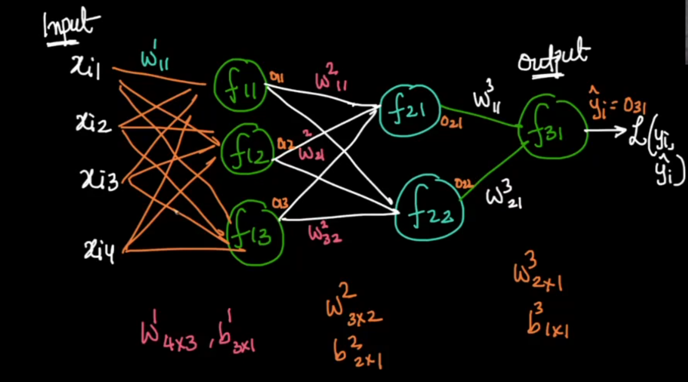

Here is the corrected formatting with no spaces between `$` notation:  

---

### **Practical Machine Learning Models**  

#### **Tabular Data**  
- **MLP vs. GBDT**: Multi-Layer Perceptron (MLP) and Gradient Boosted Decision Trees (GBDT) achieve similar performance on structured tabular data.  
- **Real-world Preference**: MLP is often preferred for large-scale and high-dimensional tabular data, especially when integrated with deep learning systems.  

#### **Deep Learning for Unstructured Data**  
For data types such as images, time series, speech, and text, deep learning models are essential due to their ability to learn complex non-linear patterns:  
- **Deep Learning (DL) is required (✓)**  
- **Key architectures for different data types:**  
  - **CNN (Convolutional Neural Networks)** → Best for image processing and feature extraction.  
  - **LSTM (Long Short-Term Memory Networks)** → Effective for sequential data like time series and speech.  
  - **Transformers** → State-of-the-art architecture for natural language processing (NLP) and increasingly used in vision and speech tasks.  

  

## **Training a Multi-Layer Perceptron**  

A **Multi-Layer Perceptron (MLP)** is a type of artificial neural network that learns to make predictions based on input data. Below, we explain the training process in an easy-to-understand manner.  

---

## **1. Initialization**  
Before training, we:  
- **Initialize all parameters (weights and biases) randomly.**  
- **Pre-process the input data:** Standardize it (convert values to a common scale).  
- **Set the learning rate $\eta$** for updating weights and biases in training.  


- $W^k$ → Weights for layer $k$  
- $b^k$ → Biases for layer $k$  
- $\eta$ → Learning rate (step size for weight updates)  

---

## **2. Forward Propagation (Making Predictions)**  
We pass the input **$x_i$** through the MLP to get the output **$\hat{y}_i$** (predicted value).  

### **Network Architecture Diagram**  

```
Input Layer (4 neurons) → Hidden Layer 1 (3 neurons) → Hidden Layer 2 (2 neurons) → Output Layer (1 neuron)
```

Each layer has a **set of weights** $W$ and **biases** $b$ to process inputs before passing them to the next layer.  

#### **Mathematical Representation:**  
- **Input Layer:**  
  $$
  x_{i1}, x_{i2}, x_{i3}, x_{i4}
  $$  
- **Weights and Biases:**  
  - Layer 1: $W^1: 4 \times 3, \quad b^1: 3 \times 1$  
  - Layer 2: $W^2: 3 \times 2, \quad b^2: 2 \times 1$  
  - Layer 3: $W^3: 2 \times 1, \quad b^3: 1 \times 1$  
- **Prediction:**  
  $$
  \hat{x}_i \rightarrow \text{MLP} \rightarrow \hat{y}_i
  $$  


- $x_i$ → Input features  
- $\hat{y}_i$ → Predicted output  

---

## **3. Loss Calculation (Error Measurement)**  
After predicting **$\hat{y}_i$**, we compare it with the actual value **$y_i$** using a loss function:  

$$
\sum_{n} \text{Loss}(y_i, \hat{y}_i)
$$  

This loss tells us how far our prediction is from the actual value.  


- $y_i$ → Actual output  
- $L(y_i, \hat{y}_i)$ → Loss function (measures error)  

---

## **4. Backpropagation (Learning from Mistakes)**  
We adjust the weights and biases to reduce the error (loss). The updates are done using **Gradient Descent**:  

$$
W^{k}_{ij \text{ new}} = W^{k}_{ij \text{ old}} - \eta \frac{\partial L}{\partial W^{k}_{ij}} \bigg|_{W^{k}_{ij \text{ old}}}
$$

$$
b^{k}_{ij \text{ new}} = b^{k}_{ij \text{ old}} - \eta \frac{\partial L}{\partial b^{k}_{ij}} \bigg|_{b^{k}_{ij \text{ old}}}
$$

Where:  
- $W^k_{ij}$ = Weight at layer $k$ for neuron $i, j$.  
- $b^k_{ij}$ = Bias at layer $k$ for neuron $i, j$.  
- $\frac{\partial L}{\partial W}$, $\frac{\partial L}{\partial b}$ = Gradients (rate of change of loss w.r.t weights and biases).  


- $\frac{\partial L}{\partial W}$ → Gradient of loss w.r.t weights  
- $\frac{\partial L}{\partial b}$ → Gradient of loss w.r.t biases  

---

## **5. Training Process (Iterating Until Learning Completes)**  
- **Repeat Steps 2, 3, & 4** until the weights and biases stop changing significantly (convergence).  

$$
W^{k}_{ij \text{ new}} \approx W^{k}_{ij \text{ old}}
$$

$$
b^{k}_{ij \text{ new}} \approx b^{k}_{ij \text{ old}}
$$

This means our model has **learned** the patterns in the data and can make accurate predictions.  


- $W^{k}_{ij} \approx W^{k}_{ij}$ → Indicates training is complete when weights no longer change significantly.  
- $b^{k}_{ij} \approx b^{k}_{ij}$ → Biases also stop changing significantly.  

---
