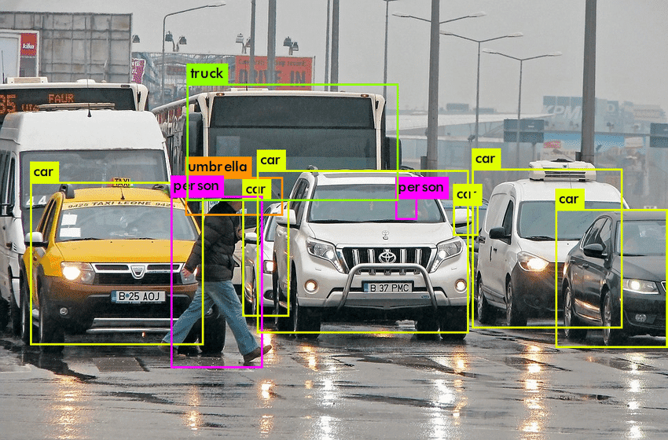
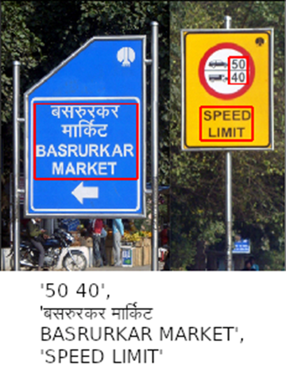
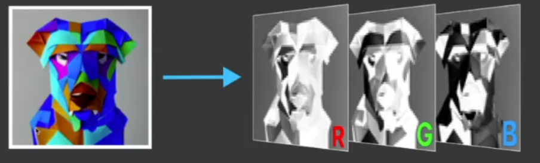
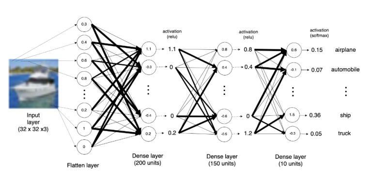
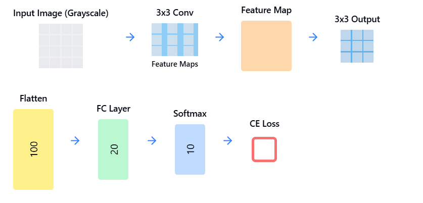

## **Detect *Object* in the image**

## **Extract *Text* from the image**

## **Write one-line describing the image(Known as *Image Captioning*)**

These problems might be easy for humans as we are trained with 500,000,000 years of image data, but What about Computers?

Before even answering this question, let's investigate-

**What a Computer actually sees?**

*   A Digital Image is a matrix of size (H,W,C), comprising of numbers (also known as pixel values) typically ranging from 0-255. Here H,W,C denote Height, Width and No. of Channels in a image.
*   For a Grayscale image, # channels is 1, while for Colored Image its 3.
  

The image is a 28x28 grayscale representation. Pixel values range from 0 to 255, where 0 represents black and 255 represents white. These pixel values are represented using 8-bit numbers.

### **History of Computer Vision:**

1. **1950s - 1990s: The Era of Image Processing (IP) and Classical Computer Vision (CV)**
   - Early techniques focused on basic image analysis such as:
     - **Shape Detection**: Identifying geometric shapes in images.
     - **Edge Detection**: Extracting boundaries or edges within an image.
     - **Face Detection**: Recognizing and localizing faces in images.
   - These methods relied on custom algorithms designed for specific tasks.

2. **1990s: Emergence of Convolutional Neural Networks (CNNs)**
   - CNNs were proposed but largely ignored due to a lack of computational power and large datasets required for training.

3. **2012: The Breakthrough with AlexNet**
   - AlexNet revolutionized Computer Vision by demonstrating the power of CNNs for image classification.
   - Key factors behind its success:
     - Scalable **Convolutional Neural Networks (CNNs)**.
     - Availability of large datasets (e.g., ImageNet).
     - Use of GPUs to accelerate training.

4. **The Rise of CNNs and Modern Computer Vision**
   - **Classical Computer Vision (50 years):**
     - Relied on custom-crafted algorithms for tasks like edge detection, shape detection, and face detection.
   - **Modern Computer Vision (Last Few Years):**
     - Shifted towards **deep learning** models like CNNs, which learn patterns directly from large amounts of data.
     - Advances in **computational power (GPUs)** have fueled this progress.

### MLP (Multi-Layer Perceptron):

- **Input Vector**: $\mathbf{x_i}$
- **Weights and Bias**: Associated with inputs, denoted as $\mathbf{W}$ and $b$.
- **Activation Function**: ReLU (Rectified Linear Unit).
- **Output Calculation**:
  $$
  y = \text{ReLU}(\mathbf{W} \cdot \mathbf{x_i} + b)
  $$

### **Different Ideas for Image Processing**  

1. **Input Dimensions:**  
   - Image size: $h \times w$ (height × width).  
   - Grayscale image: Each pixel contains a single intensity value.  

2. **Sliding Window Technique:**  
   - A **3×3 kernel** (filter) slides over the image.  
   - For each window, corresponding values in the kernel and the image are used for calculations.  

3. **Matrix A:**  
   - Example region from the grayscale image (e.g., $3 \times 3$ matrix).  
   - Each cell represents pixel intensity values from the original image.  

4. **Matrix B (Kernel):**  
   - **Predefined kernel** for transformation (e.g., smoothing, edge detection).  
   - Each value in $B$ represents a weight to multiply with corresponding pixel values in $A$.  

5. **Component-Wise Multiplication:**  
   - **Element-wise multiplication** is performed between $ A $ and $ B $.  
   - Formula:  
     $$
     \text{Resultant Value} = (A[1,1] \cdot B[1,1]) + (A[1,2] \cdot B[1,2]) + \dots
     $$

6. **Aggregation (Averaging):**  
   - The sum of the multiplied values is divided by the sum of kernel values to compute the final pixel value.  
   - Example calculation:  
     $$
     \text{Average} = \frac{\sum \text{(Component-wise multiplication values)}}{\text{Sum of kernel weights}}
     $$

**Convolution:** Component-wise multiplication + addition

### **Flow of Classical Image Processing and Neuroscience-Inspired Perception**

**Pixels** → **Edges** → **Shapes** → **Objects** → **Faces/Cats**

- **Pixels:** Raw intensity values of the image.  
- **Edges:** Detect boundaries or discontinuities.  
- **Shapes:** Combine edges to form geometric shapes.  
- **Objects:** Group shapes to identify specific objects.  
- **Faces/Cats:** Classify objects into specific categories like faces or animals.

