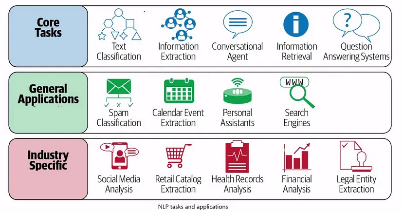
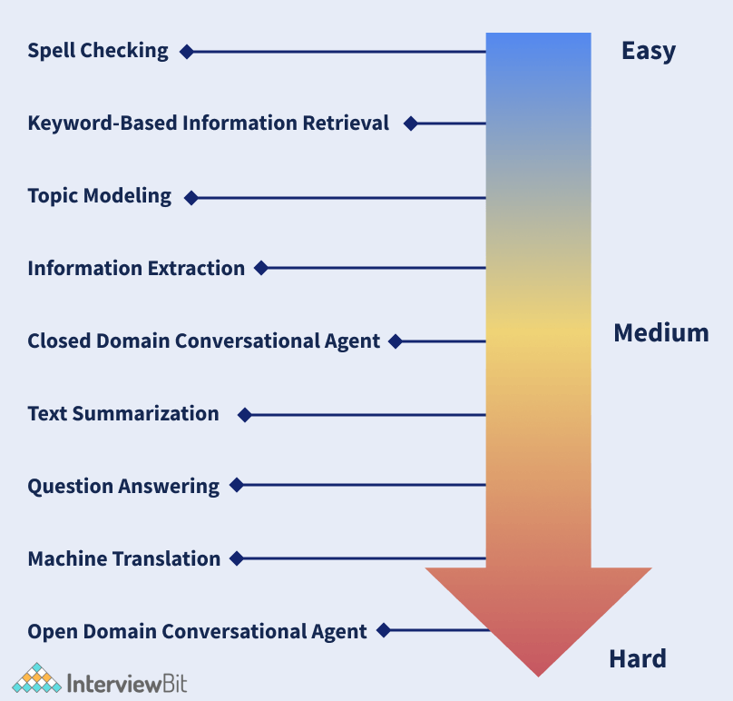
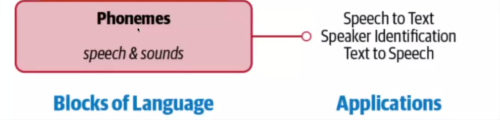

## Natural Language Processing

### Introduction
Natural Language Processing (NLP) is a branch of computer science that focuses on enabling computers to understand and process human language. While computers operate using binary (0s and 1s), humans communicate using natural languages. NLP bridges this gap by providing methods to analyze, model and understand human communication.

Popular Applications
- **Google Assistant** - Voice-based AI assistant
- **Gmail Smart Compose** - Intelligent email writing suggestions

### **How Does It Work?**
The challenge lies in teaching machines to understand human language when they can only process binary data. NLP provides the frameworks and techniques to:
1. Convert human language into machine-readable format
2. Process and analyze the language data
3. Generate meaningful responses or take appropriate actions

### Key Tasks of NLP Include
**Text Processing**
- **Text Correction & Enhancement**
  - Improves text clarity, grammar and readability
  - Examples: Grammarly, spell-checkers

- **Text Summarization**
  - Creates concise summaries from longer documents
  - Useful for research, news articles, reports

**Language Understanding**
- **Sentiment Analysis**
  - Determines emotional tone (positive/negative/neutral)
  - Used in social media monitoring, customer feedback

- **Question & Answering (Q&A)**
  - Answers questions based on knowledge base
  - Powers virtual assistants, help systems

**Communication**
- **Chatbots**
  - Interactive conversational agents
  - Customer service, virtual assistance

- **Translation**
  - Language-to-language conversion
  - Real-time translation services

**Media Processing**
- **Speech to Text**
  - Converts spoken words to written text
  - Voice commands, dictation services

- **Closed Captioning**
  - Generates video subtitles/captions
  - Accessibility features, content localization

**Specialized Applications**
- **Number Plate Recognition**
  - Uses computer vision (YOLOv5) + OCR
  - Traffic monitoring, parking systems

### Agenda:

In this Module, We'll try to understand:

- What NLP is?
- The broader spectrum of NLP-based solutions
- Overview of numerous applications of NLP in real-world scenarios.
- Various tasks that form the basis of building different NLP applications.
- This will be followed by an understanding of language from an NLP perspective and of why NLP is difficult.
- An overview of heuristics, machine learning, and deep learning, then introduce a few commonly used algorithms in NLP.

### Core application areas

- **Email platforms** -> Gmail, Outlook, etc.  
  Use NLP extensively to provide a range of product features, such as spam classification, priority inbox, calendar event extraction, auto-complete, etc.

- **Voice-based assistants** -> Apple Siri, Google Assistant, Microsoft Cortana, and Amazon Alexa  
  Rely on a range of NLP techniques to interact with the user, understand user commands, and respond accordingly.

- **Modern search engines** -> Google and Bing  
  Query understanding, query expansion, question answering, information retrieval, and ranking and grouping of the results, to name a few.

- **Machine translation services** -> Google Translate, Bing Microsoft Translator, and Amazon Translate  

### Other industrial applications:
- Organizations across verticals analyze their social media feeds to build a better and deeper understanding of the voice of their customers.
- E-commerce platforms like Amazon: are extracting relevant information from product descriptions to understanding user reviews.
- Advances in NLP are being applied to solve use cases in domains such as healthcare, finance, and law. Chapter 10 addresses these.
- Companies such as Arria are working to use NLP techniques to automatically generate reports for various domains, from weather forecasting to financial services.
- NLP forms the backbone of spelling and grammar-correction tools, such as Grammarly and spell check in Microsoft Word and Google Docs.
- Watson AI was built using NLP techniques and is one of the examples of NLP bots winning a world competition.
- NLP is used in a range of learning and assessment tools and technologies, such as automated scoring in exams like the Graduate Record Examination (GRE).
- Plagiarism detection (e.g., Turnitin), Intelligent tutoring systems, and language learning apps like Duolingo.
- NLP is used to build large knowledge bases, such as the Google Knowledge Graph, which are useful in a range of applications like search and question answering.

### Commonly Implemented Tasks in NLP

Main NLP tasks that appear frequently across various NLP projects:

- **Language modeling**:  
  This is the task of predicting what the next word in a sentence will be based on the history of previous words. The goal of this task is to learn the probability of a sequence of words appearing in a given language. Language modeling is useful for building solutions for a wide variety of problems, such as:
  - Spelling correction
  - Speech recognition
  - Optical character recognition
  - Handwriting recognition
  - Machine translation

- **Text classification**:  
  This is the task of bucketing the text into a known set of categories based on its content. Text classification is by far the most popular task in NLP and is used in a variety of tools, from email spam identification to sentiment analysis.

- **Information extraction**:  
  As the name indicates, this is the task of extracting relevant information from text, such as calendar events from emails or the names of people mentioned in a social media post.  
  Example: Gmail extracts destination from tickets whenever we are traveling.

- **Information retrieval**:  
  This is the task of finding documents relevant to a user query from a large collection. Applications like Google Search are well-known use cases of information retrieval.  
  Example: Semantic search engine.

- **Conversational agent**:  
  This is the task of building dialogue systems that can converse in human languages.  
  Example: Alexa, Siri, etc.

- **Text summarization**:  
  This task aims to create short summaries of longer documents while retaining the core content and preserving the overall meaning of the text.  
  Example: Inshorts, Creating automated abstracts.

- **Question answering**:  
  This is the task of building a system that can automatically answer questions posed in natural language.

- **Machine translation**:  
  This is the task of converting a piece of text from one language to another. Tools like Google Translate are common applications of this task.

- **Topic modeling**:  
  This is the task of uncovering the topical structure of a large collection of documents. Topic modeling is a common text-mining tool and is used in a wide range of domains, from literature to bioinformatics.

### Understanding Complexity in Language

To understand what complexity means, we need to understand **What does a Language consist of?**  
Language is a structured system of communication that involves complex combinations of its constituent components, such as characters, words, sentences, etc.  
The systematic study of language is called **Linguistics**.  
In order to study NLP, it is important to understand some concepts from linguistics about how language is structured.

Let's see how these components relate to some of the NLP tasks we have discussed today.

### Four components of Language

We can think of human language as composed of four major building blocks:

1. **Phonemes**  
   Phonemes are the smallest units of sound in a language. They may not have any meaning by themselves but can induce meanings when uttered in combination with other phonemes.
   Example: In English, /k/ in "cat", /b/ in "bat", and /m/ in "mat" are different phonemes that change the meaning of the word when substituted.

2. **Morphemes and Lexemes**  
   A morpheme is the smallest unit of language that has a meaning. It is formed by a combination of phonemes. Not all morphemes are words, but all prefixes and suffixes are morphemes. Lexemes are the structural variations of morphemes related to one another by meaning.
   Example: In the word "unhappiness", there are three morphemes: "un-" (prefix), "happy" (root), and "-ness" (suffix). For lexemes, "run", "runs", "running", and "ran" are all lexemes of the same base word.

3. **Syntax**  
   Syntax is a set of rules to construct grammatically correct sentences out of words and phrases in a language.
   Example: "The cat chased the mouse" follows correct English syntax, while "Cat the mouse the chased" doesn't, even though it contains the same words.

4. **Context**  
   Context is how various parts in a language come together to convey a particular meaning. Context includes long-term references, world knowledge, and common sense along with the literal meaning of words and phrases.
   Example: In the sentence "The bank is closed", context determines whether we're talking about a financial institution or the edge of a river. Similarly, understanding "It's raining cats and dogs" requires contextual knowledge that this is an idiom meaning heavy rain.

### Importance in NLP

NLP applications need knowledge of different levels of these building blocks, starting from the basic sounds of language (phonemes) to texts with some meaningful expressions (context).

### Approaches to These Problems

1. **Heuristics-Based**
2. **Machine Learning**
3. **Deep Learning**

### Heuristics-Based NLP

Similar to other early AI systems, early attempts at designing NLP systems were based on building rules for the task at hand. This required that the developers had some expertise in the domain to formulate rules that could be incorporated into a program. Such systems also required resources like dictionaries and thesauruses, typically compiled and digitized over a period of time.

An example of designing rules to solve an NLP problem using such resources is lexicon-based sentiment analysis. It uses counts of positive and negative words in the text to deduce the sentiment of the text.

### Machine Learning for NLP

Machine learning techniques are applied to textual data just as they're used on other forms of data, such as images, speech, and structured data. Supervised machine learning techniques such as classification and regression methods are heavily used for various NLP tasks.

As an example:

- An NLP classification task would be to classify news articles into a set of news topics like sports or politics.

- On the other hand, regression techniques, which give a numeric prediction, can be used to estimate the price of a stock based on processing the social media discussion about that stock.
- Similarly, unsupervised clustering algorithms can be used to club together text documents.

Some common machine learning algorithms for NLP:

- Naive Bayes
- SVM (Support Vector Machines)
- Logistic Regression
- Hidden Markov Model
- Conditional Random Fields (CRFs)

### Deep Learning for NLP

We briefly touched on a couple of popular machine learning methods that are used heavily in various NLP tasks. In the last few years, we have seen a huge surge in using neural networks to deal with complex, unstructured data. Language is inherently complex and unstructured. Therefore, we need models with better representation and learning capability to understand and solve language tasks.

Here are a few popular deep neural network architectures that have become the status quo in NLP:

- Recurrent Neural Network (RNN)
- LSTM (Long Short Term Memory)
- Convolutional Neural Network (CNN)
- Transformer Networks
- BERT (Bidirectional Encoder Representations from Transformers)
- GPT (Generative Pretrained Transformer)
- T5 (Text-to-Text Transfer Transformer)
- XLNet

**Case Study: Public Reaction to COVID-19 Strain**

As a Data Scientist at the Ministry of Health and Family Welfare, your task is to analyze public sentiment regarding the new COVID-19 strain. The key concerns are:

• People may panic when new strains are detected, leading to:
  - Hoarding of essential supplies
  - Spread of misinformation
  - Need for quick government response

**Gathering Public Opinion**
Rather than slow traditional surveys, social media analysis offers real-time insights into public sentiment.

**Twitter Analysis Approach**
We'll analyze Twitter data to understand public reaction:
- Process tweet text to determine positive/negative sentiment 
- Use sentiment analysis to categorize opinions automatically
- Monitor sentiment trends over time

**Benefits of This Analysis**
- Quick assessment of virus spread perception
- Identify areas needing public education 
- Enable rapid government response
- Counter misinformation effectively

**Available Data**
- Dataset: Kaggle COVID Tweets collection
- Size: 11,663 labeled tweets
- Labels: Positive and negative sentiment
- Source: [Kaggle COVID Tweets](<kaggle_link>)

